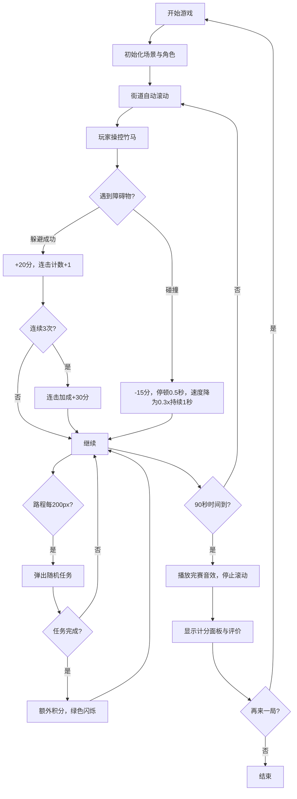

## 1. 产品概述

宋代汴京竹马跑酷游戏，让用户扮演竹马将军带领孩童在古街中骑竹马竞赛，通过操控竹马完成快跑、转身、跳跃、避障等动作获取积分升级骑术。

- 核心玩法：横向卷轴跑酷，操控竹马骑手躲避障碍物并完成随机任务
- 目标用户：喜欢传统文化主题和休闲游戏的玩家
- 产品价值：将传统儿童游戏与现代游戏机制结合，传播传统文化的同时提供趣味游戏体验

## 2. 核心功能

### 2.1 用户角色

| 角色 | 注册方式 | 核心权限 |
|------|----------|----------|
| 玩家 | 无需注册，直接进入 | 游戏操控、查看积分、重新开始 |

### 2.2 功能模块

1. **游戏主场景**：宋代长街渲染、自动滚动、障碍物生成、围观NPC
2. **竹马骑手控制**：键盘/拖拽操控、跳跃转向急停、碰撞检测与反馈
3. **积分与任务系统**：避障得分、连击加成、随机任务触发、等级晋升
4. **技能状态面板**：骑术等级、速度倍率、剩余时间、连击数显示
5. **游戏结束系统**：计分统计、评价体系、完赛音效、再来一局

### 2.3 页面详情

| 页面名称 | 模块名称 | 功能描述 |
|----------|----------|----------|
| 游戏主界面 | 街道场景 | 横向滚动的宋代长街，包含石板路、商铺幌子、NPC |
| 游戏主界面 | 竹马骑手 | 可操控角色，支持WASD/拖拽控制，有奔跑动画和碰撞反馈 |
| 游戏主界面 | 障碍物管理 | 石墩、水洼、水果摊随机生成，碰撞扣分减速 |
| 游戏主界面 | 技能面板 | 左侧固定面板，显示等级、速度、时间、连击 |
| 游戏主界面 | 计分系统 | 积分计算、连击加成、任务提示、升级动画 |
| 结束弹窗 | 计分面板 | 总积分、避障成功率、最高连击、评价等级 |

## 3. 核心流程

玩家进入游戏后，竹马骑手位于街道左侧，通过WASD键或鼠标拖拽控制角色躲避从右向左滚动的障碍物，每成功躲避获得积分，连续躲避触发连击加成。每隔一段路程弹出随机任务，完成可获得额外积分。90秒游戏结束后显示最终成绩和评价，可选择再来一局。

## 4. 用户界面设计

### 4.1 设计风格

- **主色调**：深灰#6b7b6b（青砖）、米白#f5f5dc（灰瓦/纸）、木色#8b6f47（木纹）
- **点缀色**：红#c0392b（骑童衣衫）、金#ffd700（等级描边）、翠绿#27ae60（NPC衣服）
- **字体**：统一使用serif字体，营造古朴氛围
- **动画风格**：弹出式动画（scale 0→1，透明度0→1，400ms ease-out）
- **整体基调**：宋代市井青砖灰瓦风格，古朴雅致又不失游戏趣味性

### 4.2 页面设计概述

| 页面名称 | 模块名称 | UI元素 |
|----------|----------|--------|
| 游戏主界面 | 街道场景 | 横向渐变天际线、石板路纹理、商铺布幌、NPC呼吸动画 |
| 游戏主界面 | 竹马骑手 | 竹竿棕黄、马头深褐、骑童红衫、马头摆动动画、碰撞闪烁 |
| 游戏主界面 | 技能面板 | 浅米色背景、木纹边框、金色等级描边、数字闪烁更新 |
| 游戏主界面 | 障碍物 | 灰色石墩、半透明蓝水洼、黄褐色水果摊 |
| 结束弹窗 | 计分面板 | 半透明白背景、圆角12px、阴影8px、深红按钮悬停变亮 |
| 通用 | 反馈动画 | 加分飘字、扣分飘字、任务提示、升级动画 |

### 4.3 响应性

- **桌面端（≥768px）**：左侧技能面板20%，中央街道70%，右侧边距10%
- **移动端（<768px）**：上方街道全宽，下方技能面板横排
- 触控优化：支持拖拽操控竹马，按钮足够大便于点击

### 4.4 视觉动效指引

- **NPC动画**：三三两两站街道两旁，骑手经过时手部上下摆动鼓掌，周期2秒幅度±3px的呼吸动画
- **竹马动画**：马头上下摆动（rotate -5deg到+5deg交替）模拟奔跑颠簸
- **场景动画**：街道从右向左自动滚动，速度随时间递增（初始0.5x，每10秒+0.1x，上限1.5x）
- **碰撞反馈**：弹跳+红色闪烁300ms，右上角-10分飘出消失
- **完赛动画**：所有NPC转身面向骑手挥手持续3秒，播放1.5秒号角音效
