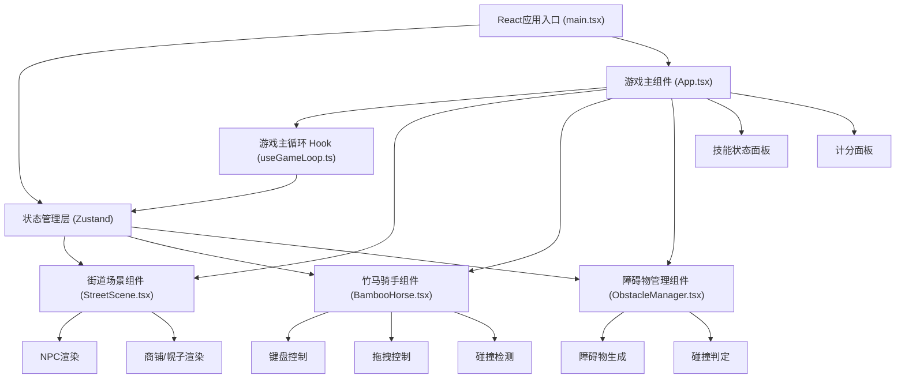

## 1. 架构设计



## 2. 技术描述

- **前端框架**: React 18 + TypeScript + Vite
- **状态管理**: Zustand
- **动画库**: Framer Motion
- **拖拽库**: React DnD
- **构建工具**: Vite 5
- **样式方案**: CSS Modules + CSS变量
- **音频**: Web Audio API（合成完赛号角音）

### 依赖版本说明
- react: ^18.2.0
- react-dom: ^18.2.0
- typescript: ^5.3.0
- vite: ^5.0.0
- @vitejs/plugin-react: ^4.2.0
- framer-motion: ^10.16.0
- zustand: ^4.4.0
- react-dnd: ^16.0.1
- react-dnd-html5-backend: ^16.0.1

## 3. 项目文件结构

```
auto103/
├── package.json
├── vite.config.js
├── tsconfig.json
├── index.html
└── src/
    ├── main.tsx
    ├── App.tsx
    ├── styles/
    │   └── global.css
    ├── components/
    │   ├── StreetScene.tsx
    │   ├── BambooHorse.tsx
    │   ├── ObstacleManager.tsx
    │   ├── SkillPanel.tsx
    │   ├── ScorePanel.tsx
    │   └── TaskPopup.tsx
    ├── hooks/
    │   ├── useGameLoop.ts
    │   └── useKeyboard.ts
    ├── store/
    │   └── useGameStore.ts
    ├── types/
    │   └── game.ts
    └── utils/
        ├── audio.ts
        └── collision.ts
```

## 4. 数据模型与状态设计

### 4.1 游戏状态 (Zustand Store)

```typescript
interface GameState {
  status: 'idle' | 'playing' | 'paused' | 'ended';
  score: number;
  timeRemaining: number;
  speedMultiplier: number;
  combo: number;
  maxCombo: number;
  obstaclesAvoided: number;
  obstaclesHit: number;
  rank: '新兵' | '校尉' | '将军';
  currentTask: Task | null;
  taskCompleted: boolean;
  scrollOffset: number;
  isHit: boolean;
  playerPosition: { x: number; y: number };
  playerRotation: number;
  isJumping: boolean;
  
  startGame: () => void;
  resetGame: () => void;
  addScore: (points: number) => void;
  subtractScore: (points: number) => void;
  incrementCombo: () => void;
  resetCombo: () => void;
  setSpeed: (speed: number) => void;
  setPlayerPosition: (x: number, y: number) => void;
  setPlayerRotation: (rotation: number) => void;
  setJumping: (jumping: boolean) => void;
  setHit: (hit: boolean) => void;
  setCurrentTask: (task: Task | null) => void;
  completeTask: () => void;
  updateScrollOffset: (delta: number) => void;
  tick: (deltaTime: number) => void;
}
```

### 4.2 实体类型定义

```typescript
interface Obstacle {
  id: string;
  type: 'stone' | 'puddle' | 'fruitStand';
  x: number;
  y: number;
  width: number;
  height: number;
  passed: boolean;
}

interface NPC {
  id: string;
  x: number;
  y: number;
  side: 'left' | 'right';
  color: string;
  isClapping: boolean;
  isWaving: boolean;
}

interface Task {
  id: string;
  description: string;
  points: number;
  type: 'jump' | 'puddle' | 'spin';
  targetCount: number;
  currentCount: number;
  expiresAt: number;
}

interface ShopSign {
  id: string;
  x: number;
  y: number;
  text: string;
  side: 'left' | 'right';
}
```

## 5. 核心模块说明

### 5.1 useGameLoop Hook
- 基于requestAnimationFrame实现60fps游戏循环
- 管理deltaTime计算，确保动画速度一致
- 调用store的tick方法更新游戏状态
- 控制场景滚动速度（随时间递增，碰撞减速）
- 触发随机任务生成

### 5.2 BambooHorse 组件
- 竹马骑手渲染（纯CSS绘制：竹竿、马头、骑童）
- 键盘控制：W跳跃、A/D转向、S急停
- 拖拽控制：鼠标/触摸拖拽移动位置
- 奔跑动画：马头上下摆动（CSS keyframes）
- 碰撞反馈：弹跳动画+红色闪烁
- 使用framer-motion处理动画

### 5.3 StreetScene 组件
- 响应式街道场景渲染
- 石板路CSS纹理平铺
- 商铺幌子渲染（左右两侧随机分布）
- NPC渲染与动画（呼吸、鼓掌、挥手）
- 天际线横向渐变背景
- 障碍物与竹马的层级关系管理

### 5.4 ObstacleManager 组件
- 障碍物随机生成（控制同时存在≤6个）
- 三种障碍物类型：石墩、水洼、水果摊
- 随场景滚动移动
- 碰撞检测（与竹马骑手）
- 躲避判定与积分计算

### 5.5 SkillPanel 组件
- 左侧固定技能面板
- 骑术等级展示（金色文字描边）
- 速度倍率、剩余时间、连击数实时更新
- 数字变化闪烁动画

### 5.6 ScorePanel 组件
- 游戏结束弹出
- 总积分、避障成功率、最高连击展示
- 评价等级（竹马将军/熟练骑手/初学稚童）
- 再来一局按钮

## 6. 性能优化策略

### 6.1 渲染性能
- 使用CSS `will-change` 和 `transform` 优先进行动画
- 障碍物和NPC使用对象池复用，避免频繁创建销毁
- React.memo包裹纯展示组件避免不必要重渲染
- 游戏状态通过Zustand selector精确订阅

### 6.2 帧率控制
- 游戏循环稳定60fps，使用requestAnimationFrame
- 空闲时通过visibilitychange暂停渲染，不超过80fps
- CSS动画使用`animation-play-state`在页面不可见时暂停

### 6.3 资源限制
- NPC同时渲染不超过12个
- 障碍物同时存在不超过6个
- 动画层级控制，避免过多合成层

## 7. API 定义（无后端，纯前端）

本项目为纯前端游戏，无需后端API。所有数据存储在Zustand状态管理中。
