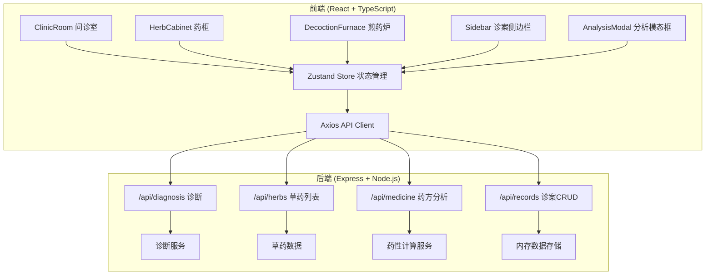
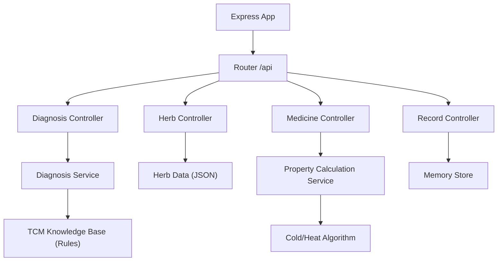
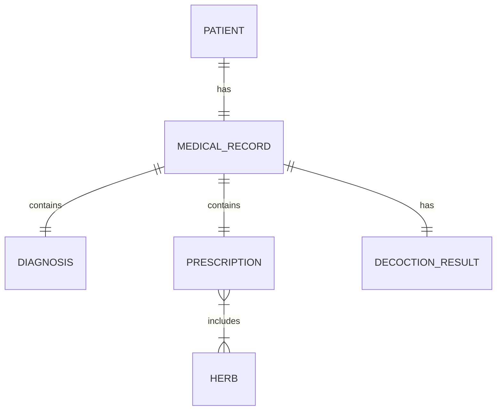

## 1. 架构设计



## 2. 技术描述
- **前端**：React@18 + TypeScript@5 + Vite@5
- **状态管理**：zustand@4
- **路由**：react-router-dom@6
- **动画**：framer-motion@11
- **HTTP客户端**：axios@1
- **后端**：Express@4
- **文件上传**：multer@1
- **数据存储**：内存存储（开发环境）
- **初始化工具**：vite-init react-express-ts 模板

## 3. 路由定义
| 路由 | 页面 | 说明 |
|------|------|------|
| / | 问诊室 | 默认首页，新建或继续当前诊案 |
| /cabinet | 药柜 | 选择和配伍草药 |
| /furnace | 煎药炉 | 煎煮药物 |
| /records | 诊案详情 | 查看历史诊案 |

## 4. API 定义

### 类型定义
```typescript
// 共享类型定义
interface Patient {
  id: string;
  name: string;
  age: number;
  complaint: string;
  avatarSeed: number;
}

interface Herb {
  id: string;
  name: string;
  nature: 'cold' | 'hot' | 'warm' | 'cool';
  effects: string[];
  meridian: ('liver' | 'heart' | 'spleen' | 'lung' | 'kidney')[];
}

interface Diagnosis {
  pulse: string;
  tongue: string;
  symptoms: string[];
  syndrome: string;
  recommendedFormula: string;
}

interface Prescription {
  id: string;
  herbs: Herb[];
  name: string;
  coldHeatValue: number;
  mainMeridian: string[];
  dosage: string;
}

interface MedicalRecord {
  id: string;
  patient: Patient;
  diagnosis: Diagnosis;
  prescription: Prescription;
  decoctionResult: {
    fireLevel: number;
    duration: number;
    soupColor: string;
  };
  createdAt: string;
}
```

### API 端点
| 方法 | 路径 | 请求 | 响应 |
|------|------|------|------|
| POST | /api/diagnosis | { pulse, tongue, symptoms } | { syndrome, recommendedFormula } |
| GET | /api/herbs | - | Herb[] |
| POST | /api/medicine | { herbs: string[] } | { name, coldHeatValue, mainMeridian, dosage } |
| GET | /api/records | - | MedicalRecord[] |
| POST | /api/records | MedicalRecord | { id, success: true } |
| GET | /api/records/:id | - | MedicalRecord |

## 5. 服务器架构



## 6. 数据模型

### 6.1 数据关系图



### 6.2 数据定义

草药初始数据（20种）：
- 人参：温，补气，脾肺经
- 黄芪：温，补气升阳，脾肺经
- 甘草：平，调和诸药，十二经
- 大黄：寒，泻下攻积，脾胃大肠肝经
- 茯苓：平，利水渗湿，心脾肾经
- 白术：温，健脾益气，脾胃经
- 当归：温，补血活血，肝心脾经
- 川芎：温，活血行气，肝胆心包经
- 白芍：微寒，养血敛阴，肝脾经
- 熟地：微温，补血滋阴，肝肾经
- 黄芩：寒，清热燥湿，肺胆脾胃大肠小肠经
- 黄连：寒，清热燥湿，心脾胃肝胆大肠经
- 黄柏：寒，清热燥湿，肾膀胱大肠经
- 栀子：寒，泻火除烦，心肺三焦经
- 柴胡：微寒，解表退热，肝胆经
- 升麻：微寒，发表透疹，肺脾胃大肠经
- 葛根：凉，解肌退热，脾胃经
- 薄荷：凉，疏散风热，肺肝经
- 菊花：微寒，散风清热，肺肝经
- 金银花：寒，清热解毒，肺心胃经

## 7. 文件结构与调用关系

```
.
├── package.json
├── vite.config.js
├── tsconfig.json
├── index.html
├── server/
│   └── index.js          # Express入口 → 路由 → 服务 → 内存存储
├── src/
│   ├── main.tsx          # 应用入口 → App.tsx
│   ├── App.tsx           # 路由配置 → 各页面组件
│   ├── store/
│   │   └── useStore.ts   # Zustand状态 → 被所有组件调用
│   ├── components/
│   │   ├── Sidebar.tsx       # 诊案列表 → useStore → API
│   │   ├── ClinicRoom.tsx    # 问诊室 → useStore → /api/diagnosis
│   │   ├── HerbCabinet.tsx   # 药柜 → useStore → /api/herbs
│   │   ├── DecoctionFurnace.tsx  # 煎药炉 → useStore
│   │   ├── HerbCard.tsx      # 草药卡片 → HerbCabinet调用
│   │   ├── PatientCard.tsx   # 病人卡片 → ClinicRoom调用
│   │   ├── PrescriptionPanel.tsx  # 药方面板 → HerbCabinet调用
│   │   ├── AnalysisModal.tsx     # 分析报告 → /api/medicine
│   │   └── SteamParticles.tsx    # 蒸汽粒子 → DecoctionFurnace调用
│   ├── services/
│   │   └── api.ts          # Axios封装 → 所有API调用
│   ├── types/
│   │   └── index.ts        # 类型定义 → 全局共享
│   ├── utils/
│   │   ├── tcm.ts          # 中医算法 → 诊断和药性计算
│   │   └── patientGenerator.ts  # 病人随机生成
│   └── styles/
│       └── globals.css     # 全局样式 + CSS变量 + 动画
└── .trae/
    └── documents/
        ├── PRD.md
        └── TechnicalArchitecture.md
```

**数据流向说明**：
1. 用户交互 → 组件 setState → Zustand store 更新
2. Store 变化 → 触发 API 调用 (axios) → Express 后端
3. 后端路由 → Controller → Service → 内存存储
4. 后端响应 → API client → Store 更新 → 组件重新渲染
5. 组件间通信全部通过 Zustand store，无直接 props 透传
