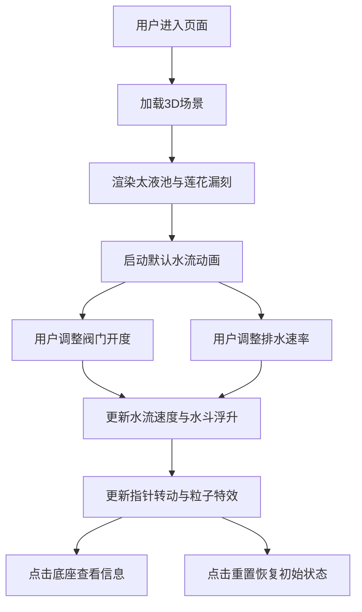

## 1. 产品概述

唐代莲花漏刻3D交互可视化应用，让用户以唐代司天台漏刻博士的身份，在虚拟大明宫太液池畔操作古代计时仪器。通过调整阀门开度和排水速率，实时观察水流计时效果、光影动态与粒子特效。

- 核心目的：通过沉浸式3D交互体验，展示中国古代水力计时技术的精妙原理
- 目标用户：历史爱好者、教育工作者、博物馆参观者
- 市场价值：将传统文化与现代Web技术结合，创造寓教于乐的交互体验

## 2. 核心功能

### 2.1 用户角色

| 角色 | 注册方式 | 核心权限 |
|------|----------|----------|
| 访客用户 | 无需注册 | 完整的3D场景浏览、交互操作、信息查看 |

### 2.2 功能模块

1. **3D场景模块**：太液池环境渲染、莲花漏刻3D模型、宫殿背景剪影
2. **交互控制模块**：阀门开度滑块、排水速率旋钮、重置按钮、信息面板
3. **计时系统模块**：十二时辰刻度、指针转动、水斗浮升逻辑
4. **粒子特效模块**：水流粒子、池面涟漪、水珠滴落、浮萍羽毛动画
5. **信息展示模块**：时辰换算、流量累计、指针偏差显示

### 2.3 页面详情

| 页面名称 | 模块名称 | 功能描述 |
|----------|----------|----------|
| 主场景页面 | 3D场景渲染 | 实时渲染太液池、莲花漏刻、光影效果 |
| 主场景页面 | 控制面板 | 左侧竖直面板，包含滑块、旋钮、按钮 |
| 主场景页面 | 信息弹窗 | 点击底座弹出时辰、流量、偏差信息 |
| 主场景页面 | 响应式适配 | 移动端自动折叠为顶部横条 |

## 3. 核心流程

用户进入页面 → 加载3D场景（太液池、莲花漏刻、宫殿背景）→ 观察默认水流效果 → 调整阀门开度滑块（控制入水流量）→ 调整排水速率旋钮（控制出水速度）→ 实时观察水斗浮升、指针转动、涟漪变化 → 点击莲花底座查看详细信息 → 点击重置按钮恢复初始状态

## 4. 用户界面设计

### 4.1 设计风格

- **主色调**：青铜色#b87333、青蓝色#3a6baa、青石色#7a8a7a
- **点缀色**：朱砂色#c0392b、金色#ffd700、大理石白#e8e0d0
- **整体气质**：盛唐皇家园林风格，含蓄庄重，古典雅致
- **按钮样式**：微浮雕效果，悬停上浮2px，点击脉冲缩放
- **字体**：使用古典衬线字体搭配现代无衬线字体，体现古今融合
- **布局风格**：左侧固定控制面板，右侧全屏3D场景

### 4.2 页面设计概述

| 页面名称 | 模块名称 | UI元素 |
|----------|----------|----------|
| 主场景页面 | 3D场景 | 45度俯视视角，青蓝色水面带波浪，青石池岸，远处宫殿剪影 |
| 主场景页面 | 控制面板 | 半透明青石纹理背景，铜色镶边，宽220px，左侧吸附 |
| 主场景页面 | 阀门滑块 | 大理石白滑块，木色滑动轨迹，范围0-100% |
| 主场景页面 | 排水旋钮 | 铜质渐变旋钮，5档刻度（慢、较慢、中、较快、快） |
| 主场景页面 | 重置按钮 | 朱砂色，悬停变亮红，点击脉冲效果 |
| 主场景页面 | 信息弹窗 | 点击底座弹出，显示时辰、流量、偏差 |

### 4.3 响应式设计

- **桌面端**（≥768px）：左侧竖直控制面板，右侧3D场景
- **移动端**（<768px）：控制面板折叠为顶部横条，点击汉堡图标展开
- **触摸优化**：增大交互元素尺寸，支持滑动和点击手势
- **性能适配**：低性能设备自动降低粒子数量和渲染质量

### 4.4 3D场景指导

- **环境氛围**：暖色调天光模拟唐代午后阳光，配合柔和环境光
- **光照设置**：方向光模拟太阳光（色温3500K），半球光模拟环境反射，点光源照亮莲花主体
- **相机设置**：初始45度俯视，距离场景中心15单位，允许轨道缩放和平移
- **构图**：莲花漏刻位于画面视觉中心偏右下，太液池占据下半部，宫殿剪影作为背景
- **交互**：OrbitControls控制相机视角，鼠标悬停高亮可交互元素，点击底座弹出信息
- **动画**：水面波浪、浮萍漂浮、羽毛飘动、指针转动、粒子流动，全部使用requestAnimationFrame驱动
- **后期处理**：轻微泛光（Bloom）效果增强金属质感，色彩分级统一色调
- **性能预算**：粒子上限200个，帧率≥55fps，Draw call≤100

