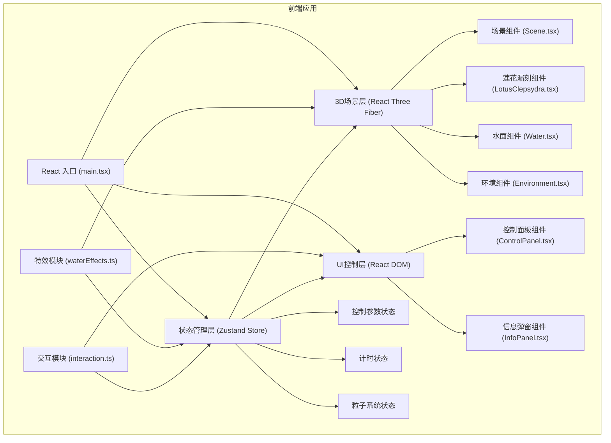

## 1. 架构设计



## 2. 技术描述

* **前端框架**：React\@18 + TypeScript\@5 + Vite\@5

* **3D渲染**：Three\@0.160 + @react-three/fiber\@8 + @react-three/drei\@9

* **状态管理**：Zustand\@4

* **样式方案**：Tailwind CSS\@3 + CSS Modules

* **构建工具**：Vite\@5 + @vitejs/plugin-react\@4

* **性能优化**：requestAnimationFrame驱动、粒子池化、LOD策略

## 3. 目录结构

```
src/
├── components/
│   ├── ControlPanel.tsx      # 左侧控制面板
│   ├── InfoPanel.tsx         # 信息弹窗
│   └── scene/
│       ├── Scene.tsx         # 3D场景入口
│       ├── LotusClepsydra.tsx # 莲花漏刻主体
│       ├── Water.tsx         # 太液池水面
│       └── Environment.tsx   # 环境（池岸、宫殿剪影）
├── hooks/
│   ├── useWaterEffects.ts    # 水流粒子系统Hook
│   └── useAnimation.ts       # 动画循环Hook
├── store/
│   └── useAppStore.ts        # Zustand全局状态
├── types/
│   └── index.ts              # TypeScript类型定义
├── utils/
│   ├── timeUtils.ts          # 时辰换算工具
│   └── constants.ts          # 常量定义
├── App.tsx                   # 应用根组件
├── main.tsx                  # 入口文件
└── index.css                 # 全局样式
```

## 4. 数据流向

```
┌─────────────────┐     ┌─────────────────┐     ┌─────────────────┐
│  用户交互输入   │────▶│  Zustand Store  │────▶│  3D场景更新     │
│  (ControlPanel) │     │  (useAppStore)  │     │  (Scene)        │
└─────────────────┘     └─────────────────┘     └─────────────────┘
          │                        │                        │
          │                        ▼                        │
          │                ┌─────────────────┐              │
          └───────────────▶│  粒子系统       │◀─────────────┘
                           │  (useWaterEffects) │
                           └─────────────────┘
                                    │
                                    ▼
                           ┌─────────────────┐
                           │  动画渲染循环   │
                           │  (useFrame)     │
                           └─────────────────┘
```

## 5. 核心状态模型

### 5.1 控制参数状态

```typescript
interface ControlState {
  valveOpening: number;      // 阀门开度 0-100
  drainageRate: number;      // 排水速率 0-4 (5档)
  waterLevel: number;        // 水位高度 0-1
  pointerAngle: number;      // 指针角度 0-360
  currentHour: number;       // 当前时辰 0-11
  totalWaterFlow: number;    // 累计流量（斗）
  pointerDeviation: number;  // 指针偏差（刻）
  isInfoPanelOpen: boolean;  // 信息面板开关
  activePetal: number;       // 当前高亮花瓣 -1为无
}
```

### 5.2 粒子系统状态

```typescript
interface Particle {
  id: number;
  position: [number, number, number];
  velocity: [number, number, number];
  life: number;
  maxLife: number;
  type: 'water' | 'ripple' | 'drop';
  size: number;
}

interface ParticleSystem {
  particles: Particle[];
  maxParticles: number;
  spawnRate: number;
}
```

## 6. 核心算法

### 6.1 计时计算

```typescript
// 水斗浮升速度 = 入水流量 - 排水速率
const inflowRate = valveOpening * 0.01;  // 0-1
const outflowRate = drainageRate * 0.2;  // 0, 0.2, 0.4, 0.6, 0.8
const netFlowRate = Math.max(0, inflowRate - outflowRate);

// 指针转动角度补偿（确保匀速）
const baseRotationSpeed = 0.5; // 度/帧
const compensatedSpeed = baseRotationSpeed * (1 + (inflowRate - 0.5) * 0.3);

// 时辰换算
const SHICHEN = ['子', '丑', '寅', '卯', '辰', '巳', '午', '未', '申', '酉', '戌', '亥'];
const currentShichenIndex = Math.floor((pointerAngle % 360) / 30);
```

### 6.2 涟漪半径衰减

```typescript
// 排水越快，涟漪频率越高但幅度越小
const rippleFrequency = 1 + drainageRate * 0.5;
const rippleRadiusMultiplier = 1 - drainageRate * 0.06; // 每档减少6%，共减少30%
```

## 7. 性能优化策略

1. **粒子池化**：预分配200个粒子对象，循环复用，避免频繁GC
2. **InstancedMesh**：浮萍、羽毛等重复物体使用实例化渲染
3. **帧时间预算**：每帧逻辑更新≤8ms，渲染≤8ms
4. **视锥剔除**：Three.js内置视锥剔除，不可见物体跳过渲染
5. **LOD策略**：远处宫殿剪影使用低多边形模型
6. **事件节流**：用户输入事件节流，避免频繁状态更新

