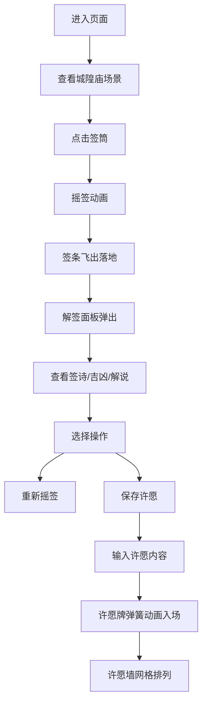

## 1. 产品概述
城隍庙摇签祈福系统是一款模拟传统求签仪式的全栈Web应用，通过CSS动画还原古代城隍庙内殿场景，实现签筒摇签、签条飞出、解签面板展示等核心交互，同时提供许愿墙功能记录香客祈福心愿。

- 核心目的：解决传统求签流程中签文内容、摇签力度与签号落地的随机性问题，以及香客许愿记录无法长期保存和追溯的问题
- 目标用户：对传统文化感兴趣、寻求线上祈福体验的互联网用户
- 市场价值：将传统民俗文化与现代Web技术结合，创造沉浸式的线上祈福体验，具有文化传播和娱乐价值

## 2. 核心功能

### 2.1 用户角色
| 角色 | 注册方式 | 核心权限 |
|------|----------|----------|
| 香客 | 自动生成会话ID | 摇签求签、查看解签、悬挂许愿牌、查看个人许愿记录 |

### 2.2 功能模块
1. **庙殿场景模块**：CSS绘制宋代城隍庙内殿，包含青砖地面、红木柱、城隍神龛、签筒、蒲团
2. **摇签动画模块**：签筒摇晃动画、签条飞出抛物线轨迹、落签效果
3. **解签面板模块**：毛玻璃效果面板，展示签号、签诗、吉凶等级、解说文字
4. **许愿墙模块**：木质许愿牌悬挂、弹簧动画入场、网格排列、自动移除旧牌
5. **后端服务模块**：签文数据接口、许愿记录接口、会话管理

### 2.3 页面详情
| 页面名称 | 模块名称 | 功能描述 |
|----------|----------|----------|
| 主场景页 | 庙殿场景 | CSS绘制城隍庙内殿全景，签筒可点击触发摇签 |
| 主场景页 | 摇签动画 | 签筒左右摇晃0.5秒，签条抛物线飞出落于蒲团 |
| 主场景页 | 解签面板 | 半透明毛玻璃面板弹出，展示签文详情，支持重新摇签和保存许愿 |
| 主场景页 | 许愿墙 | 右侧许愿墙区域，展示许愿牌列表，支持新增许愿牌 |

## 3. 核心流程

### 3.1 摇签求签流程
用户进入页面 → 看到城隍庙内殿场景 → 点击签筒 → 签筒摇晃动画 → 签条飞出落于蒲团 → 解签面板弹出 → 查看签文详情 → 选择重新摇签或保存许愿

### 3.2 许愿流程
用户查看签文 → 点击"许愿记录"按钮 → 跳转至许愿墙输入许愿内容 → 输入20字以内许愿文 → 点击悬挂 → 许愿牌弹簧动画飞入许愿墙 → 自动排列成网格 → 超出5块时最旧的淡出移除

## 4. 用户界面设计

### 4.1 设计风格
- **主色调**：朱红#8b2500、木黄#d4a76a、青灰#6b7b6b
- **辅助色**：暗铜色#6b4e3a、浅木色#e8cf9c、木色#c47e3a
- **字体**：签诗使用楷体，正文使用系统宋体/衬线字体
- **布局**：左右两栏布局，左侧65%庙殿场景，右侧35%许愿墙
- **视觉效果**：毛玻璃半透明面板、CSS渐变绘制场景元素、弹簧动画效果

### 4.2 页面设计概述
| 页面名称 | 模块名称 | UI元素 |
|----------|----------|--------|
| 主场景页 | 庙殿场景 | 青砖地面#6b7b6b、两侧红木柱#8b2500、城隍神龛（暗铜色#6b4e3a袍服）、签筒（木纹黄#d4a76a，高60px直径40px）、蒲团 |
| 主场景页 | 摇签动画 | 签筒左右摇晃0.5秒（0.1秒间隔位移3px）、签条抛物线轨迹（translate+rotate 30度） |
| 主场景页 | 解签面板 | 半透明白#ffffffaa、模糊半径10px、缩放过渡0.8→1.0（0.3秒）、楷体#3a2a1a签诗 |
| 主场景页 | 许愿墙 | 木质许愿牌#e8cf9c（宽60px高80px）、输入框浅底深字#5d3a1a、弹簧动画stiffness:200 damping:20 |

### 4.3 响应式设计
- **桌面端**：左右两栏布局，左侧65%，右侧35%
- **移动端**（<768px）：上下堆叠布局，庙殿场景缩小至70%比例，许愿墙高度固定300px可滚动
- **触摸优化**：按钮最小触控区域44px，滚动区域惯性滚动支持

## 5. 性能要求
- 摇签到签条落地动画总时长 ≤ 1.2秒
- API响应时间 < 200ms（模拟）
- 许愿墙最多显示50块许愿牌时帧率 ≥ 50fps
