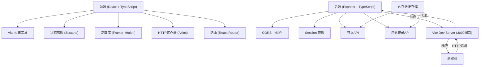
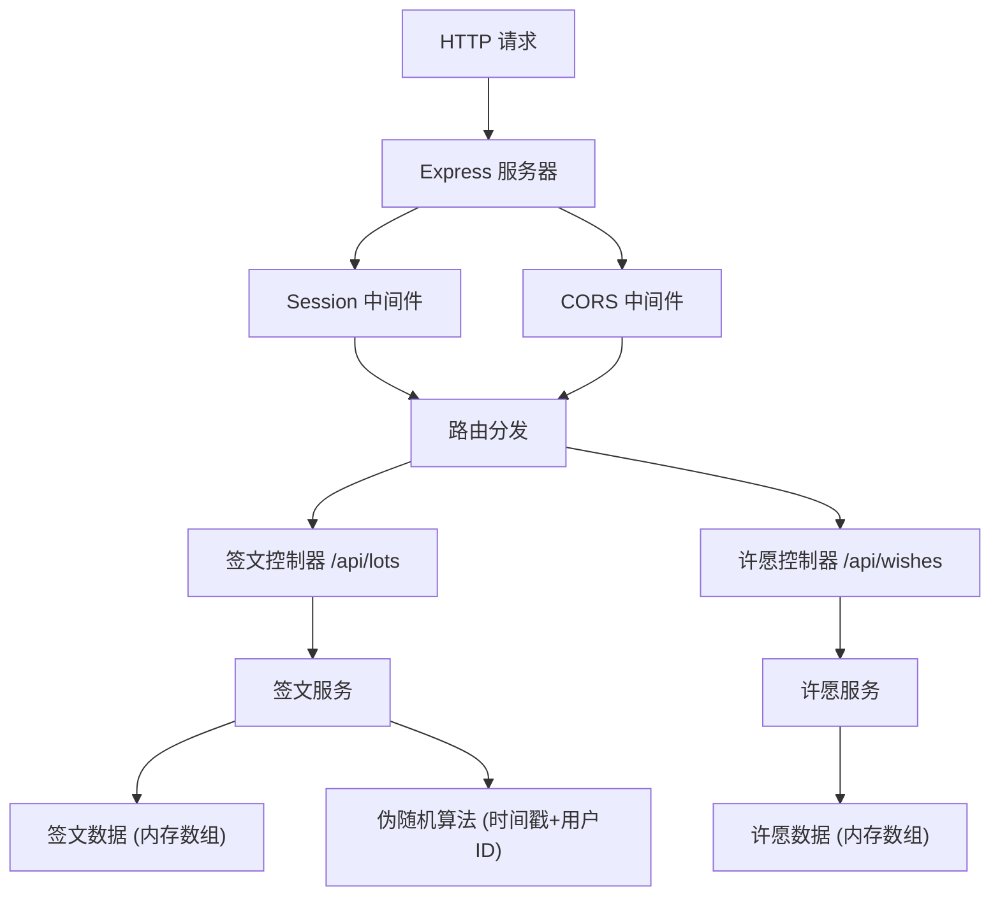
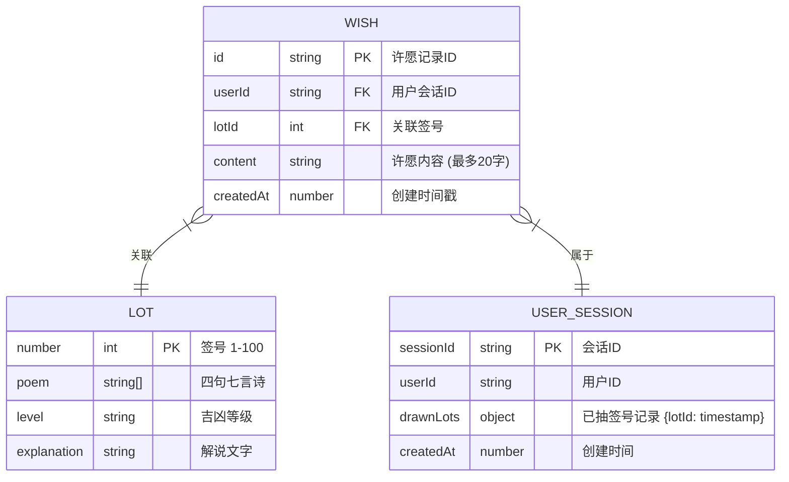

## 1. 架构设计



## 2. 技术描述

* **前端框架**：React\@18 + TypeScript

* **构建工具**：Vite\@5

* **状态管理**：Zustand\@4

* **动画库**：Framer Motion\@11

* **路由**：React Router DOM\@6

* **HTTP客户端**：Axios\@1

* **后端框架**：Express\@4

* **后端语言**：TypeScript

* **中间件**：CORS、express-session

* **数据存储**：内存数组（模拟）

* **开发代理**：Vite代理后端至localhost:5000

## 3. 路由定义

| 路由                  | 用途                       |
| ------------------- | ------------------------ |
| /                   | 主场景页面，包含庙殿场景、签筒、解签面板、许愿墙 |
| /api/lots/:id       | GET - 获取指定签号的签文数据        |
| /api/wishes         | POST - 保存许愿内容与关联签号       |
| /api/wishes/:userId | GET - 返回该用户所有许愿记录        |

## 4. API 定义

### 4.1 类型定义

```typescript
// 签文数据类型
interface Lot {
  id: number;
  number: number;
  poem: string[];  // 四句七言诗
  level: '上上' | '上吉' | '中吉' | '中平' | '中下' | '下下';
  explanation: string;
}

// 许愿记录类型
interface Wish {
  id: string;
  userId: string;
  lotId: number;
  content: string;
  createdAt: number;
}

// 摇签响应类型
interface DrawLotResponse {
  lot: Lot;
  timestamp: number;
}

// 保存许愿请求类型
interface SaveWishRequest {
  lotId: number;
  content: string;
}

// 保存许愿响应类型
interface SaveWishResponse {
  success: boolean;
  wish: Wish;
}

// 获取许愿列表响应类型
interface GetWishesResponse {
  wishes: Wish[];
}
```

### 4.2 接口详情

**GET /api/lots/:id**

* 描述：根据签号获取签文详情

* 参数：id (number, 1-100)

* 响应：`DrawLotResponse`

* 伪随机约束：同一用户1小时内不重复签号

**POST /api/wishes**

* 描述：保存许愿记录

* 请求体：`SaveWishRequest`

* 响应：`SaveWishResponse`

* 会话：通过session获取userId

**GET /api/wishes/:userId**

* 描述：获取用户所有许愿记录

* 参数：userId (string)

* 响应：`GetWishesResponse`

## 5. 服务端架构图



## 6. 数据模型

### 6.1 数据模型定义



### 6.2 初始化数据

**签文数据（100条）**：

* 每条签文包含：签号(1-100)、四句七言签诗、吉凶等级、解说文字

* 预先定义好所有100条签文数据存储在内存数组中

**会话数据**：

* 用户首次访问时生成session和userId

* 记录用户已抽签号及时间戳，用于1小时去重逻辑

## 7. 项目文件结构

```
├── package.json
├── vite.config.js
├── tsconfig.json
├── index.html
├── src/
│   ├── App.tsx              # 主应用组件，路由配置，全局状态
│   ├── components/
│   │   ├── TempleScene.tsx  # 庙殿场景、签筒摇签动画
│   │   ├── WishWall.tsx     # 许愿墙组件
│   │   └── LotPanel.tsx     # 解签面板组件
│   ├── store/
│   │   └── useStore.ts      # Zustand全局状态管理
│   ├── api/
│   │   └── index.ts         # API请求封装
│   ├── types/
│   │   └── index.ts         # TypeScript类型定义
│   └── utils/
│       └── random.ts        # 伪随机算法工具
└── server/
    ├── index.ts             # Express服务入口
    ├── data/
    │   └── lots.ts          # 100条签文数据
    ├── controllers/
    │   ├── lotController.ts # 签文接口控制器
    │   └── wishController.ts # 许愿接口控制器
    ├── services/
    │   ├── lotService.ts    # 签文业务逻辑
    │   └── wishService.ts   # 许愿业务逻辑
    └── types/
        └── index.ts         # 后端类型定义
```

## 8. 伪随机算法设计

```typescript
// 基于时间戳和用户ID的伪随机算法
function generateLotNumber(userId: string, drawnHistory: Record<number, number>): number {
  const now = Date.now();
  const ONE_HOUR = 60 * 60 * 1000;
  
  // 过滤掉超过1小时的记录
  const recentDrawn = Object.entries(drawnHistory)
    .filter(([_, timestamp]) => now - timestamp < ONE_HOUR)
    .map(([lotId]) => parseInt(lotId));
  
  // 生成可用签号池
  const availableLots = Array.from({ length: 100 }, (_, i) => i + 1)
    .filter(n => !recentDrawn.includes(n));
  
  if (availableLots.length === 0) {
    // 全部抽完时重置（理论上不会发生，1小时100次）
    return Math.floor(Math.random() * 100) + 1;
  }
  
  // 基于用户ID和时间戳生成伪随机索引
  const seed = parseInt(userId.replace(/\D/g, '').slice(0, 8) || '0') + now;
  const randomIndex = seed % availableLots.length;
  
  return availableLots[randomIndex];
}
```

