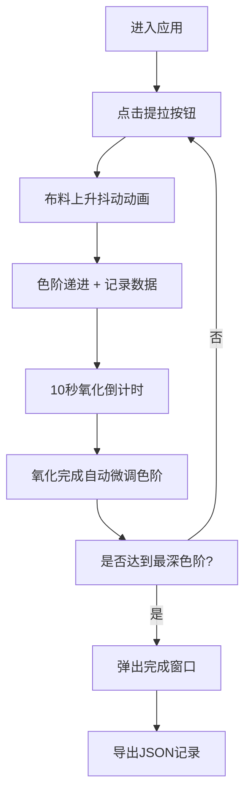

## 1. 产品概述

古代蓝染浸染氧化过程模拟互动应用，让用户体验明代染匠学徒的蓝染工艺操作流程，通过反复提拉布料观察色阶变化，记录每次浸染数据，最终完成一匹完美的蓝染布匹。

- 主要用途：文化体验、工艺教学、互动展示
- 目标用户：手工艺爱好者、文化学习者、普通网民
- 产品价值：以互动形式传承传统蓝染技艺，寓教于乐

## 2. 核心功能

### 2.1 用户角色

| 角色 | 注册方式 | 核心权限 |
|------|----------|----------|
| 访客用户 | 无需注册 | 完整体验蓝染操作、记录浸染数据、导出记录 |

### 2.2 功能模块

1. **染缸操作区**：半圆形染缸、布料提拉动画、气泡效果、氧化计时器
2. **浸染记录表**：时间线卡片展示、色块预览、历史回退功能
3. **完成弹窗**：全流程时间线展示、JSON记录导出

### 2.3 页面详情

| 页面名称 | 模块名称 | 功能描述 |
|----------|----------|----------|
| 主页面 | 染缸操作区 | 点击"提拉一次"按钮触发布料上升抖动动画，颜色向深蓝过渡一个色阶；氧化倒计时10秒内按钮禁用；氧化完成自动微调色阶 |
| 主页面 | 浸染记录表 | 右侧时间线卡片列表，显示轮次、色值、氧化时长；点击卡片可回退到历史色阶 |
| 主页面 | 完成弹窗 | 达到最深色阶时弹出，展示完整时间线，提供JSON导出按钮 |

## 3. 核心流程

用户进入应用 → 点击提拉按钮 → 布料上升抖动 + 色阶递进 → 记录当前轮次数据 → 开始10秒氧化倒计时 → 氧化完成自动微调色阶 → 重复操作直至最深色阶 → 弹出完成窗口 → 导出浸染记录

## 4. 用户界面设计

### 4.1 设计风格

- 主色调：暖米色背景(#f0ead6)、陶土色染缸(#8b5e3c)、深棕底座(#5a3d2b)、靛蓝色系渐变
- 按钮风格：圆角按钮，悬停有上浮效果，禁用状态灰色
- 字体：思源宋体（Source Han Serif），古典雅致
- 布局风格：左右两栏（左侧60%染缸区，右侧40%记录表），卡片式设计
- 视觉细节：染液径向渐变、布料颜色动态过渡、气泡漂浮动画、水滴抖落效果

### 4.2 页面设计概述

| 页面名称 | 模块名称 | UI元素 |
|----------|----------|--------|
| 主页面 | 染缸操作区 | 半圆形陶土染缸(直径300px)、渐变布料(60x180px)、圆形底座、三个漂浮气泡、提拉按钮、氧化倒计时显示 |
| 主页面 | 浸染记录表 | 卡片列表(圆角8px，浅米色#f5f0e1背景)、10x10px色块预览、轮次编号、时间戳、氧化时长 |
| 主页面 | 完成弹窗 | 半透明遮罩、时间线展示、导出按钮 |

### 4.3 响应式

- 桌面端优先设计，左右两栏布局
- 移动端自适应为上下布局，染缸区在上，记录表在下
- 按钮和触摸区域优化，最小点击区域44px

### 4.4 动效设计

- 提拉动画：布料从底部向上滑出 + 抖动效果(0.6s)
- 颜色过渡：ease-in-out 缓动(0.5s)
- 气泡动画：4s循环随机漂浮，提拉时缩放至0淡出(0.3s)
- 卡片悬停：上浮2px + 背景变深(#e8dcc8)
- 列表滚动条：自定义窄条(宽4px，颜色#8b5e3c)
