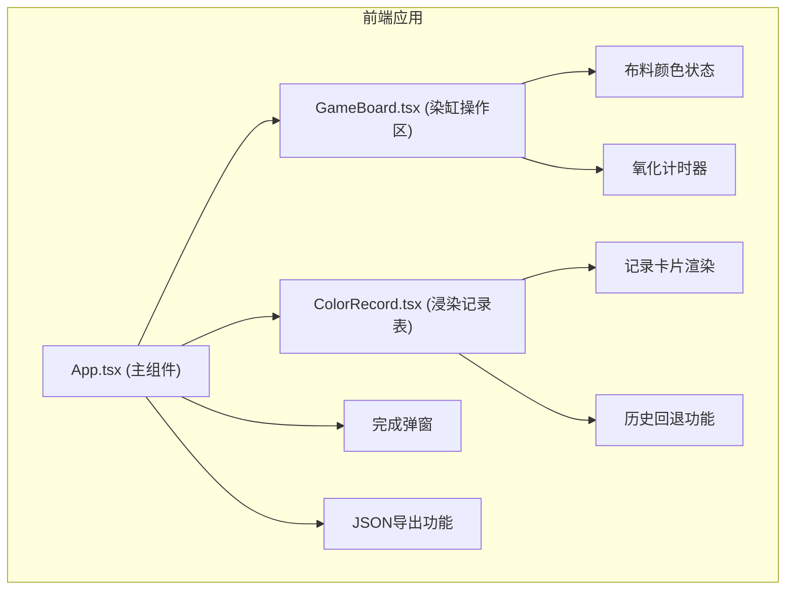
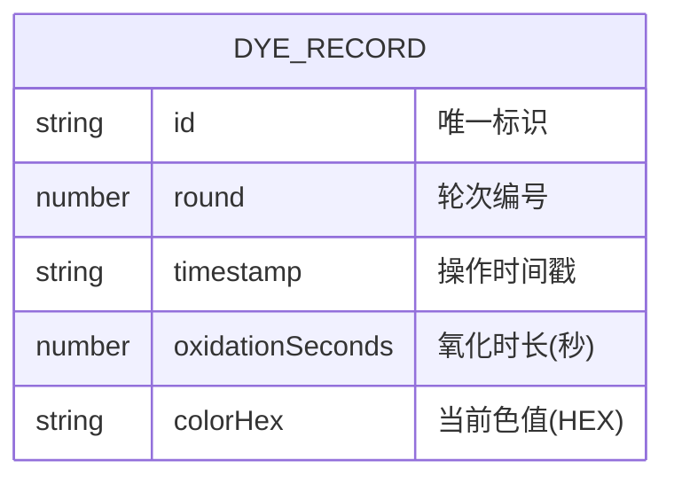

## 1. 架构设计



## 2. 技术描述

- 前端框架：React 18 + TypeScript
- 构建工具：Vite 5
- 动画库：framer-motion
- 唯一ID生成：uuid
- 语言：TypeScript (严格模式，target ES2020)
- 后端：无（纯前端应用）
- 数据库：无（数据存储在内存中）

## 3. 技术栈说明

| 技术 | 版本 | 用途 |
|------|------|------|
| react | ^18.2.0 | 前端框架 |
| react-dom | ^18.2.0 | React DOM渲染 |
| typescript | ^5.4.0 | 类型安全 |
| vite | ^5.2.0 | 构建工具 |
| @vitejs/plugin-react | ^4.2.0 | Vite React插件 |
| framer-motion | ^11.0.0 | 动画库 |
| uuid | ^9.0.0 | 唯一ID生成 |
| @types/uuid | ^9.0.0 | uuid类型定义 |

## 4. 文件结构与职责

```
src/
├── App.tsx              # 主组件，状态管理，数据流向控制
├── components/
│   ├── GameBoard.tsx    # 染缸与布料操作区
│   └── ColorRecord.tsx  # 浸染记录表
├── types/
│   └── index.ts         # 类型定义
└── utils/
    └── colorUtils.ts    # 颜色计算工具函数
```

### 调用关系与数据流向

1. **App.tsx → GameBoard.tsx**
   - 传递：当前色值、氧化倒计时状态、回调函数
   - 接收：提拉操作触发、新色值计算结果

2. **GameBoard.tsx → App.tsx**
   - 调用 `onLift` 回调：传递当前色值、氧化时长
   - 数据流向：用户点击 → 色值计算 → 向上传递

3. **App.tsx → ColorRecord.tsx**
   - 传递：浸染记录数组、历史回退回调
   - 数据流向：App状态更新 → 记录表重新渲染

4. **ColorRecord.tsx → App.tsx**
   - 调用 `onRevert` 回调：传递目标记录的色值和索引
   - 数据流向：用户点击历史卡片 → 触发回退操作

## 5. 数据模型

### 5.1 数据模型定义



### 5.2 类型定义

```typescript
interface DyeRecord {
  id: string;
  round: number;
  timestamp: string;
  oxidationSeconds: number;
  colorHex: string;
}

interface ColorStage {
  hex: string;
  stage: number;
}
```

### 5.3 预设色阶

共10个色阶，从淡绿到深蓝：
1. #b5d8a7 (淡绿)
2. #8fc27e
3. #6ba85e
4. #4f8b4d
5. #35703a
6. #1f562b
7. #154024
8. #0e2e1c
9. #061e12
10. #0a2c5d (深蓝)

## 6. 核心算法

### 6.1 颜色偏移算法

- 氧化完成自动微调：向更深色阶偏移约5%（半个色阶）
- 使用RGB线性插值计算中间色值
- 支持在两个预设色阶之间进行插值

### 6.2 性能优化

- 动画使用CSS transform和opacity，保证60fps
- 记录列表最多保留50条，超出自动移除最早记录
- 使用React.memo优化卡片组件重渲染
- 定时器使用useRef管理，避免内存泄漏

## 7. 配置文件

### 7.1 package.json

- 启动脚本：`npm run dev`
- 依赖：react、react-dom、typescript、vite、@vitejs/plugin-react、framer-motion、uuid

### 7.2 tsconfig.json

- 严格模式：strict: true
- target: ES2020
- jsx: react-jsx

### 7.3 vite.config.js

- 基础React插件配置
- 端口：默认5173
