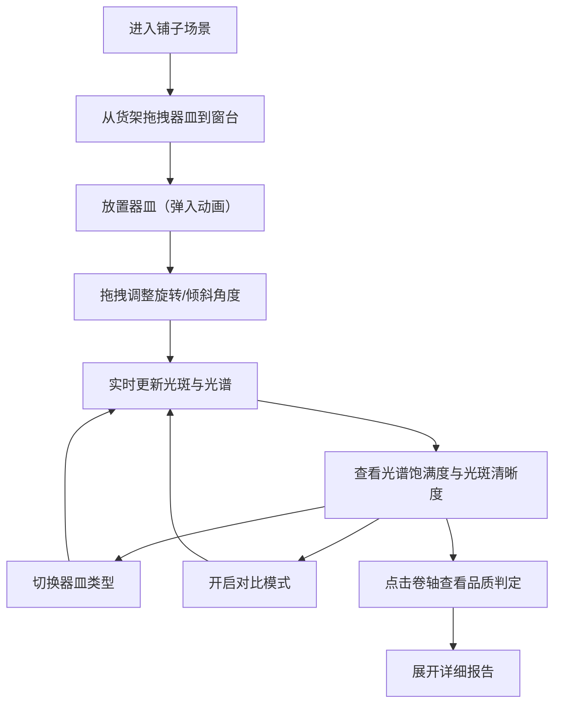

## 1. 产品概述

本产品是一个基于浏览器的唐代琉璃器皿铺交互模拟器，用户可以扮演唐代西市的琉璃鉴赏家，通过拖拽调整琉璃器皿的角度，实时观察光线折射产生的色散光谱和光斑变化，以此判断琉璃的品质等级。

- 核心价值：将古代琉璃鉴赏与现代光学物理结合，提供沉浸式、教育性的交互体验
- 目标用户：对中国古代文化、物理光学或互动艺术感兴趣的用户

## 2. 核心功能

### 2.1 用户角色
| 角色 | 注册方式 | 核心权限 |
|------|----------|----------|
| 鉴赏者 | 无需注册 | 浏览铺子场景、拖拽器皿、调整角度、查看品质判定、对比不同器皿 |

### 2.2 功能模块
1. **铺子场景模块**：CSS绘制唐代西市琉璃铺剖面，包含青砖地面、胡桃木货架、木框窗户、斜向光束等元素
2. **器皿交互模块**：支持从货架拖拽器皿到窗台，通过鼠标拖拽调整旋转角度（0-360°）和倾斜角度（0-90°）
3. **折射计算模块**：根据入射角、材质折射率、壁厚实时计算色散光谱和光斑形状
4. **品质判定模块**：根据光谱饱满度（0-100分）和光斑清晰度（清晰/半模糊/模糊）综合评定等级（劣等/中等/上等/极品）
5. **器皿切换模块**：三种预设器皿（执壶/高足杯/扁瓶）一键切换，支持对比模式并排显示
6. **结果展示模块**：古风卷轴样式展示品质结果，可展开详细报告

### 2.3 页面详情
| 页面名称 | 模块名称 | 功能描述 |
|----------|----------|-------------|
| 主场景页 | 铺子场景渲染 | CSS绘制唐代琉璃铺内景，包含地面、货架、窗户、光源 |
| 主场景页 | 器皿拖拽交互 | 从货架拖拽器皿到窗台光束下方，放置时有弹入动画 |
| 主场景页 | 角度调整控制 | 鼠标拖拽调整旋转和倾斜角度，每1度更新一次折射效果 |
| 主场景页 | 光谱与光斑显示 | 左侧墙面显示光斑，地面显示色散光谱带 |
| 主场景页 | 品质评分面板 | 实时显示光谱饱满度分数、光斑清晰度等级 |
| 主场景页 | 器皿切换器 | 三种器皿一键切换，支持对比模式 |
| 主场景页 | 古风卷轴结果 | 点击卷轴展开详细品质报告，含折射率、色散角、光斑评级 |

## 3. 核心流程

用户进入应用后，首先看到唐代琉璃铺的场景，货架上陈列着三种琉璃器皿。用户从货架拖拽一只执壶到窗台的光束下方，然后通过鼠标拖拽调整执壶的旋转角度和倾斜角度，系统实时计算并显示墙面光斑和地面色散光谱。用户可以切换不同材质的器皿观察折射差异，或开启对比模式并排比较。当用户对当前角度满意时，点击品质判定卷轴查看综合评级和详细报告。

## 4. 用户界面设计

### 4.1 设计风格
- **主色调**：唐代宫廷红绿配色，墙面浅米色#f5e6cc，地板青砖灰#6b7b6b，货架胡桃木深褐#5d3a1a，窗框棕红#8b4513
- **按钮样式**：圆角+浅投影（shadow为#3a3a3a 30%透明度），毛边纸质纹理背景
- **字体**：竖排繁体小楷用于卷轴评语，正文使用清晰易读的中文字体
- **布局风格**：CSS绘制的剖面场景，层次分明，左侧为墙面区域，右侧为窗户和货架
- **视觉细节**：CSS linear-gradient叠加noise图层的米色底，半透明渐变光束，毛边纸质纹理

### 4.2 页面设计概述
| 页面名称 | 模块名称 | UI元素 |
|----------|----------|--------|
| 主场景页 | 铺子场景 | 青砖地面、三层胡桃木货架、方形木框窗、斜向白光光束、灰白窗台、左侧深色木板墙面 |
| 主场景页 | 琉璃器皿 | 执壶（半透明渐变#a8d8ea到#e0f7fa，CSS clip-path绘制壶柄弧线）、高足杯、扁瓶，各有独特造型 |
| 主场景页 | 色散光谱带 | 宽160px高20px，从紫色#8b00ff渐变到红色#ff0000，包含靛蓝、蓝、绿、黄、橙等中间色 |
| 主场景页 | 光斑显示 | 左侧墙面上的光斑，形状从圆形到椭圆到不规则多边形 |
| 主场景页 | 品质卷轴 | 米黄色#f5deb3底面，竖排繁体小楷，可展开/收起，带分数条和光谱图 |
| 主场景页 | 器皿切换器 | 三个器皿图标按钮，对比模式切换开关 |
| 主场景页 | 角度指示器 | 实时显示当前旋转角度和倾斜角度数值 |

### 4.3 响应式设计
- 设计优先：桌面端（800px-1440px）
- 自适应规则：器皿和光谱带等比缩放，小屏（<800px）时货架由横向变为纵向排列
- 触摸优化：移动端支持触摸拖拽调整角度，触摸区域适当放大

### 4.4 动画与交互
- 角度调整动画：所有角度调整0.2s ease-out平滑过渡
- 器皿放置动画：0.3s弹入动画（缩放1.02→1）
- 拖拽反馈：光标变为抓取手形，拖拽时有轻微缩放效果
- 卷轴展开/收起：平滑的高度过渡动画
- 光谱更新：颜色渐变平滑过渡，无明显跳变
