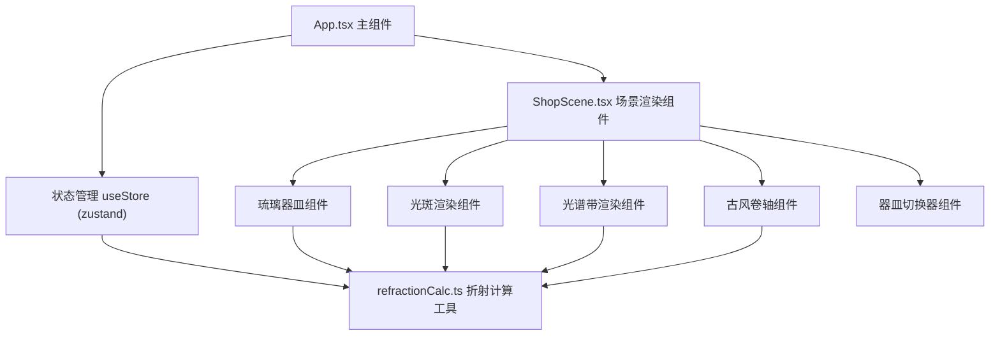

## 1. 架构设计

本项目为纯前端React应用，无需后端服务。采用组件化架构，状态管理使用zustand，动画效果使用framer-motion，整体遵循单向数据流原则。



## 2. 技术描述

* **前端框架**：React 18 + TypeScript

* **构建工具**：Vite 5

* **状态管理**：zustand 4

* **动画库**：framer-motion 11

* **样式方案**：原生CSS + CSS变量 + framer-motion动画

* **无后端**：纯前端应用，所有计算在浏览器端完成

## 3. 项目文件结构

| 文件路径                                | 用途                          |
| ----------------------------------- | --------------------------- |
| `package.json`                      | 项目依赖与脚本配置                   |
| `vite.config.js`                    | Vite构建配置                    |
| `tsconfig.json`                     | TypeScript编译配置（严格模式，ES2020） |
| `index.html`                        | 入口HTML页面，加载字体和基础样式          |
| `src/App.tsx`                       | 主组件，整体布局协调与状态管理             |
| `src/components/ShopScene.tsx`      | 场景渲染组件，CSS绘制铺子场景，处理用户交互     |
| `src/components/GlassVessel.tsx`    | 琉璃器皿组件，渲染不同造型的器皿            |
| `src/components/LightSpot.tsx`      | 光斑渲染组件，显示墙面光斑               |
| `src/components/SpectrumBand.tsx`   | 光谱带渲染组件，显示色散光谱              |
| `src/components/QualityScroll.tsx`  | 古风卷轴组件，展示品质判定结果             |
| `src/components/VesselSwitcher.tsx` | 器皿切换器组件，切换器皿类型和对比模式         |
| `src/utils/refractionCalc.ts`       | 折射与光谱计算工具模块                 |
| `src/store/useStore.ts`             | zustand状态管理store            |

## 4. 核心数据类型定义

```typescript
// 器皿类型
type VesselType = 'ewer' | 'goblet' | 'flatBottle';

// 材质信息
interface Material {
  name: string;
  refractiveIndex: number; // 折射率
  wallThickness: number; // 壁厚（mm）
}

// 器皿状态
interface VesselState {
  type: VesselType;
  rotation: number; // 旋转角度 0-360°
  tilt: number; // 倾斜角度 0-90°
  isOnSill: boolean; // 是否在窗台上
  isDragging: boolean; // 是否正在拖拽
  position: { x: number; y: number }; // 当前位置
}

// 光谱数据
interface SpectrumData {
  wavelengths: number[]; // 波长数组（380-780nm）
  intensities: number[]; // 对应强度 0-1
  colorStops: { color: string; position: number }[]; // CSS渐变色标
  fullnessScore: number; // 光谱饱满度 0-100
}

// 光斑数据
interface LightSpotData {
  shape: 'circle' | 'ellipse' | 'polygon';
  position: { x: number; y: number };
  size: { width: number; height: number };
  blurRadius: number; // 模糊半径
  clarity: 'clear' | 'semi' | 'blurred'; // 清晰度
  rotation: number;
}

// 品质等级
type QualityGrade = 'inferior' | 'medium' | 'superior' | 'exquisite';

// 品质判定结果
interface QualityResult {
  grade: QualityGrade;
  gradeText: string; // 繁体评语
  fullnessScore: number;
  clarityLevel: string;
  measuredRefractiveIndex: number;
  dispersionAngle: number;
  spotRating: string;
  detailedReport: string;
}

// 对比模式状态
interface CompareMode {
  enabled: boolean;
  leftVessel: VesselState;
  rightVessel: VesselState;
}
```

## 5. 状态管理Store定义

```typescript
// zustand store 接口
interface AppState {
  // 主器皿状态
  currentVessel: VesselState;
  // 对比模式
  compareMode: CompareMode;
  // 计算结果
  spectrumData: SpectrumData | null;
  lightSpotData: LightSpotData | null;
  qualityResult: QualityResult | null;
  // 卷轴状态
  scrollExpanded: boolean;
  // Actions
  setVesselType: (type: VesselType) => void;
  setRotation: (rotation: number) => void;
  setTilt: (tilt: number) => void;
  setVesselPosition: (x: number, y: number) => void;
  placeVesselOnSill: () => void;
  setDragging: (isDragging: boolean) => void;
  toggleCompareMode: () => void;
  setCompareVesselType: (type: VesselType) => void;
  calculateRefraction: () => void;
  evaluateQuality: () => void;
  toggleScroll: () => void;
  resetScene: () => void;
}
```

## 6. 折射计算模块接口

```typescript
// 计算入射角
function calculateIncidentAngle(rotation: number, tilt: number): number;

// 计算折射角（斯涅尔定律）
function calculateRefractionAngle(incidentAngle: number, refractiveIndex: number): number;

// 计算色散光谱
function calculateSpectrum(
  incidentAngle: number,
  refractiveIndex: number,
  wallThickness: number
): SpectrumData;

// 计算光斑数据
function calculateLightSpot(
  incidentAngle: number,
  refractiveIndex: number,
  vesselType: VesselType,
  rotation: number,
  tilt: number
): LightSpotData;

// 计算光谱饱满度分数
function calculateFullnessScore(spectrum: SpectrumData): number;

// 评定光斑清晰度
function evaluateClarity(blurRadius: number): 'clear' | 'semi' | 'blurred';

// 综合品质评定
function evaluateQuality(
  fullnessScore: number,
  clarity: 'clear' | 'semi' | 'blurred',
  refractiveIndex: number
): QualityResult;
```

## 7. 性能优化策略

1. **计算缓存**：使用useMemo缓存折射计算结果，仅在角度或材质变化时重新计算
2. **节流更新**：拖拽时使用requestAnimationFrame确保60FPS，每1度更新一次
3. **预加载数据**：切换器皿时预计算对比器皿的光谱数据，切换延迟<100ms
4. **CSS硬件加速**：使用transform和opacity属性实现动画，触发GPU加速
5. **组件拆分**：将大组件拆分为小组件，避免不必要的重渲染
6. **状态最小化**：zustand中只存储必要状态，派生数据通过计算获得

## 8. 开发规范

* **TypeScript严格模式**：启用所有严格类型检查

* **组件命名**：PascalCase命名组件，camelCase命名函数和变量

* **样式管理**：使用CSS变量定义主题色，组件内使用scoped样式

* **性能约束**：角度调整后16ms内完成计算和渲染，确保60FPS

* **代码组织**：工具函数纯函数化，便于测试和维护

