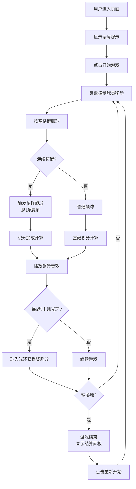

## 1. 产品概述

本产品是一款基于浏览器的古代蹴鞠训练场颠球技巧挑战游戏，让用户体验宋代汴京瓦舍中蹴鞠艺人的训练生活。用户通过键盘操作控制角色使用不同身体部位连续颠球，避免球落地，根据表现获得积分与称号。

- 核心目标：提供沉浸式的古代蹴鞠文化体验，结合物理模拟和技巧挑战的游戏性
- 目标用户：对中国传统文化和休闲小游戏感兴趣的网民
- 产品价值：融合传统文化传播与游戏娱乐，打造独特的互动体验

## 2. 核心功能

### 2.1 用户角色
无需注册，游客即可体验全部游戏内容。

### 2.2 功能模块
1. **游戏主场景**：宋代风格训练场，包含物理模拟和用户交互
2. **角色控制系统**：键盘控制球员移动和颠球动作
3. **物理引擎**：球的抛物线运动、反弹轨迹计算、落地检测
4. **计分系统**：积分计算、连续次数统计、称号评定
5. **奖励机制**：金色光环额外奖励、花样颠球积分加成
6. **音效系统**：Web Audio API生成古代铜铃音效

### 2.3 页面详情
| 页面名称 | 模块名称 | 功能描述 |
|---------|---------|---------|
| 游戏主页 | 训练场场景 | CSS绘制宋代训练场，包含青砖地面、木栏杆、蓝天白云飞鸟 |
| 游戏主页 | 球员角色 | Q版宋代蹴鞠艺人，幞头、圆领袍、布靴造型 |
| 游戏主页 | 蹴鞠球 | 皮革质感圆形球体，径向渐变和条纹纹理 |
| 游戏主页 | 计分板 | 显示当前积分、连续颠球次数、花样等级 |
| 游戏主页 | 进度条 | 显示距离下一称号的进度，三色渐变 |
| 游戏结束页 | 结算面板 | 显示总得分、最高连颠次数、获得称号、重新开始按钮 |

## 3. 核心流程

用户打开页面后看到全屏提示，点击进入游戏。使用方向键移动球员，空格键颠球。连续按键可触发花样颠球（膝顶、肩顶）获得额外积分。每隔5秒出现金色光环，将球颠入光环可获得奖励分。球落地后游戏结束，显示结算面板，可点击重新开始。

## 4. 用户界面设计

### 4.1 设计风格
- **设计主题**：宋代古典风格，还原汴京瓦舍训练场氛围
- **主色调**：青砖灰#6b7b6b、木色#6b4e3a、朱红#c0392b、土黄#d4a76a、金色#ffd700、天蓝#87ceeb
- **字体**：使用具有古典韵味的字体，标题使用书法风格字体，正文使用清晰易读的宋体类字体
- **动画风格**：流畅优雅，使用Framer Motion实现过渡动画，帧率不低于50FPS
- **视觉元素**：CSS绘制的宋代建筑元素、飞鸟剪影、古典纹饰

### 4.2 页面设计概述
| 页面名称 | 模块名称 | UI元素 |
|---------|---------|---------|
| 游戏主页 | 训练场背景 | 淡蓝天幕#87ceeb、飞鸟剪影（CSS伪元素随机位置）、青砖地面#6b7b6b、木栏杆#6b4e3a高20px |
| 游戏主页 | 球员角色 | 64px Q版人物：幞头#1a1a1a、圆领窄袖袍#c0392b、腰带#d4a76a、布靴#8b8b8b，CSS渐变绘制 |
| 游戏主页 | 蹴鞠球 | 直径24px，径向渐变#d4a76a到#6b4e3a，隐约条纹纹理 |
| 游戏主页 | 金色光环 | 直径60px，半透明放射渐变，持续2秒，出现在球附近 |
| 游戏主页 | 计分板 | 顶部固定，显示积分、连击数、当前花样等级 |
| 游戏主页 | 进度条 | 底部固定，三色渐变#d4a76a→#c0392b→#ffd700 |
| 游戏主页 | 浮动数字 | 颠球时球上方弹出积分数字，CSS缩放动画 |
| 结算面板 | 称号展示 | 蹴鞠新手<10、瓦舍艺人10-50、汴京高手50-200、天下第一>200 |
| 结算面板 | 统计数据 | 总得分、最高连颠次数、获得称号 |
| 结算面板 | 重新开始按钮 | 古典风格按钮，悬停动效 |

### 4.3 响应式设计
- 桌面端（>=1024px）：训练场和球员原始尺寸
- 平板端（768-1023px）：整体缩放0.8倍
- 移动端（<768px）：整体缩放0.6倍
- 计分板始终固定在屏幕顶部可见
- 进度条始终固定在屏幕底部可见

### 4.4 交互设计
- **方向键**：控制球员左右移动
- **空格键**：颠球，单按普通颠球，连续按键触发花样颠球
- **踢腿动画**：颠球时球员腿部动画
- **球反弹**：抛物线轨迹，真实物理模拟
- **称号弹出**：获得新称号时的动画效果
- **金色光环**：出现和消失的淡入淡出动画

## 5. 性能要求
- 物理模拟更新频率：>=60Hz
- 动画帧率：>=50FPS
- 落地检测误差：<=2px
- 每次按键最多触发一次反弹，避免连击抖动
