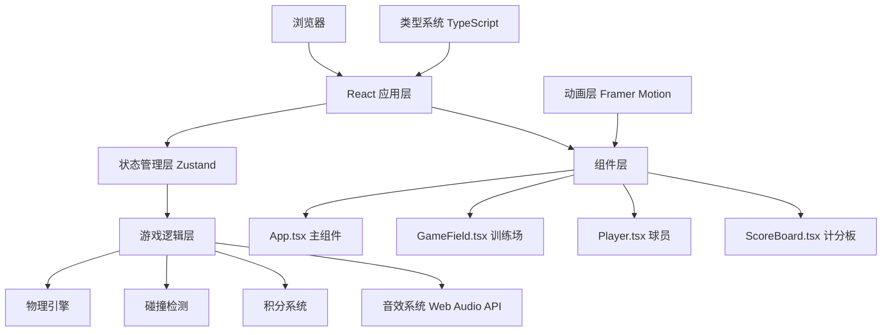

## 1. 架构设计



## 2. 技术描述

* **前端框架**：React\@18 + TypeScript

* **构建工具**：Vite\@5 + @vitejs/plugin-react

* **状态管理**：Zustand

* **动画库**：Framer Motion

* **音效**：Web Audio API（原生）

* **样式**：CSS Modules / 内联样式 + CSS变量

* **无需后端**：纯前端应用，无服务端依赖

## 3. 项目结构

```
auto111/
├── package.json
├── vite.config.js
├── tsconfig.json
├── index.html
└── src/
    ├── App.tsx          # 主组件，游戏状态管理和布局
    ├── GameField.tsx    # 训练场组件，物理模拟和用户交互
    ├── Player.tsx       # 球员组件，动画和碰撞检测
    ├── ScoreBoard.tsx   # 计分板组件，积分和等级显示
    └── types.ts         # 类型定义和常量
```

## 4. 核心数据模型

### 4.1 游戏状态

```typescript
interface GameState {
  status: 'idle' | 'playing' | 'gameover';
  score: number;
  combo: number;
  maxCombo: number;
  totalJuggles: number;
  currentTrick: TrickType;
  title: TitleType;
  ballPosition: Position;
  ballVelocity: Velocity;
  playerPosition: Position;
  goldenRing: GoldenRing | null;
  lastJuggleTime: number;
  consecutiveKeys: number;
}
```

### 4.2 类型定义

```typescript
type TrickType = 'normal' | 'knee' | 'shoulder';
type TitleType = '新手' | '瓦舍艺人' | '汴京高手' | '天下第一';

interface Position {
  x: number;
  y: number;
}

interface Velocity {
  vx: number;
  vy: number;
}

interface GoldenRing {
  x: number;
  y: number;
  createdAt: number;
  duration: number;
}

interface JuggleResult {
  points: number;
  trick: TrickType;
  inGoldenRing: boolean;
}
```

### 4.3 常量定义

```typescript
const GRAVITY = 0.5;
const BALL_RADIUS = 12;
const PLAYER_WIDTH = 64;
const PLAYER_HEIGHT = 96;
const JUGGLE_FORCE = -12;
const GOLDEN_RING_INTERVAL = 5000;
const GOLDEN_RING_DURATION = 2000;
const GOLDEN_RING_BONUS = 50;

const TRICK_POINTS: Record<TrickType, number> = {
  normal: 10,
  knee: 20,
  shoulder: 30,
};

const TITLE_THRESHOLDS: Record<TitleType, number> = {
  '新手': 0,
  '瓦舍艺人': 10,
  '汴京高手': 50,
  '天下第一': 200,
};
```

## 5. 核心模块说明

### 5.1 物理引擎（GameField.tsx）

* 使用requestAnimationFrame实现60Hz更新

* 抛物线运动计算：vy += gravity, y += vy, x += vx

* 落地检测：ball.y >= groundY - ballRadius（误差<=2px）

* 边界检测：限制球在训练场内运动

* 防抖处理：每次按键最多触发一次反弹

### 5.2 碰撞检测（Player.tsx）

* 球员与球的碰撞检测

* 球与金色光环的碰撞检测

* 使用矩形/圆形碰撞算法

### 5.3 积分系统

* 基础积分：根据花样类型计算

* 连击加成：连续颠球额外加成

* 光环奖励：球入光环额外+50分

* 称号评定：根据totalJuggles判定

### 5.4 音效系统

* Web Audio API生成铜铃音效

* 振荡器 + 增益节点 + 频率包络

* 不同花样对应不同音高

### 5.5 动画系统

* Framer Motion实现球员踢腿动画

* 球的反弹动画

* 浮动积分数字动画

* 金色光环淡入淡出

* 称号弹出动画

## 6. 响应式实现

* 使用CSS变量定义基准尺寸

* 媒体查询根据宽度设置缩放比例

* transform: scale()实现整体缩放

* position: fixed保证计分板和进度条始终可见

## 7. 性能优化

* 使用useRef存储高频更新的物理状态

* 使用requestAnimationFrame进行物理计算

* 避免不必要的重渲染

* 合理使用React.memo优化组件

