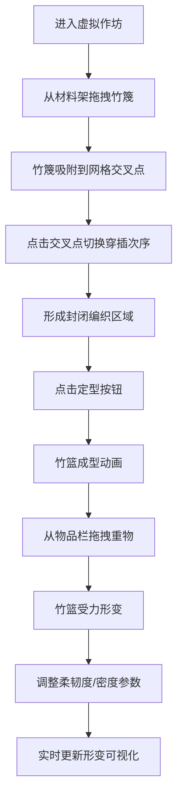

## 1. 产品概述

宋代江南竹编工艺交互可视化应用，通过3D仿真技术模拟竹篮编织全过程与成型后的受力形变，解决传统工艺中经纬篾片穿插次序、编织密度和柔韧度对成品影响无法直观预览的问题。面向竹编匠人、工艺爱好者和文化传承者，提供沉浸式的编织工艺学习与体验平台。

## 2. 核心功能

### 2.1 用户角色
| 角色 | 注册方式 | 核心权限 |
|------|----------|----------|
| 普通用户 | 无需注册，直接使用 | 完整的编织模拟、参数调整、承重测试体验 |

### 2.2 功能模块
1. **虚拟作坊场景**：宋代江南风格的3D竹编作坊，包含材料架、圆形操作台、定型按钮
2. **竹篾编织交互**：拖拽吸附、交叉点点击控制穿插次序、编织纹理选择（人字纹/十字纹）
3. **定型动画**：封闭多边形区域收缩为圆台形竹篮，带外翻唇口
4. **承重形变模拟**：重物拖拽放置、贝塞尔曲线插值形变、裂隙破损效果
5. **参数控制面板**：竹篾柔韧度滑块、编织密度滑块、实时状态栏

### 2.3 页面详情
| 页面名称 | 模块名称 | 功能描述 |
|----------|----------|----------|
| 主页面 | 3D编织场景 | Three.js渲染的宋代竹编作坊，支持拖拽竹篾、点击交叉点、定型动画、承重测试 |
| 主页面 | 左侧材料架 | 半透明磨砂玻璃效果，码放青竹篾，支持拖拽到操作台 |
| 主页面 | 上方物品栏 | 重物选择区（陶罐、木匣、竹扇），支持拖拽到竹篮中央 |
| 主页面 | 右侧控制面板 | 柔韧度滑块（0.3-0.9）、密度滑块（0.5-1.5）、定型按钮 |
| 主页面 | 底部状态栏 | 实时显示锁定交叉点数量、编织密度、承重值、变形百分比 |

## 3. 核心流程

用户进入应用后，首先看到3D渲染的宋代竹编作坊场景。从左侧材料架拖拽竹篾到中央操作台，竹篾自动吸附到经纬网格交叉点。点击已放置的交叉点可切换经纬篾的上下穿插次序。当编织区域形成封闭多边形后，点击定型按钮触发竹篮成型动画。成型后从上方物品栏拖拽重物到竹篮中央，观察受力形变和裂隙效果。通过右侧滑块调整柔韧度和密度参数，实时观察变形变化。

## 4. 用户界面设计

### 4.1 设计风格
- **主色调**：米黄#f5e6c8、竹绿#6b8e23、竹黄#d4a76a、青砖#7a8a7a、竹木#6b4e3a
- **背景色**：浅灰#e0d5c1
- **设计理念**：宋代江南美学，雅致古朴，突出竹编工艺的自然质感
- **字体**：标题使用"Ma Shan Zheng"书法字体，正文使用"Noto Serif SC"衬线字体
- **交互元素**：圆角设计，半透明磨砂玻璃效果（backdrop-filter: blur(8px)，不透明度0.85）
- **动画**：所有交互过渡0.2-0.3s，操作台呼吸光晕周期3秒

### 4.2 页面设计概述
| 页面名称 | 模块名称 | UI元素 |
|----------|----------|--------|
| 主页面 | 3D场景 | 青砖地面、竹木柱、材料架、圆形操作台带同心凹槽、动态光晕 |
| 主页面 | 材料架 | 左侧悬浮面板，磨砂玻璃效果，青竹篾渐变绿色（#6b8e23至#3a5f0b） |
| 主页面 | 物品栏 | 顶部悬浮面板，磨砂玻璃效果，三种重物图标 |
| 主页面 | 控制面板 | 右侧悬浮面板，滑块组（带刻度标签）、定型按钮（竹黄色，悬停变深） |
| 主页面 | 状态栏 | 底部悬浮条，实时数据显示，进度条样式 |

### 4.3 响应式设计
- **桌面端（>768px）**：三栏布局，左侧材料架、中央操作台、右侧控制面板，顶部物品栏
- **移动端（≤768px）**：上下堆叠布局，顶部物品栏，中间操作台，底部材料架和控制面板合并
- **画布分辨率**：随视口缩放，最低保持800x600

### 4.4 3D场景指引
- **环境**：柔和的宋代作坊自然光，环境光+方向光组合，阴影柔和
- **光照**：主光源从右上方45°入射，强度1.2，环境光强度0.6
- **相机**：PerspectiveCamera，初始位置(3, 3, 5)，看向原点，支持OrbitControls旋转查看
- **材质**：竹篾使用MeshStandardMaterial，带轻微粗糙度（0.6），操作台使用半透明材质
- **动画**：竹篾弹动使用弹簧物理模拟，定型动画使用lerp插值，形变使用贝塞尔曲线
- **性能**：400交叉点+30竹篾时帧率≥50FPS，响应时间≤150ms，使用InstancedMesh优化渲染
