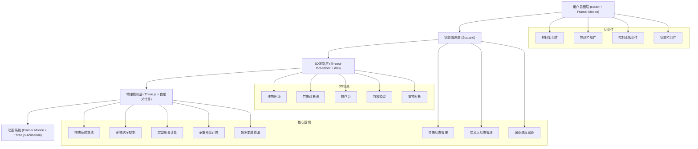

## 1. 架构设计



## 2. 技术说明

* **前端框架**：React\@18 + TypeScript\@5

* **构建工具**：Vite\@5 + @vitejs/plugin-react\@4

* **3D引擎**：Three\@0.160 + @react-three/fiber\@8 + @react-three/drei\@9

* **状态管理**：Zustand\@4

* **动画库**：Framer Motion\@11

* **样式方案**：原生CSS + CSS变量 + 响应式媒体查询

## 3. 目录结构

```
src/
├── App.tsx              # 主应用组件，集成Canvas和UI层
├── store.ts             # Zustand状态管理
├── types.ts             # TypeScript类型定义
├── WeavingCanvas.tsx    # Three.js编织操作场景
├── UIControls.tsx       # UI组件集合（材料架、物品栏、控制面板、状态栏）
└── index.css            # 全局样式和CSS变量
```

## 4. 数据模型

### 4.1 核心类型定义

```typescript
// 竹篾类型
interface BambooStrip {
  id: string;
  type: 'warp' | 'weft'; // 经篾或纬篾
  startX: number;
  startY: number;
  endX: number;
  endY: number;
  thickness: number;
  color: string;
  isPlaced: boolean;
  bounceOffset: number; // 弹动动画偏移
}

// 交叉点类型
interface Intersection {
  id: string;
  x: number;
  y: number;
  warpId: string;
  weftId: string;
  order: 'warp-over' | 'weft-over'; // 经压纬或纬压经
  isLocked: boolean;
  animationProgress: number;
}

// 重物类型
interface HeavyObject {
  id: string;
  type: 'pot' | 'box' | 'fan';
  weight: number; // 0.3-0.8 kg
  position: { x: number; y: number; z: number };
  isPlaced: boolean;
}

// 竹篮状态
interface BasketState {
  isFormed: boolean;
  formationProgress: number; // 0-1
  deformation: number; // 0-1
  maxDeformation: number; // 0.15单位
  loadCapacity: number; // 最大承重量
  cracks: Crack[];
}

// 裂隙类型
interface Crack {
  id: string;
  x: number;
  y: number;
  length: number;
  angle: number;
}

// 全局应用状态
interface AppState {
  bambooStrips: BambooStrip[];
  intersections: Intersection[];
  heavyObjects: HeavyObject[];
  basket: BasketState;
  flexibility: number; // 0.3-0.9
  density: number; // 0.5-1.5
  gridSpacing: number; // 0.12-0.15
  selectedPattern: 'herringbone' | 'cross'; // 人字纹或十字纹
  draggedStrip: string | null;
  draggedObject: string | null;
  lockedIntersectionCount: number;
  currentLoad: number;
}
```

### 4.2 核心常量

```typescript
// 网格参数
const DEFAULT_GRID_SPACING = 0.15;
const MIN_GRID_SPACING = 0.12;
const MAX_INTERSECTIONS = 400;

// 物理参数
const MAX_DEFLECTION = 0.15; // 最大下凹深度
const DEFLECTION_THRESHOLD = 0.1; // 裂隙出现阈值
const CRACK_LENGTH_MIN = 0.02;
const CRACK_LENGTH_MAX = 0.06;

// 动画参数
const FORMATION_DURATION = 1500; // ms
const INTERSECTION_ANIMATION_DURATION = 200; // ms
const BOUNCE_AMPLITUDE_MIN = 0.01;
const BOUNCE_AMPLITUDE_MAX = 0.03;

// 颜色常量
const COLORS = {
  floor: '#7a8a7a',
  pillar: '#6b4e3a',
  bambooStart: '#6b8e23',
  bambooEnd: '#3a5f0b',
  table: '#d4a76a',
  pressedBamboo: '#7cba5e',
  background: '#e0d5c1',
  primary: '#f5e6c8',
  accent: '#6b8e23',
};
```

## 5. 核心算法

### 5.1 网格吸附算法

```
输入：拖拽位置(x, y)
输出：最近的网格交叉点坐标
1. 计算网格间距 spacing = DEFAULT_GRID_SPACING / density
2. 计算吸附点 gridX = round(x / spacing) * spacing
3. 计算吸附点 gridY = round(y / spacing) * spacing
4. 限制在操作台范围内
5. 返回吸附点坐标
```

### 5.2 定型形变计算

```
输入：编织区域顶点数组，目标圆台参数
输出：形变后的顶点数组
1. 计算编织区域中心
2. 对每个顶点：
   a. 计算顶点到中心的距离r
   b. 计算目标半径：r_target = lerp(0.4, 1.0, t) （底部0.4，顶部1.0）
   c. 计算高度：y = lerp(0, 0.8, t) + 外翻唇口偏移
   d. 使用lerp在原始位置和目标位置间插值
3. 返回形变后的顶点
```

### 5.3 承重形变计算

```
输入：重物重量mass，柔韧度flex，密度dens
输出：形变网格
1. 计算最大形变 max_deflect = MAX_DEFLECTION * (mass / loadCapacity)
2. 对每个网格点(x, y)：
   a. 计算到中心的距离r
   b. 使用贝塞尔曲线计算形变：deflect = max_deflect * (1 - (r/R)^2)^2
   c. 调整柔韧度影响：deflect *= (1 / (0.3 + flex))
   d. 调整密度影响：deflect *= (1.5 / dens)
3. 若deflect > DEFLECTION_THRESHOLD，生成随机裂隙
4. 返回形变网格
```

## 6. 性能优化策略

1. **InstancedMesh**：使用实例化网格渲染大量竹篾，减少draw call
2. **对象池**：预分配竹篾和交叉点对象，避免频繁GC
3. **按需更新**：仅在参数变化时重新计算形变
4. **LOD**：远景使用简化模型
5. **Web Workers**：将复杂的物理计算移至Worker线程
6. **requestAnimationFrame**：所有动画使用RAF同步
7. **状态选择器**：使用Zustand的selector避免不必要重渲染

