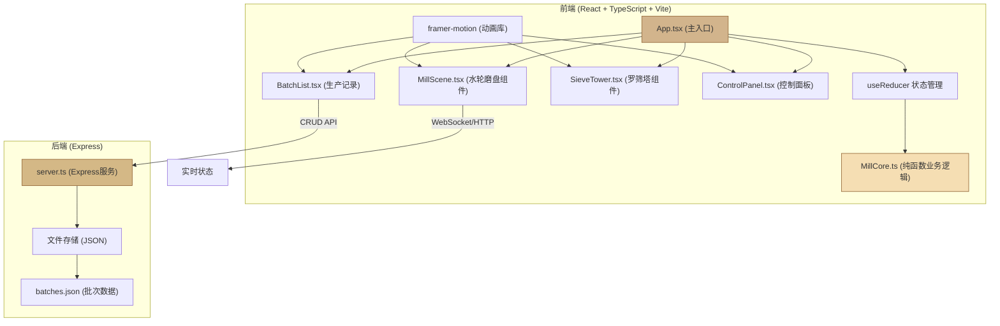

## 1. 架构设计



## 2. 技术说明

### 2.1 技术栈
- **前端框架**：React 18 + TypeScript
- **构建工具**：Vite 5
- **动画库**：framer-motion 11
- **HTTP客户端**：axios 1
- **后端框架**：Express 4
- **跨域中间件**：cors 2
- **ID生成**：uuid 9
- **语言目标**：ES2020
- **严格模式**：TypeScript strict: true

### 2.2 核心设计原则
- **业务逻辑与UI分离**：所有计算逻辑在 MillCore.ts 纯函数中实现
- **状态集中管理**：useReducer 统一管理研磨、筛分、打包三个核心动作
- **组件职责单一**：每个组件只负责渲染和交互，不包含业务计算
- **性能优先**：动画使用 CSS transform/opacity，粒子系统使用对象池
- **响应式布局**：CSS Grid + Flexbox，媒体查询适配移动端

## 3. 目录结构

```
auto12/
├── package.json
├── index.html
├── tsconfig.json
├── vite.config.js
├── src/
│   ├── App.tsx                 # 主入口组件
│   ├── MillCore.ts             # 核心业务逻辑
│   ├── main.tsx                # React 挂载入口
│   ├── components/
│   │   ├── MillScene.tsx       # 水轮+磨盘场景
│   │   ├── SieveTower.tsx      # 罗筛塔组件
│   │   ├── ControlPanel.tsx    # 控制面板
│   │   ├── Bucket.tsx          # 收集桶组件
│   │   ├── Bag.tsx             # 布袋组件
│   │   └── BatchList.tsx       # 生产记录
│   └── types/
│       └── index.ts            # 类型定义
├── src/backend/
│   └── server.ts               # Express 后端
└── data/
    └── batches.json            # 数据存储文件
```

## 4. 状态管理设计

### 4.1 State 类型定义

```typescript
interface MillState {
  // 水轮控制
  valveOpening: number;      // 0-100%
  wheelSpeed: number;        // 转速 rpm
  
  // 磨盘控制
  gap: number;               // 0.5-3mm
  load: number;              // 0-100%
  isOverloaded: boolean;     // 过载保护
  isRunning: boolean;        // 运行状态
  
  // 研磨产出
  fineFlour: number;         // 精白面 斤
  mediumFlour: number;       // 中筋面 斤
  bran: number;              // 麸皮 斤
  
  // 筛分进度
  sieveProgress: number;     // 0-100%
  
  // 粒子系统
  particles: Particle[];     // 粉尘粒子
  
  // 打包记录
  batches: Batch[];          // 生产批次
  animatingBags: AnimatingBag[]; // 动画中的布袋
}

interface Particle {
  id: string;
  x: number;
  y: number;
  vx: number;
  vy: number;
  size: number;
  opacity: number;
  life: number;
}

interface Batch {
  id: string;
  type: 'fine' | 'medium' | 'bran';
  weight: number;
  timestamp: string;
  gap: number;
  speed: number;
}

interface AnimatingBag {
  id: string;
  type: 'fine' | 'medium' | 'bran';
  weight: number;
  x: number;
  y: number;
}
```

### 4.2 Action 类型

```typescript
type MillAction =
  | { type: 'SET_VALVE'; payload: number }
  | { type: 'SET_GAP'; payload: number }
  | { type: 'TICK'; payload: number }  // 每帧更新
  | { type: 'PACK'; payload: 'fine' | 'medium' | 'bran' }
  | { type: 'LOAD_BATCHES'; payload: Batch[] }
  | { type: 'REMOVE_BAG_ANIMATION'; payload: string };
```

## 5. API 定义

### 5.1 后端路由

| Method | Route | Purpose |
|--------|-------|---------|
| GET | /api/batches | 获取所有生产批次 |
| POST | /api/batches | 创建新批次 |
| GET | /api/batches/:id | 获取单个批次 |
| DELETE | /api/batches/:id | 删除批次 |

### 5.2 请求响应格式

```typescript
// POST /api/batches 请求体
interface CreateBatchRequest {
  type: 'fine' | 'medium' | 'bran';
  weight: number;
  gap: number;
  speed: number;
}

// 响应格式
interface ApiResponse<T> {
  success: boolean;
  data?: T;
  error?: string;
}

// Batch 响应
interface BatchResponse {
  id: string;
  type: 'fine' | 'medium' | 'bran';
  weight: number;
  timestamp: string;
  gap: number;
  speed: number;
}
```

## 6. 核心业务逻辑 (MillCore.ts)

### 6.1 纯函数列表

| 函数名 | 输入 | 输出 | 功能描述 |
|--------|------|------|----------|
| calculateWheelSpeed | valveOpening: number | number | 根据阀门开度计算水轮转速 |
| calculateLoad | gap: number, speed: number | number | 计算磨盘负载百分比 |
| isOverloaded | load: number | boolean | 判断是否过载（>85%） |
| calculateFlourOutput | gap: number, speed: number, dt: number | {fine, medium, bran} | 计算dt时间内的面粉产出及分级 |
| getFlourFineness | gap: number | 'fine' \| 'medium' \| 'coarse' | 根据间隙判断面粉粗细 |
| createParticle | x: number, y: number | Particle | 创建粉尘粒子 |
| updateParticle | p: Particle, dt: number | Particle \| null | 更新粒子状态，生命周期结束返回null |

### 6.2 关键算法

**磨盘负载计算公式**：
```
负载 = (基准负载 / 间隙²) × (转速 / 100) × 调节系数
基准负载 = 50，调节系数 = 0.3
当负载 > 85% 时触发过载保护停机
```

**面粉分级算法**：
```
间隙 < 1mm:  精白面60%，中筋面30%，麸皮10%
间隙 1-2mm: 精白面30%，中筋面50%，麸皮20%
间隙 > 2mm: 精白面10%，中筋面40%，麸皮50%
产出速率 = 转速 × 0.01 × 调节系数 (斤/秒)
```

## 7. 性能优化策略

1. **粒子对象池**：预分配100个粒子对象，循环复用避免GC
2. **requestAnimationFrame**：所有动画和状态更新统一在 RAF 中处理
3. **CSS 硬件加速**：动画属性仅使用 transform 和 opacity
4. **批量更新**：每帧只更新一次 React state，减少重渲染
5. **memo 包裹**：纯展示组件使用 React.memo 包裹
6. **节流控制**：后端API调用添加防抖，避免频繁请求

## 8. 动画实现

### 8.1 framer-motion 应用场景
- **水轮旋转**：`animate={{ rotate: 360 }}`，`transition={{ repeat: Infinity, duration, ease: "linear" }}`
- **罗筛振动**：`animate={{ x: [0, 8, -8, 0] }}`，`transition={{ repeat: Infinity, duration: 0.6 }}`
- **布袋弹出**：`initial={{ scale: 0, y: 0 }}`，`animate={{ scale: 1, y: -20 }}`，`transition={{ type: "spring", damping: 8 }}`
- **状态过渡**：`transition={{ duration: 0.4, ease: "easeOut" }}`

### 8.2 自定义粒子动画
- 使用 Canvas 或绝对定位 div 实现粉尘粒子
- 每帧更新粒子位置和透明度
- 超出边界或生命周期结束后回收粒子
