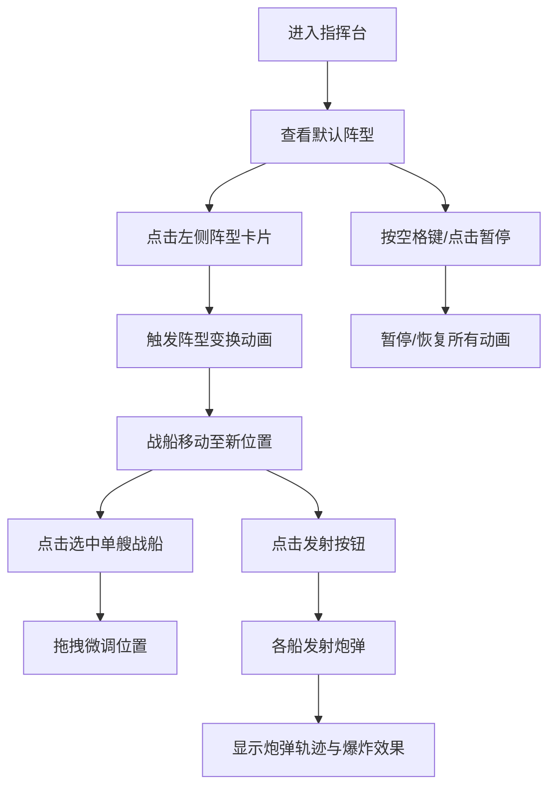

## 1. 产品概述

古代水师战船3D编队模拟与炮击演练系统，为水师将领提供直观的阵型变换与火力覆盖模拟平台，解决传统战术推演中难以可视化阵型优劣和炮击范围的问题。

- 核心目的：通过3D可视化技术，让将领能够直观模拟雁行阵、鱼鳞阵、偃月阵等不同阵型的变换过程，评估各阵型的火力输出与防御能力
- 目标用户：水师指挥官、军事战术研究员、历史爱好者
- 产品价值：提升战术决策效率，降低推演成本，增强战术理解的直观性

## 2. 核心特性

### 2.1 用户角色

| 角色 | 注册方式 | 核心权限 |
|------|----------|----------|
| 指挥者 | 无需注册，直接使用 | 阵型切换、炮击演练、战船微调、暂停控制 |

### 2.2 功能模块

1. **3D海战场景**：海面波动、战船模型、粒子特效、环境光照
2. **阵型控制系统**：雁行阵(V型)、鱼鳞阵(菱形)、偃月阵(弧形)切换，带平滑移动动画
3. **战船交互系统**：点击选中、拖拽微调、血量显示、金色光环选中效果
4. **炮击演练系统**：炮弹发射、抛物线轨迹、尾烟粒子、水柱爆炸效果
5. **环境模拟系统**：风向风力显示、波浪动画、全局暂停控制
6. **信息展示面板**：阵型名称、总火力值、被击中概率预估

### 2.3 页面详情

| 页面名称 | 模块名称 | 功能描述 |
|----------|----------|----------|
| 主界面 | 左侧阵型卡片 | 三个半透明毛玻璃卡片，点击切换阵型，选中时金色边框+放大效果 |
| 主界面 | 中央3D场景 | 海面、战船编队、炮击动画、粒子特效，可交互操作 |
| 主界面 | 右侧信息面板 | 实时显示当前阵型信息、火力数值、防御概率条 |
| 主界面 | 右下角控制区 | 风力罗盘、暂停/恢复按钮、发射按钮 |

## 3. 核心流程

用户进入指挥台后，首先看到默认阵型的战船编队在海面上。可以点击左侧阵型卡片切换编队，观察战船平滑移动到新位置。选中单艘战船可微调位置。点击发射按钮触发炮击演练，观察炮弹轨迹和爆炸效果。按空格键或点击暂停按钮可暂停所有动画。

## 4. 用户界面设计

### 4.1 设计风格

- **主色调**：暗蓝色调海战风格，天空渐变#1a2a3a到#3a5a7a，海面#0a2a4a
- **强调色**：金色#ffd700（选中光环、边框）、船体#8b5a2b、炮弹#444444
- **卡片风格**：半透明毛玻璃面板，模糊度10px，底色#ffffff30，选中时金色边框+1.05倍放大，过渡0.3s
- **字体**：采用具有历史感的衬线字体搭配现代无衬线字体，标题使用Cinzel，正文使用Noto Sans SC
- **布局**：三栏布局（左侧25%、中间60%、右侧15%），最小宽度1024px

### 4.2 页面设计概览

| 页面名称 | 模块名称 | UI元素 |
|----------|----------|--------|
| 主界面 | 左侧阵型卡片 | 毛玻璃卡片、阵型名称、阵型示意图、选中动画 |
| 主界面 | 中央3D场景 | 战船编队（20艘）、波浪海面、炮弹轨迹、粒子特效 |
| 主界面 | 右侧信息面板 | 阵型名称、总火力值数字、被击中概率百分比条 |
| 主界面 | 右下角控制区 | 风力罗盘（半透明）、暂停按钮、发射按钮 |

### 4.3 响应式设计

- 桌面端优先设计，最小宽度1024px
- 三栏固定比例布局（25% / 60% / 15%）
- 触摸设备支持触屏拖拽战船
- 高DPI屏幕适配

### 4.4 3D场景指引

- **环境**：暗蓝色渐变天空，带微弱星光，海面带白色波浪反光线条
- **光照**：半球光（天空色/海面色）+ 方向光模拟月光，营造夜晚海战氛围
- **相机**：透视相机，初始位置(0, 15, 25)，看向场景中心，支持OrbitControls缩放旋转
- **动画**：海面正弦波动（波长8，振幅0.2），战船随波轻微摇晃，选中光环脉冲动画（周期1.2秒）
- **粒子系统**：炮弹尾烟、水柱爆炸、波浪泡沫
- **性能优化**：实例化渲染战船，LOD控制，帧率目标60FPS，最低30FPS
