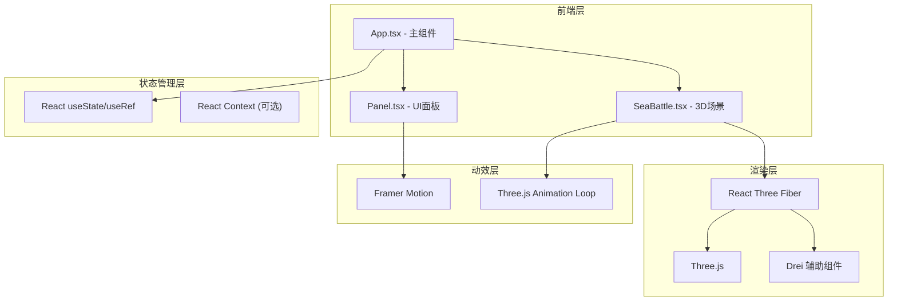

## 1. 架构设计



## 2. 技术选型说明

- **前端框架**：React@18 + TypeScript
- **构建工具**：Vite@5 + @vitejs/plugin-react
- **3D渲染**：Three@0.160 + @react-three/fiber@8 + @react-three/drei@9
- **UI动画**：Framer Motion@11
- **代码规范**：TypeScript 严格模式，ES2020 target

## 3. 目录结构

```
.
├── package.json
├── index.html
├── tsconfig.json
├── vite.config.js
└── src/
    ├── App.tsx              # 主组件，全局状态管理
    ├── scene/
    │   └── SeaBattle.tsx    # 3D场景核心组件
    └── ui/
        └── Panel.tsx        # UI面板组件
```

## 4. 核心数据模型

### 4.1 阵型类型定义

```typescript
type FormationType = 'goose' | 'fish' | 'crescent';

interface FormationConfig {
  name: string;
  nameCN: string;
  description: string;
  totalFirepower: number;
  hitProbability: number;
  positions: Array<{ x: number; z: number }>;
}
```

### 4.2 战船数据模型

```typescript
interface ShipData {
  id: number;
  position: { x: number; y: number; z: number };
  targetPosition: { x: number; y: number; z: number };
  health: number;
  maxHealth: number;
  isSelected: boolean;
  rotation: number;
}
```

### 4.3 炮弹数据模型

```typescript
interface CannonballData {
  id: number;
  startPos: { x: number; y: number; z: number };
  targetPos: { x: number; y: number; z: number };
  currentPos: { x: number; y: number; z: number };
  progress: number;
  speed: number;
}
```

### 4.4 全局状态

```typescript
interface GlobalState {
  currentFormation: FormationType;
  isPaused: boolean;
  selectedShipId: number | null;
  windDirection: { x: number; z: number };
  windStrength: number;
  isFiring: boolean;
}
```

## 5. 阵型配置

### 5.1 雁行阵 (V型) - 20艘战船
```
    1
   2 3
  4 5 6
 7 8 9 10
... 以此类推形成V型
```

### 5.2 鱼鳞阵 (菱形) - 20艘战船
```
    1
   2 3
  4 5 6
 7 8 9 10
  11 12 13
   14 15
    16
   17 18
  19 20
```

### 5.3 偃月阵 (弧形) - 20艘战船
沿半圆弧形均匀分布，凹面朝向前方

## 6. 性能优化策略

1. **实例化渲染**：使用 `InstancedMesh` 渲染20艘战船，减少Draw Call
2. **LOD控制**：远处战船使用简化模型
3. **帧率控制**：使用 `useFrame` 的 delta 时间控制动画速度
4. **对象池**：炮弹和粒子系统使用对象池复用，避免频繁GC
5. **阴影优化**：仅关键物体投射/接收阴影，限制阴影贴图大小
6. **粒子上限**：限制同时存在的粒子数量（最大200个）

## 7. 动画系统

### 7.1 阵型切换动画
- 时长：0.5秒
- 缓动函数：easeInOutCubic
- 移动轨迹：半透明虚线显示，使用LineDashedMaterial

### 7.2 选中光环动画
- 周期：1.2秒
- 效果：透明度0.3-0.8脉冲，半径1.0-1.2倍缩放

### 7.3 炮弹抛物线
- 公式：`y = y0 + vy*t - 0.5*g*t²`
- 重力加速度：9.8单位/秒²
- 尾烟粒子：每0.05秒生成一个，生命周期1秒

### 7.4 水柱爆炸效果
- 高度：2-4单位随机
- 粒子数量：15-25个
- 持续时间：1秒
- 淡出效果：透明度线性衰减至0
