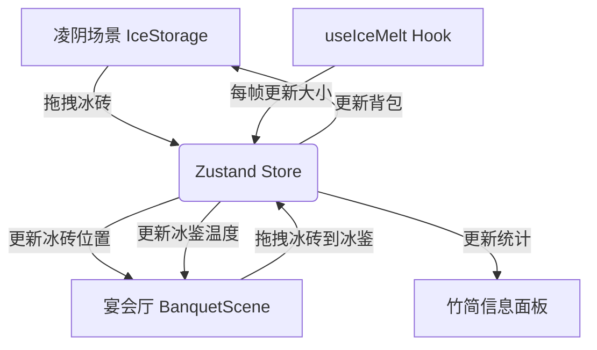

# 古代冰鉴储冰管理互动游戏 - 技术架构文档

## 1. 技术选型

| 技术 | 版本 | 选型理由 |
|------|------|----------|
| React | 18.x | 组件化开发，生态成熟，配合framer-motion实现流畅交互 |
| TypeScript | 5.x | 类型安全，减少运行时错误，提升代码可维护性 |
| Vite | 5.x | 快速开发体验，热更新效率高，构建速度快 |
| framer-motion | 11.x | 声明式动画API，拖拽交互性能优秀，满足<50ms响应要求 |
| zustand | 4.x | 轻量级状态管理，API简洁，无Provider嵌套，性能优异 |
| HTML5 Canvas | - | 粒子效果渲染，保证45fps以上帧率 |

---

## 2. 状态管理设计 (Zustand Store)

### 2.1 Store 结构

```typescript
interface IceBrick {
  id: string;
  batchId: string;           // 批次ID
  storedAt: number;          // 入库时间戳
  originalSize: number;      // 原始大小 (1.0)
  currentSize: number;       // 当前大小 (0-1.0)
  placedAt?: number;         // 放入冰鉴时间
  location: 'pile' | 'backpack' | 'jian';  // 当前位置
  jianId?: string;           // 所在冰鉴ID
}

interface Jian {
  id: string;
  type: 'large' | 'medium' | 'small';
  diameter: number;          // 直径（相对单位）
  temperature: number;       // 当前温度
  capacity: number;          // 最大容纳冰砖数
  iceBricks: string[];       // 冰砖ID列表
}

interface IceStore {
  // 冰砖数据
  iceBricks: Map<string, IceBrick>;
  pileBricks: string[];      // 冰砖堆中的冰砖ID (6x5排列)
  backpack: string[];        // 背包中的冰砖ID (最多10个)
  jians: Map<string, Jian>;
  
  // 统计数据
  usedCount: number;         // 已使用冰砖数
  totalMelted: number;       // 融化消失的冰砖数
  totalHarvested: number;    // 总采集冰砖数
  
  // 操作方法
  pickupFromPile: (brickId: string) => boolean;
  placeToBackpack: (brickId: string) => boolean;
  placeToJian: (brickId: string, jianId: string) => boolean;
  removeMeltedBrick: (brickId: string) => void;
  updateBrickSize: (brickId: string, size: number) => void;
}
```

### 2.2 状态数据流



---

## 3. 核心模块设计

### 3.1 App.tsx - 主组件

**职责**：
- 场景切换管理（凌阴/宴会厅）
- 全局布局（两栏式/响应式抽屉）
- 调用子组件
- 状态初始化

**关键实现**：
```typescript
const App: React.FC = () => {
  const [activeScene, setActiveScene] = useState<'storage' | 'banquet'>('storage');
  const [isPanelOpen, setIsPanelOpen] = useState(false);
  
  // 初始化冰砖堆 (6x5)
  useEffect(() => {
    initializePile();
  }, []);
  
  return (
    <div className="app-container">
      <header className="app-header">
        <TabBar active={activeScene} onChange={setActiveScene} />
        <HamburgerMenu onClick={() => setIsPanelOpen(!isPanelOpen)} />
      </header>
      <div className="main-content">
        <main className="scene-area">
          <AnimatePresence mode="wait">
            {activeScene === 'storage' ? (
              <IceStorage key="storage" />
            ) : (
              <BanquetScene key="banquet" />
            )}
          </AnimatePresence>
        </main>
        <div className="bamboo-divider" />
        <aside className={`info-panel ${isPanelOpen ? 'open' : ''}`}>
          <BambooPanel />
        </aside>
      </div>
    </div>
  );
};
```

### 3.2 IceStorage.tsx - 凌阴场景

**职责**：
- 渲染6×5冰砖堆
- 处理冰砖拖拽
- 渲染背包栏
- 水珠闪烁动画

**关键实现点**：
- 使用framer-motion的`drag`属性实现拖拽
- 冰砖堆使用CSS Grid布局 (6列 × 5行)
- 拖拽时通过`onDragStart`、`onDragEnd`事件管理状态
- 水珠效果使用CSS `@keyframes`动画，`animation-delay`错开闪烁

### 3.3 BanquetScene.tsx - 宴会厅场景

**职责**：
- 渲染朱漆食案和三组青铜冰鉴
- 处理背包冰砖拖拽到冰鉴槽位
- 温度计算与显示
- Canvas雾气粒子效果渲染

**温度计算逻辑**：
```typescript
const calculateTemperature = (jian: Jian): number => {
  const activeBricks = jian.iceBricks.filter(id => {
    const brick = iceBricks.get(id);
    return brick && brick.currentSize >= 0.2;
  });
  return Math.max(0, 25 - activeBricks.length);
};
```

**粒子系统设计**：
- Canvas独立于React渲染循环
- 粒子池：预分配50个粒子对象，避免频繁GC
- 粒子生成速率：与温度成反比 (25°C: 0个/秒, 0°C: 30个/秒)
- 粒子属性：{x, y, vx, vy, size, opacity, life}
- 使用`requestAnimationFrame`驱动，目标帧率60fps

### 3.4 useIceMelt.ts - 融化逻辑Hook

**职责**：
- 计算冰块随时间的融化
- 触发融化完成的回调

**算法**：
```typescript
// 每5分钟缩小5% → 每秒缩小 5% / 300s = 0.01667%/s
const MELT_RATE_PER_SECOND = 0.05 / 300;

export const useIceMelt = () => {
  useEffect(() => {
    let lastTime = performance.now();
    
    const tick = (currentTime: number) => {
      const deltaTime = (currentTime - lastTime) / 1000; // 秒
      lastTime = currentTime;
      
      // 更新所有放置中的冰砖大小
      store.getState().iceBricks.forEach((brick) => {
        if (brick.location === 'jian' && brick.placedAt) {
          const newSize = Math.max(0, brick.currentSize - MELT_RATE_PER_SECOND * deltaTime);
          
          if (newSize < 0.2 && brick.currentSize >= 0.2) {
            // 触发融化消失
            store.getState().removeMeltedBrick(brick.id);
            playSound('splash');
          } else {
            store.getState().updateBrickSize(brick.id, newSize);
          }
        }
      });
      
      animationFrameId = requestAnimationFrame(tick);
    };
    
    animationFrameId = requestAnimationFrame(tick);
    return () => cancelAnimationFrame(animationFrameId);
  }, []);
};
```

---

## 4. 性能优化策略

### 4.1 拖拽性能 (< 50ms)
- 使用framer-motion的硬件加速动画（transform: translate3d）
- 避免拖拽过程中触发React re-render
- 使用`will-change: transform`提示浏览器优化

### 4.2 粒子效果帧率 (≥ 45fps)
- Canvas离屏渲染，粒子池复用
- 限制最大粒子数（100个）
- 粒子更新使用简单的线性运算，避免三角函数
- 降低粒子透明度变化频率

### 4.3 状态更新性能
- zustand使用`shallow`选择器避免不必要re-render
- 冰砖融化计算批量处理，每帧只更新一次状态
- 使用`Map`存储冰砖数据，O(1)查找

---

## 5. 样式系统

### 5.1 CSS 变量定义 (global.css)
```css
:root {
  --bronze: #5d7a5a;
  --bamboo: #d4c5a9;
  --cinnabar: #c0392b;
  --ice: #c8e6c9;
  --cellar-wall: #4a4a4a;
  --cellar-floor: #6b7b6b;
  --bg: #2c2c2c;
  
  --hover-scale: 1.1;
  --click-scale: 0.95;
  --transition: 0.2s ease-out;
  --glow: 0 0 15px rgba(200, 230, 201, 0.8);
}
```

### 5.2 麻布纹理背景
```css
.linen-bg {
  background-color: var(--bg);
  background-image: 
    repeating-linear-gradient(0deg, transparent, transparent 2px, rgba(255,255,255,0.03) 2px, rgba(255,255,255,0.03) 4px),
    repeating-linear-gradient(90deg, transparent, transparent 2px, rgba(255,255,255,0.03) 2px, rgba(255,255,255,0.03) 4px);
}
```

### 5.3 竹节分隔线
```css
.bamboo-divider {
  width: 4px;
  background: repeating-linear-gradient(
    180deg,
    var(--bronze) 0px,
    var(--bronze) 20px,
    #3d4a3a 20px,
    #3d4a3a 24px,
    var(--bronze) 24px,
    var(--bronze) 44px
  );
}
```

---

## 6. 音效系统

| 音效 | 触发时机 | 实现方式 |
|------|----------|----------|
| 水滴声 | 冰砖放入背包 | Web Audio API生成短促高频音 |
| 水花声 | 冰块融化消失 | Web Audio API生成低频噪音 + 衰减 |
| 放置声 | 冰砖放入冰鉴 | 简短金属碰撞音 |

**音效生成**：不使用外部音频文件，通过Web Audio API实时生成，避免资源加载延迟。

---

## 7. 响应式断点

| 断点 | 布局模式 |
|------|----------|
| ≥ 900px | 两栏式：70%主区 + 30%面板 |
| < 900px | 单栏式，面板收为底部抽屉 |

---

## 8. 构建与部署

### 8.1 开发脚本
```json
{
  "dev": "vite",
  "build": "tsc && vite build",
  "preview": "vite preview"
}
```

### 8.2 TypeScript 严格模式
```json
{
  "strict": true,
  "noImplicitAny": true,
  "strictNullChecks": true,
  "strictFunctionTypes": true
}
```

---

## 9. 验收测试清单

- [ ] 凌阴场景渲染30块冰砖，6×5排列正确
- [ ] 拖拽冰砖到背包，成功放入且不超过10个
- [ ] 拖拽时有80%缩放效果，跟随鼠标流畅
- [ ] 宴会厅三组冰鉴正确渲染，大小比例正确
- [ ] 冰砖放入冰鉴槽位自动排列
- [ ] 温度显示正确，每块冰砖降温1度
- [ ] 雾气粒子效果随温度变化明显
- [ ] 冰块大小实时更新，融化进度可见
- [ ] 小于20%大小时自动消失，播放音效
- [ ] 竹简面板数据实时更新
- [ ] 悬停/点击动画效果正确
- [ ] 窗口宽度<900px时面板转为抽屉模式
- [ ] `npm run build` 无TypeScript错误
- [ ] 连续运行10分钟内存无明显泄漏
