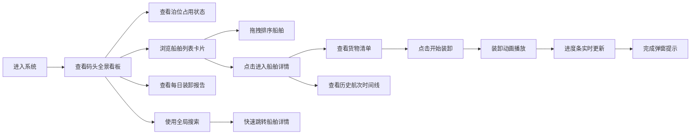

## 1. 产品概述
明代漕运码头船只调度与货物管理系统，让用户以漕运总督的身份管理多艘货船的停泊、装卸和航行记录。通过可视化的泊位状态图、实时装卸进度和历史航次时间线，实现高效的码头运营管理。

- **核心目标**：提供沉浸式的古代漕运管理体验，让用户直观地调度船舶、监控装卸进度、追溯航行历史
- **目标用户**：对历史模拟管理类应用感兴趣的用户，教育/文化展示场景的使用者
- **产品价值**：将古代漕运制度与现代数据可视化技术结合，既具教育意义又有操作趣味性

## 2. 核心功能

### 2.1 用户角色
| 角色 | 登录方式 | 核心权限 |
|------|----------|----------|
| 漕运总督 | 直接进入（模拟身份） | 查看泊位状态、调度船舶、监控装卸、查看航行记录、生成每日报告 |

### 2.2 功能模块
1. **码头全景看板**：泊位占用可视化、装卸进度展示、船舶列表卡片、拖拽排序
2. **单船详情页**：货物清单展示、装卸队列管理、历史航次时间线、装卸操作
3. **全局搜索**：船名/货物名/泊位号模糊搜索、实时下拉结果、跳转导航
4. **每日装卸报告**：7天吞吐量折线图、侧边栏可折叠、数据可视化

### 2.3 页面详情
| 页面名称 | 模块名称 | 功能描述 |
|----------|----------|----------|
| 码头全景看板 | 泊位状态条形图 | 四色展示（空闲/装卸中/满载待发/维修中），悬停显示详情，实时刷新 |
| 码头全景看板 | 船舶列表卡片 | 船帆图标、吃水深度条、泊位编号、状态标签，支持拖拽排序，卡片入场动画 |
| 码头全景看板 | 每日报告侧边栏 | 7天吞吐量趋势折线图，渐变配色，区域填充，可折叠收起，拖拽调整宽度 |
| 单船详情页 | 货物清单 | 按重量降序排列，每件货物含名称、重量（石）、圆形装卸进度条 |
| 单船详情页 | 装卸操作 | 开始装卸按钮，货物渐隐渐显动画，进度条实时更新，完成弹窗提示 |
| 单船详情页 | 航次时间线 | 30天历史航次，圆点加折线展示，点击展开航程详情 |
| 全局组件 | 搜索框 | 右上角圆角矩形，聚焦展开动画，实时模糊搜索，下拉结果跳转 |

## 3. 核心流程

### 3.1 主要操作流程
用户进入系统 → 查看码头全景看板（泊位状态+船舶列表）→ 可拖拽调整船舶排序 → 点击船舶卡片进入详情页 → 查看货物清单和航次记录 → 点击"开始装卸"触发装卸动画和进度更新 → 装卸完成收到提示 → 返回看板查看每日报告 → 使用搜索快速定位船舶

## 4. 用户界面设计

### 4.1 设计风格
- **主色调**：米黄色（#f5f0e1）背景，深蓝色（#2c3e50）头部与脚部，强调色橙色（#e67e22）
- **泊位状态色**：空闲#6b8e23（橄榄绿），装卸中#d4a017（金黄），满载待发#b22222（耐火砖红），维修中#708090（青灰）
- **字体**：思源柔黑体，营造古代文化氛围
- **卡片风格**：圆角8px，细阴影（box-shadow: 0 2px 8px rgba(0,0,0,0.1)）
- **按钮风格**：圆角矩形，悬停变深色，点击涟漪效果（0.2s）
- **图标风格**：融入古代元素，船帆、货物箱、漕运符号等

### 4.2 页面设计概述
| 页面名称 | 模块名称 | UI元素 |
|----------|----------|--------|
| 码头全景看板 | 泊位条形图 | 横向条形图，四色状态，悬停提示，framer-motion入场动画 |
| 码头全景看板 | 船舶卡片 | 船帆图标、吃水深度条、状态标签、拖拽手柄、卡片悬停上浮效果 |
| 码头全景看板 | 报告侧边栏 | 可折叠箭头、渐变折线图、区域填充、拖拽调整宽度（20%-40%） |
| 单船详情页 | 货物清单 | 左侧列表、按重量排序、圆形进度条、渐隐渐显装卸动画 |
| 单船详情页 | 航次时间线 | 右侧时间轴、圆点节点、折线连接、点击展开详情面板 |
| 全局组件 | 搜索框 | 右上角定位、聚焦展开动画（到300px）、浅灰边框、下拉结果列表 |

### 4.3 交互与动效
- **卡片入场**：framer-motion stagger动画，错落有致地进入
- **装卸动画**：AnimatePresence实现货物从船舱到码头的渐隐渐显（0.5s）
- **进度更新**：每0.3秒增加2%，平滑过渡
- **侧边栏折叠**：0.3s平滑过渡动画
- **搜索展开**：聚焦时宽度从150px过渡到300px，显示边框
- **列表滚动**：overflow-y: auto + overscroll-behavior: contain，弹性滚动效果
- **按钮反馈**：悬停变深 + 点击涟漪（0.2s）

### 4.4 性能要求
- DOM重绘频率 ≤ 60FPS
- 搜索响应时间 < 200ms
- 折线图虚拟化渲染，只绘制可视区域数据点
- 动画使用transform和opacity属性，避免布局抖动

### 4.5 响应式设计
- 桌面端优先设计，主看板70% + 侧边栏30%布局
- 侧边栏可拖拽调整宽度（最小20%，最大40%）
- 卡片网格自适应，在较窄屏幕自动调整列数
