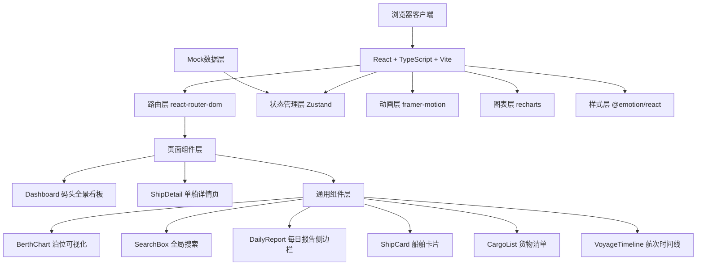

## 1. 架构设计



## 2. 技术描述

### 2.1 技术栈

* **前端框架**：React\@18 + TypeScript\@5

* **构建工具**：Vite\@5

* **路由管理**：react-router-dom\@6

* **状态管理**：zustand\@4（轻量高效，适合本项目规模）

* **动画库**：framer-motion\@11（入场动画、装卸动画、交互反馈）

* **图表库**：recharts\@2（泊位条形图、吞吐量折线图）

* **样式方案**：@emotion/react\@11 + @emotion/styled\@11（CSS-in-JS，主题化管理）

* **HTTP客户端**：axios\@1（预留后端接口扩展能力）

* **拖拽库**：@dnd-kit/core + @dnd-kit/sortable（船舶卡片拖拽排序）

### 2.2 初始化方式

使用 `npm init vite-init@latest` 基于 react-ts 模板创建项目，然后根据需求调整依赖配置。

### 2.3 后端与数据

本项目为前端演示项目，使用 Mock 数据模拟后端接口，数据文件存放于 `src/data/` 目录，包含：

* 船舶基础数据（船名、吃水深度、泊位、状态）

* 货物清单数据（名称、重量、装卸进度）

* 航次历史数据（启航港、到达港、航行天数、日期）

* 泊位状态数据（编号、状态、占用时长、剩余时间）

* 每日吞吐量数据（日期、装卸总量）

## 3. 目录结构

```
src/
├── App.tsx                    # 主应用入口，路由配置，全局状态
├── main.tsx                   # React 渲染入口
├── index.css                  # 全局样式，字体引入
├── pages/
│   ├── Dashboard.tsx          # 码头全景看板
│   └── ShipDetail.tsx         # 单船详情页
├── components/
│   ├── BerthChart.tsx         # 泊位占用可视化组件
│   ├── SearchBox.tsx          # 全局搜索框组件
│   ├── DailyReport.tsx        # 每日报告侧边栏
│   ├── ShipCard.tsx           # 船舶列表卡片
│   ├── CargoList.tsx          # 货物清单组件
│   ├── VoyageTimeline.tsx     # 航次时间线组件
│   ├── CircularProgress.tsx   # 圆形进度条组件
│   └── LoadingModal.tsx       # 装卸完成弹窗
├── store/
│   └── useAppStore.ts         # Zustand 全局状态管理
├── data/
│   ├── ships.ts               # 船舶Mock数据
│   ├── berths.ts              # 泊位Mock数据
│   ├── cargo.ts               # 货物Mock数据
│   ├── voyages.ts             # 航次Mock数据
│   └── dailyReport.ts         # 每日报告Mock数据
├── types/
│   └── index.ts               # TypeScript 类型定义
├── hooks/
│   ├── useSearch.ts           # 搜索逻辑Hook
│   ├── useLoadingProgress.ts  # 装卸进度Hook
│   └── useDraggableWidth.ts   # 侧边栏拖拽宽度Hook
└── utils/
    ├── formatters.ts          # 格式化工具函数
    └── animations.ts          # 动画配置常量
```

## 4. 路由定义

| 路由路径        | 页面组件       | 功能描述                  |
| ----------- | ---------- | --------------------- |
| `/`         | Dashboard  | 码头全景看板，泊位状态、船舶列表、每日报告 |
| `/ship/:id` | ShipDetail | 单船详情页，货物清单、装卸操作、航次时间线 |
| `*`         | Dashboard  | 404重定向到首页             |

## 5. 状态管理设计

### 5.1 Zustand Store 结构

```typescript
interface AppState {
  // 数据
  ships: Ship[];
  berths: Berth[];
  dailyReport: DailyReportData[];
  
  // UI 状态
  sidebarCollapsed: boolean;
  sidebarWidth: number;
  searchQuery: string;
  searchResults: SearchResult[];
  
  // 装卸状态
  loadingShipId: string | null;
  loadingProgress: Record<string, number>;
  
  // Actions
  setShips: (ships: Ship[]) => void;
  updateShipOrder: (activeId: string, overId: string) => void;
  startLoading: (shipId: string, cargoId: string) => void;
  updateLoadingProgress: (shipId: string, progress: number) => void;
  completeLoading: (shipId: string) => void;
  setSearchQuery: (query: string) => void;
  toggleSidebar: () => void;
  setSidebarWidth: (width: number) => void;
  getShipById: (id: string) => Ship | undefined;
}
```

## 6. 数据模型

### 6.1 类型定义

```typescript
// 泊位状态类型
type BerthStatus = 'idle' | 'loading' | 'ready' | 'maintenance';

// 泊位信息
interface Berth {
  id: string;
  number: number;
  status: BerthStatus;
  occupiedDuration: number;  // 已占用时长（小时）
  remainingTime: number;     // 剩余时间（小时）
  shipId?: string;           // 当前停泊船舶ID
}

// 船舶信息
interface Ship {
  id: string;
  name: string;
  draft: number;             // 吃水深度（米）
  maxDraft: number;          // 最大吃水深度
  berthNumber: number;       // 当前泊位号
  status: BerthStatus;
  cargo: CargoItem[];        // 货物清单
  voyages: Voyage[];         // 航次记录
  order: number;             // 排序字段
}

// 货物项
interface CargoItem {
  id: string;
  name: string;
  weight: number;            // 重量（石）
  loadingProgress: number;   // 装卸进度 0-100
  isLoaded: boolean;         // 是否已装卸完成
}

// 航次记录
interface Voyage {
  id: string;
  date: string;              // 启航日期
  departurePort: string;     // 启航港
  arrivalPort: string;       // 到达港
  cargoType: string;         // 货物种类
  days: number;              // 航行天数
  details: string;           // 航程详情
}

// 每日报告数据
interface DailyReportData {
  date: string;
  totalCargo: number;        // 装卸货物总量（石）
}

// 搜索结果
interface SearchResult {
  id: string;
  type: 'ship' | 'cargo' | 'berth';
  label: string;
  shipId?: string;
}
```

### 6.2 Mock 数据示例

```typescript
// 船舶数据示例
export const mockShips: Ship[] = [
  {
    id: 'ship-1',
    name: '漕运一号',
    draft: 3.2,
    maxDraft: 4.5,
    berthNumber: 1,
    status: 'loading',
    order: 1,
    cargo: [
      { id: 'cargo-1', name: '江南稻米', weight: 500, loadingProgress: 45, isLoaded: false },
      { id: 'cargo-2', name: '苏杭丝绸', weight: 120, loadingProgress: 100, isLoaded: true },
    ],
    voyages: [...]
  }
];

// 泊位数据示例
export const mockBerths: Berth[] = [
  { id: 'berth-1', number: 1, status: 'loading', occupiedDuration: 6, remainingTime: 2, shipId: 'ship-1' },
  { id: 'berth-2', number: 2, status: 'idle', occupiedDuration: 0, remainingTime: 0 },
  { id: 'berth-3', number: 3, status: 'ready', occupiedDuration: 8, remainingTime: 0.5, shipId: 'ship-3' },
  { id: 'berth-4', number: 4, status: 'maintenance', occupiedDuration: 24, remainingTime: 12 },
];
```

## 7. 关键技术实现要点

### 7.1 性能优化

1. **React.memo**：对 ShipCard、CargoList 等频繁渲染的组件进行包裹
2. **useMemo/useCallback**：对搜索过滤、数据转换等计算密集型逻辑进行缓存
3. **折线图虚拟化**：使用 recharts 的自定义组件，只渲染可视区域内的数据点
4. **节流防抖**：搜索输入使用 debounce（150ms），侧边栏拖拽使用 requestAnimationFrame
5. **CSS 动画优化**：动画属性使用 transform 和 opacity，启用 GPU 加速

### 7.2 动画实现

1. **卡片入场**：framer-motion 的 stagger 动画，延迟递增
2. **装卸动画**：AnimatePresence + 自定义 variants，实现货物从船舱到码头的位移+渐隐
3. **侧边栏折叠**：width 过渡动画 0.3s ease-in-out
4. **搜索展开**：width 从 150px 到 300px，border 透明度动画

### 7.3 交互实现

1. **拖拽排序**：@dnd-kit 实现船舶卡片拖拽，支持触摸设备
2. **侧边栏宽度调整**：监听鼠标事件，计算相对位移，限制在 20%-40% 范围内
3. **进度更新**：setInterval 每 300ms 增加 2%，达到 100% 时清除定时器并触发完成回调

### 7.4 无障碍与体验

1. 所有交互元素支持键盘导航
2. 颜色对比度符合 WCAG AA 标准
3. 加载状态有明确的视觉反馈
4. 操作成功/失败有对应的提示信息

