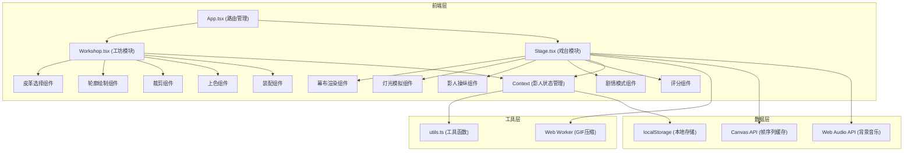

## 1. 架构设计



## 2. 技术栈说明

- **前端框架**：React@18 + TypeScript@5
- **构建工具**：Vite@5 + @vitejs/plugin-react@4
- **动画库**：framer-motion@11
- **颜色选择**：react-colorful@5
- **文件保存**：file-saver@2
- **GIF生成**：gif.js@0.2
- **状态管理**：React Context + useReducer
- **物理模拟**：自定义铰链物理（阻尼系数0.3）
- **音频处理**：Web Audio API（琵琶旋律生成）

## 3. 目录结构

```
.
├── package.json
├── index.html
├── tsconfig.json
├── vite.config.js
└── src/
    ├── App.tsx              # 主应用组件，路由切换
    ├── Workshop.tsx         # 工坊模块
    ├── Stage.tsx            # 戏台模块
    └── utils.ts             # 工具函数
```

## 4. 路由定义

| 路由 | 页面 | 说明 |
|------|------|------|
| /workshop | 工坊界面 | 皮影制作全流程 |
| /stage | 戏台界面 | 幕前表演与评分 |
| /collection | 收藏界面 | 本地作品管理 |

## 5. 数据模型

### 5.1 影人部件数据结构

```typescript
interface ShadowPart {
  id: string;
  type: 'head' | 'body' | 'armLeft' | 'armRight' | 'legLeft' | 'legRight';
  path: string;           // SVG路径数据
  color: string;          // 上色颜色
  leatherType: 'cow' | 'donkey' | 'sheep';
  joints: Joint[];        // 关节点
  position: { x: number; y: number };
  rotation: number;
}

interface Joint {
  id: string;
  partId: string;
  position: { x: number; y: number };
  connectedTo?: string;    // 连接的部件ID
  damping: number;         // 阻尼系数，默认0.3
}

interface ShadowFigure {
  id: string;
  name: string;
  parts: ShadowPart[];
  createdAt: number;
  coverImage: string;      // 轮廓预览图
}
```

### 5.2 剧本数据结构

```typescript
interface ScriptLine {
  id: string;
  text: string;
  speaker: string;
  keyAction?: string;      // 触发道具特效的关键动作
  propEffect?: string;     // 道具名称
}

interface Script {
  id: string;
  title: '武松打虎' | '白蛇传' | '哪吒闹海';
  lines: ScriptLine[];
  backgroundMusic: string;
}
```

### 5.3 表演记录数据结构

```typescript
interface Performance {
  id: string;
  figureId: string;
  scriptId?: string;
  frames: Frame[];         // 帧序列，最多保存30秒
  score: number;
  duration: number;
  recordedAt: number;
}

interface Frame {
  timestamp: number;
  parts: ShadowPart[];     // 当时的部件状态
}
```

## 6. 核心技术实现

### 6.1 皮革纹理模拟

使用CSS重复渐变模拟皮革颗粒纹理：
```css
.leather-texture {
  background-image: 
    repeating-linear-gradient(45deg, 
      rgba(0,0,0,0.03) 0px, 
      rgba(0,0,0,0.03) 1px, 
      transparent 1px, 
      transparent 4px
    ),
    repeating-linear-gradient(-45deg, 
      rgba(0,0,0,0.02) 0px, 
      rgba(0,0,0,0.02) 1px, 
      transparent 1px, 
      transparent 3px
    );
}
```

### 6.2 物理铰链模拟

使用自定义物理引擎实现关节摆动：
```typescript
class HingeJoint {
  damping: number = 0.3;
  angularVelocity: number = 0;
  
  update(deltaTime: number, force: number) {
    const acceleration = force - this.damping * this.angularVelocity;
    this.angularVelocity += acceleration * deltaTime;
    this.angularVelocity *= Math.pow(0.95, deltaTime * 60);
  }
}
```

### 6.3 帧序列缓存

使用Canvas和requestAnimationFrame实现30秒录像缓存：
```typescript
class FrameBuffer {
  maxFrames: number = 450;  // 30秒 × 15fps
  frames: ImageData[] = [];
  
  capture(canvas: HTMLCanvasElement) {
    const ctx = canvas.getContext('2d');
    if (ctx) {
      const imageData = ctx.getImageData(0, 0, canvas.width, canvas.height);
      this.frames.push(imageData);
      if (this.frames.length > this.maxFrames) {
        this.frames.shift();
      }
    }
  }
}
```

### 6.4 Web Worker GIF压缩

使用Web Worker在后台处理GIF编码，避免主线程阻塞：
```typescript
// 主线程
const worker = new Worker('./gif.worker.js');
worker.postMessage({ frames, width, height, fps });
worker.onmessage = (e) => {
  if (e.data.progress !== undefined) {
    setProgress(e.data.progress);
  } else if (e.data.blob) {
    saveAs(e.data.blob, 'performance.gif');
  }
};
```

### 6.5 Web Audio API琵琶旋律

生成C4、D4、E4、G4循环的简单旋律：
```typescript
function playPipaMelody() {
  const audioCtx = new AudioContext();
  const notes = [261.63, 293.66, 329.63, 392.00]; // C4, D4, E4, G4
  let index = 0;
  
  function playNote() {
    const osc = audioCtx.createOscillator();
    const gain = audioCtx.createGain();
    osc.frequency.value = notes[index % notes.length];
    osc.connect(gain);
    gain.connect(audioCtx.destination);
    gain.gain.setValueAtTime(0.3, audioCtx.currentTime);
    gain.gain.exponentialRampToValueAtTime(0.01, audioCtx.currentTime + 0.4);
    osc.start();
    osc.stop(audioCtx.currentTime + 0.4);
    index++;
    setTimeout(playNote, 500);
  }
  playNote();
}
```

## 7. 性能优化策略

1. **requestAnimationFrame渲染循环**：统一动画更新，保证30fps以上
2. **CSS硬件加速**：对影人元素使用transform: translate3d开启GPU加速
3. **离屏Canvas**：影子渲染使用离屏Canvas，减少重绘
4. **事件节流**：鼠标移动事件使用throttle，限制触发频率
5. **Web Worker**：GIF压缩在Worker线程处理，主线程阻塞<200ms
6. **对象池**：复用DOM元素和Canvas上下文，减少GC
7. **懒加载**：戏台场景资源按需加载
