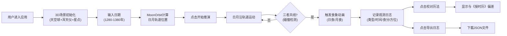

## 1. 产品概述

古代天文台星象观测与日月食推演3D交互可视化应用，让用户身临其境地体验元代钦天监官员的工作——在浑天仪旁观察星图、计算日月位置、预测并记录日月食现象，用于历法校正。

- 核心价值：将复杂的古代天文学知识转化为直观的3D交互体验，寓教于乐
- 目标用户：历史爱好者、天文爱好者、学生及教育工作者
- 独特价值：沉浸式元代天文台场景 + 专业的日月食物理推演 + 中国传统星官文化

## 2. 核心功能

### 2.1 用户角色
| 角色 | 注册方式 | 核心权限 |
|------|----------|----------|
| 天文官（用户） | 无需注册，直接进入 | 360度观测星象、调整日期推演、记录食象日志、校对历法 |

### 2.2 功能模块
1. **3D天文台场景**：圆形穹顶建筑、浑天仪模型、星空背景、日月地系统
2. **控制面板**：日期输入（年/月/日）、速度调节、推演控制
3. **日月食推演引擎**：轨道计算、碰撞检测、食象动画（日食/月食）
4. **观测日志系统**：自动记录食象、虚拟滚动列表、日志导出
5. **星图交互**：星点闪烁、星官信息展示、古筝音效
6. **历法校对**：与《授时历》对比、偏差计算

### 2.3 页面详情
| 页面名称 | 模块名称 | 功能描述 |
|----------|----------|----------|
| 主界面 | 3D天文台场景 | 可拖拽旋转的360度浑天仪视角，实时渲染日月地运动 |
| 主界面 | 左侧控制面板 | 日期输入框（1280-1380年）、速度选择（1x/5x/10x）、开始/暂停推演按钮、食象高亮提示 |
| 主界面 | 右侧观测日志 | 食象记录卡片列表（最新置顶）、"校对历法"按钮、"导出日志"按钮 |
| 主界面 | 浮动窗口 | 点击"校对历法"后显示《授时历》偏差百分比 |

## 3. 核心流程

### 3.1 主要用户流程
用户进入应用 → 3D场景加载完成（天文台、浑天仪、星空）→ 调整日期参数 → 点击"开始推演" → 日月沿轨道运动 → 发生日月食时触发动画 → 自动记录日志 → 点击"校对历法"查看偏差 → 导出JSON日志

### 3.2 系统流程图

## 4. 用户界面设计

### 4.1 设计风格
- **整体风格**：元代天文台复古风格，深色背景配合暖黄灯光
- **主色调**：
  - 背景色：#0a0a1a（入口页面）、#0a0a2e（穹顶内部）
  - 控制面板：#2a1a0a（深褐色）
  - 日志面板：#f5e6c8（仿古宣纸色）
  - 浑天仪：#c0a030（淡金色）
  - 边框：#8a7020（仿古铜色）
- **字体**：使用具有古典韵味的字体，标题使用衬线字体，正文使用清晰易读的无衬线字体
- **按钮风格**：仿古铜色边框，圆角4px，悬停背景#4a3a2a，点击缩放反馈（0.95→1.0，0.15s）

### 4.2 页面设计概述
| 页面名称 | 模块名称 | UI元素 |
|----------|----------|--------|
| 主界面 | 左侧控制面板（280px） | 三个日期输入框（年/月/日，文字#f0e0c0）、速度单选组、开始推演按钮、红色食象提示条（闪烁动画） |
| 主界面 | 中央3D场景 | 圆形穹顶（深蓝#0a0a2e）、青石板地面（#3a4a4a）、浑天仪（金色经纬线）、日月地三球、500颗星点 |
| 主界面 | 右侧观测日志（320px） | 卡片式日志列表（宣纸色背景#f5e6c8，深褐文字#3a2a1a）、卡片入场滑入动画（300px位移，0.4s ease-out）、虚拟滚动仅渲染10条 |
| 主界面 | 浮动窗口 | 居中弹窗，显示历法校对偏差，半透明遮罩 |

### 4.3 动画与交互细节
- **浑天仪旋转**：0.5s ease-in-out平滑过渡
- **食象发生**：屏幕边缘半透明红色光晕（#ff0000，10%透明度，持续1秒）
- **日志卡片入场**：从右侧滑入，300px位移，0.4s ease-out
- **星点闪烁**：5%星星每30秒闪烁一次，透明度0.5→1.0，持续0.6秒
- **日食动画**：遮光比0-100%渐变，日冕光晕从0.2→0.8单位径向渐变
- **月食动画**：月球变为暗红色#5c1a1a，保持5秒

### 4.4 响应式设计
- **桌面端（≥768px）**：三栏布局（左控制面板 + 中央3D场景 + 右日志面板）
- **移动端（<768px）**：左右面板折叠为底部抽屉，点击汉堡图标展开，3D场景全屏显示

### 4.5 3D场景指导
- **环境与氛围**：深蓝色穹顶包裹的封闭空间，暖黄色点光源模拟古代油灯照明
- **光照设置**：环境光（低强度）+ 太阳自发光（#ffdd44）+ 浑天仪金属质感高光
- **相机设置**：OrbitControls控制，可360度旋转，视角聚焦浑天仪中心
- **构图焦点**：浑天仪位于场景中心，日月地三球在其内部运动，背景星点营造深度感
- **后处理效果**：轻微泛光效果增强星光和日月的发光感，食象时屏幕边缘红色光晕
- **性能预算**：浑天仪三角面<800，星点500颗使用PointsGeometry批量渲染，目标帧率60fps

### 4.6 音效设计
- **点击星星**：Web Audio生成古筝音效（220Hz正弦波，持续0.3秒，带有轻微衰减）
