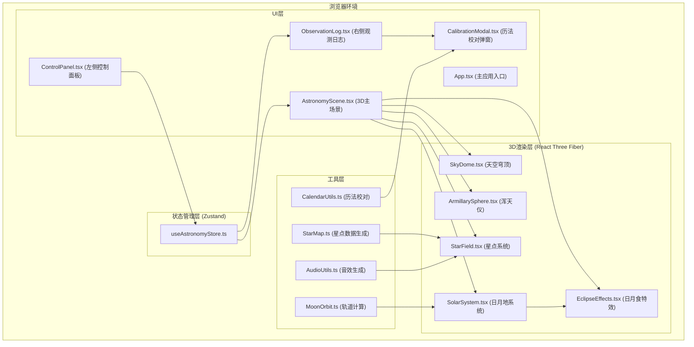

## 1. 架构设计

### 1.1 系统架构图


### 1.2 模块调用关系与数据流向
```
用户输入日期 → ControlPanel.tsx → useAstronomyStore (更新date)
    ↓
MoonOrbit.ts ← 监听date变化 → 计算日月位置 → 更新store
    ↓
AstronomyScene.tsx ← 订阅store → 渲染SolarSystem.tsx
    ↓
SolarSystem.tsx → 检测日月地共线 → 触发EclipseEffects.tsx
    ↓
useAstronomyStore → 记录食象日志 → ObservationLog.tsx渲染
    ↓
点击"校对历法" → CalendarUtils.ts → 计算与《授时历》偏差 → CalibrationModal.tsx
    ↓
点击星星 → StarField.tsx → AudioUtils.ts (古筝音效) → 显示星官信息
```

## 2. 技术描述

### 2.1 技术栈
| 层级 | 技术选型 | 版本要求 | 用途 |
|------|----------|----------|------|
| 前端框架 | React | ^18.2.0 | UI组件化开发 |
| 类型系统 | TypeScript | ^5.0.0 | 类型安全 |
| 构建工具 | Vite | ^5.0.0 | 快速开发构建 |
| 3D引擎 | Three.js | ^0.160.0 | 3D图形渲染 |
| React 3D绑定 | @react-three/fiber | ^8.15.0 | React式Three.js开发 |
| 3D工具库 | @react-three/drei | ^9.92.0 | 常用3D组件（OrbitControls等） |
| 状态管理 | Zustand | ^4.4.0 | 轻量级状态管理 |
| 样式方案 | Tailwind CSS | ^3.4.0 | 原子化CSS |

### 2.2 核心性能约束
- **帧率目标**：60fps
- **浑天仪三角面**：< 800个
- **星点数量**：固定500颗（使用PointsGeometry批量渲染）
- **轨道计算耗时**：每次 < 2ms
- **日志虚拟滚动**：仅渲染可见10条记录
- **JSON导出响应**：< 100ms

## 3. 目录结构

```
auto19/
├── index.html                          # 入口页面（背景色#0a0a1a）
├── package.json                        # 依赖与脚本
├── tsconfig.json                       # TypeScript配置（严格模式，ES2020）
├── vite.config.js                      # Vite配置
├── tailwind.config.js                  # Tailwind配置
├── postcss.config.js                   # PostCSS配置
├── .trae/
│   └── documents/
│       ├── PRD.md                      # 产品需求文档
│       └── TECH-ARCH.md                # 技术架构文档
└── src/
    ├── main.tsx                        # React入口
    ├── App.tsx                         # 主应用组件
    ├── index.css                       # 全局样式
    ├── components/
    │   ├── AstronomyScene.tsx          # 3D主场景组件
    │   ├── ControlPanel.tsx            # 左侧控制面板
    │   ├── ObservationLog.tsx          # 右侧观测日志
    │   ├── CalibrationModal.tsx        # 历法校对弹窗
    │   ├── StarInfoTooltip.tsx         # 星官信息提示
    │   └── EclipseAlert.tsx            # 食象高亮提示
    ├── components/three/
    │   ├── SkyDome.tsx                 # 天空穹顶
    │   ├── ArmillarySphere.tsx         # 浑天仪模型
    │   ├── StarField.tsx               # 星点系统
    │   ├── SolarSystem.tsx             # 日月地系统
    │   └── EclipseEffects.tsx          # 日月食特效
    ├── store/
    │   └── useAstronomyStore.ts        # Zustand状态管理
    ├── utils/
    │   ├── StarMap.ts                  # 星点数据生成
    │   ├── MoonOrbit.ts                # 月球轨道计算
    │   ├── AudioUtils.ts               # 音效生成
    │   ├── CalendarUtils.ts            # 历法校对
    │   └── DateUtils.ts                # 日期工具
    ├── types/
    │   └── astronomy.ts                # 类型定义
    └── data/
        └── stars.json                  # 中国传统星官数据
```

## 4. 数据模型

### 4.1 核心类型定义
```typescript
// 星点数据
interface StarData {
  id: string;
  position: [number, number, number]; // 3D坐标
  brightness: number; // 亮度 0.3-1.0
  color: string; // 颜色 #ffffff ~ #87ceeb
  size: number; // 大小 2-5px
  chineseName: string; // 中国星官名 如"角宿一"
  ra: number; // 赤经
  dec: number; // 赤纬
}

// 天体位置
interface CelestialPosition {
  x: number;
  y: number;
  z: number;
}

// 日月食类型
type EclipseType = 'total_solar' | 'annular_solar' | 'total_lunar' | 'partial_lunar';

// 食象记录
interface EclipseRecord {
  id: string;
  type: EclipseType;
  typeName: string; // 日全食/日环食/月全食/月偏食
  date: string; // 年月日
  time: string; // 精确到时辰
  magnitude: number; // 食分 0-1
  duration: number; // 持续时长（秒）
  azimuth: number; // 方位角 0-360度
  timestamp: number; // 记录时间戳
}

// 推演状态
type SimulationSpeed = 1 | 5 | 10;

interface SimulationState {
  isRunning: boolean;
  speed: SimulationSpeed;
  currentTime: number; // 模拟时间进度
}

// 历法校对结果
interface CalibrationResult {
  recordId: string;
  shoushiTime: string; // 《授时历》记录时间
  deviationPercent: number; // 偏差百分比
  notes: string;
}
```

### 4.2 Store状态结构
```typescript
interface AstronomyState {
  // 日期输入
  year: number; // 1280-1380
  month: number; // 1-12
  day: number; // 1-31
  
  // 日月位置
  sunPosition: CelestialPosition;
  moonPosition: CelestialPosition;
  earthPosition: CelestialPosition;
  
  // 推演状态
  simulation: SimulationState;
  
  // 食象相关
  currentEclipse: EclipseType | null;
  eclipseProgress: number; // 0-1
  eclipseRecords: EclipseRecord[];
  
  // UI状态
  selectedStar: StarData | null;
  showCalibration: string | null; // 记录ID
  
  // Actions
  setDate: (year: number, month: number, day: number) => void;
  startSimulation: () => void;
  pauseSimulation: () => void;
  setSpeed: (speed: SimulationSpeed) => void;
  updateSimulationTime: (delta: number) => void;
  triggerEclipse: (type: EclipseType, data: Omit<EclipseRecord, 'id' | 'timestamp'>) => void;
  clearEclipse: () => void;
  selectStar: (star: StarData | null) => void;
  showCalibrationModal: (recordId: string | null) => void;
  exportLogs: () => string;
}
```

## 5. 关键算法说明

### 5.1 月球轨道计算 (MoonOrbit.ts)
- 基于简化的开普勒轨道方程计算月球位置
- 输入：年月日、模拟时间进度
- 输出：月球3D坐标、太阳3D坐标
- 碰撞检测：计算日月地三者是否共线（角度偏差<2度）
- 食分计算：根据遮挡比例计算食分（0-1）

### 5.2 星点数据生成 (StarMap.ts)
- 使用球坐标系随机分布500颗星点
- 亮度：0.3-1.0随机分布
- 颜色：从#ffffff到#87ceeb渐变
- 关联中国传统星官名称（从stars.json映射）
- 闪烁机制：每30秒随机选择5%星星，透明度0.5→1.0→0.5，持续0.6秒

### 5.3 历法校对 (CalendarUtils.ts)
- 内置《授时历》日月食记录参考数据
- 计算推演结果与历史记录的时间偏差
- 偏差百分比公式：|推演时间 - 授时历时间| / 授时历时间 * 100%

## 6. 性能优化策略

1. **星点渲染**：使用THREE.Points + BufferGeometry批量渲染500颗星，避免单独Mesh
2. **浑天仪优化**：使用低多边形球体（segments=16, rings=12），三角面约768个
3. **日志虚拟滚动**：使用IntersectionObserver或固定高度计算，仅渲染可见10条
4. **动画帧管理**：使用useFrame钩子，仅在推演运行时更新位置
5. **轨道计算缓存**：相同日期的计算结果缓存，避免重复计算
6. **材质复用**：共享相同材质的几何体使用同一个Material实例

## 7. 接口与事件

### 7.1 组件间主要事件流
```
ControlPanel
  ├─ onDateChange → store.setDate() → MoonOrbit.recalculate()
  ├─ onSpeedChange → store.setSpeed()
  └─ onStartStop → store.startSimulation() / pauseSimulation()

SolarSystem
  └─ onEclipseDetect → store.triggerEclipse() → 记录日志 + 触发动画

ObservationLog
  ├─ onCalibrate → store.showCalibrationModal()
  └─ onExport → store.exportLogs() → 下载JSON

StarField
  └─ onStarClick (Shift+click) → store.selectStar() + AudioUtils.playGuzheng()
```
