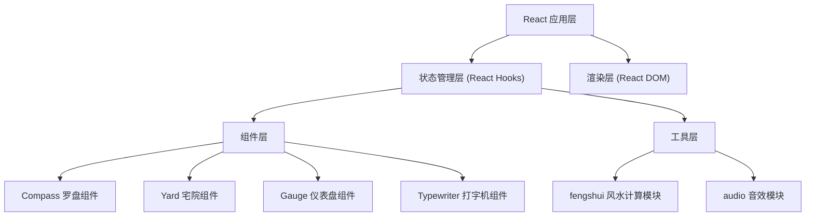

## 1. 架构设计



## 2. 技术描述

* **前端框架**：React\@18 + TypeScript\@5 + Vite\@5

* **初始化工具**：vite-init

* **动画库**：framer-motion\@11

* **音频库**：tone\@14

* **构建工具**：Vite

* **样式方案**：CSS Modules / 内联样式 + framer-motion

## 3. 文件结构

```
auto2/
├── package.json
├── index.html
├── tsconfig.json
├── vite.config.js
└── src/
    ├── App.tsx              # 主应用组件
    ├── components/
    │   ├── Compass.tsx      # 罗盘组件
    │   ├── Yard.tsx         # 宅院组件
    │   ├── Furniture.tsx    # 家具摆件组件
    │   ├── Gauge.tsx        # 评分仪表盘组件
    │   └── Typewriter.tsx   # 打字机效果组件
    └── utils/
        └── fengshui.ts      # 风水计算工具
```

## 4. 核心数据结构

### 4.1 八卦方位定义

```typescript
interface Trigram {
  name: string;           // 卦名：乾、坤、震、巽、坎、离、艮、兑
  element: string;        // 五行：金、土、木、木、水、火、土、金
  color: string;          // 五行颜色
  angle: number;          // 起始角度（度）
  description: string;    // 风水描述
  auspicious: string;     // 吉凶等级：大吉、小吉、平、凶
}
```

### 4.2 家具定义

```typescript
interface Furniture {
  id: string;
  type: 'bed' | 'table' | 'screen' | 'vat' | 'plant';
  name: string;
  icon: string;
  x: number;
  y: number;
  initialX: number;
  initialY: number;
  rotation: number;
}
```

### 4.3 宅院区域定义

```typescript
interface YardZone {
  id: string;
  name: string;           // 前院、正厅、厢房、后院
  x: number;
  y: number;
  width: number;
  height: number;
  trigram: string;        // 关联卦象
}
```

## 5. 关键算法

### 5.1 罗盘指针角度计算

```typescript
// 将鼠标/触摸位置转换为极坐标角度
function calculateAngle(clientX: number, clientY: number, centerX: number, centerY: number): number {
  const dx = clientX - centerX;
  const dy = clientY - centerY;
  return Math.atan2(dy, dx) * (180 / Math.PI);
}

// 角度归一化到0-360度
function normalizeAngle(angle: number): number {
  return ((angle % 360) + 360) % 360;
}

// 自动对齐最近分区边界（每个分区45度）
function snapToNearestZone(angle: number): number {
  const zoneSize = 45;
  return Math.round(angle / zoneSize) * zoneSize;
}
```

### 5.2 网格吸附算法

```typescript
function snapToGrid(x: number, y: number, gridSize: number): { x: number; y: number } {
  return {
    x: Math.round(x / gridSize) * gridSize,
    y: Math.round(y / gridSize) * gridSize
  };
}
```

### 5.3 风水评分计算

```typescript
function calculateFengshuiScore(furniture: Furniture[], trigrams: Trigram[]): number {
  let score = 50; // 基础分
  for (const item of furniture) {
    const zone = getZoneForPosition(item.x, item.y);
    const trigram = getTrigramForZone(zone);
    const modifier = getItemModifier(item.type, trigram);
    score += modifier;
  }
  return Math.max(0, Math.min(100, score));
}
```

## 6. 性能优化

### 6.1 拖拽性能

* 使用 `transform` 而非 `left/top` 进行位置更新，触发GPU加速

* 使用 `requestAnimationFrame` 确保60FPS

* 防抖处理高频事件

* 拖拽时设置 `will-change: transform`

### 6.2 重绘优化

* 使用 React.memo 包裹纯展示组件

* 合理拆分组件，最小化重渲染范围

* 使用 useCallback 缓存事件处理函数

### 6.3 动画性能

* framer-motion 硬件加速动画

* 避免布局抖动（Layout Thrashing）

* 使用 CSS transforms 和 opacity 做动画

## 7. 依赖包说明

| 包名                   | 版本      | 用途      |
| -------------------- | ------- | ------- |
| react                | ^18.2.0 | UI框架    |
| react-dom            | ^18.2.0 | DOM渲染   |
| typescript           | ^5.0.0  | 类型系统    |
| vite                 | ^5.0.0  | 构建工具    |
| @vitejs/plugin-react | ^4.0.0  | React支持 |
| framer-motion        | ^11.0.0 | 动画库     |
| tone                 | ^14.8.0 | 音频合成    |

