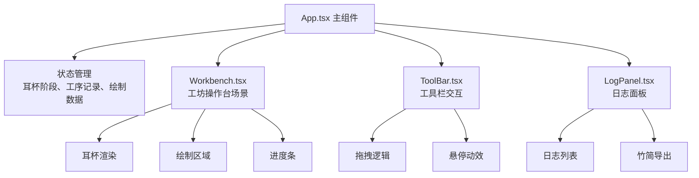

## 1. 架构设计



## 2. 技术描述

- 前端：React 18 + TypeScript + Vite
- 动画库：framer-motion
- 唯一ID生成：uuid
- 样式方案：CSS Modules + 内联样式（复杂动画）
- 初始化工具：Vite

## 3. 目录结构

```
src/
├── main.tsx              # ReactDOM 渲染入口
├── App.tsx               # 主组件，状态管理
├── types.ts              # 类型定义
└── components/
    ├── Workbench.tsx     # 工坊操作台
    ├── ToolBar.tsx       # 工具栏
    └── LogPanel.tsx      # 日志面板
```

## 4. 数据模型

### 4.1 类型定义

```typescript
// 耳杯阶段枚举
enum CupStage {
  RAW = '素胎',
  COARSE_GRIND = '粗磨',
  FINE_GRIND = '细磨',
  RED_LACQUER = '涂朱漆',
  BLACK_LACQUER = '涂黑漆',
  GILDING = '描金',
  POLISHING = '抛光上蜡'
}

// 工序记录
interface ProcessRecord {
  id: string;
  stage: CupStage;
  processName: string;
  duration: number;
  operationCount: number;
  timestamp: Date;
}

// 工具类型
type ToolType = 'coarseSandpaper' | 'fineSandpaper' | 'redLacquer' | 
                'blackLacquer' | 'gildingPen05' | 'gildingPen1' | 'gildingPen2' |
                'polishingCloth' | 'beeswax';

// 绘制笔触
interface Stroke {
  id: string;
  points: { x: number; y: number }[];
  width: number;
  color: string;
}
```

## 5. 核心组件设计

### 5.1 App.tsx - 主组件
- 管理耳杯当前阶段（cupStage）
- 管理工序记录数组（processRecords）
- 管理绘制笔触数据（strokes）
- 管理抛光反射率（reflectivity）
- 提供阶段推进回调函数
- 提供工序记录添加函数

### 5.2 Workbench.tsx - 工坊操作台
- 渲染耳杯（根据阶段应用不同样式）
- 七段进度条组件
- 描金绘制区域（Canvas或SVG）
- 抛光交互区域
- 粒子效果容器

### 5.3 ToolBar.tsx - 工具栏
- 七种工具图标渲染
- HTML5 拖拽API实现
- 悬停放大动效（transform: scale(1.1)）
- 工具名称标签显示
- 拖拽释放后触发对应操作

### 5.4 LogPanel.tsx - 日志面板
- 工序记录列表展示
- 计时器功能
- 导出按钮（点击弹出竹简样式面板）
- 竖排竹简格式渲染

## 6. 关键实现要点

### 6.1 拖拽交互
- 使用 React DnD 或原生 HTML5 Drag & Drop API
- 工具项设置 draggable="true"
- 耳杯区域设置 onDragOver 和 onDrop 事件
- 释放时根据工具类型触发对应操作

### 6.2 粒子效果
- 创建绝对定位的粒子容器
- 打磨时生成木屑粒子（随机位置、大小2-5px、颜色#c4944a）
- 使用 framer-motion 实现飘散动画（0.8秒后自动移除）

### 6.3 描金绘制
- 使用 Canvas 2D API 实现自由绘制
- mousedown 开始绘制，mousemove 记录点位，mouseup 结束笔触
- 笔触边缘 1px 羽化效果（shadowBlur + 透明度渐变）
- 三种笔尖宽度：0.5mm → 1px、1mm → 2px、2mm → 4px

### 6.4 烫金效果
- CSS filter: drop-shadow(0 0 2px #ffd700) drop-shadow(0 0 4px #ffd700)
- 使用 framer-motion 实现 0.3 秒 scale + shadow 动画

### 6.5 抛光上蜡
- 鼠标移动时更新抛光布位置
- 记录摩擦路径，绘制高光轨迹（渐隐动画2秒）
- 反射率从 10% 线性增长到 80%
- 使用 CSS filter: brightness() 和 backdrop-filter 实现反光效果

### 6.6 竹简导出
- 创建竖排文本容器（writing-mode: vertical-rl）
- 背景仿竹纹（线性渐变模拟竹节）
- 表格格式："工序名 | 耗时 | 操作次数"
