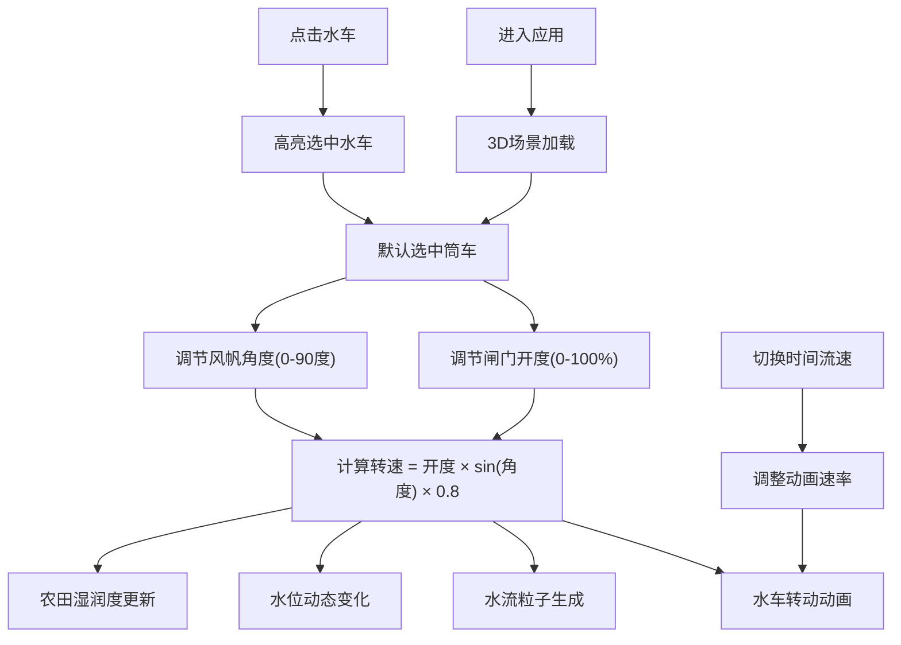

## 1. 产品概述

古代水车灌溉系统水力模拟与调度可视化应用，让用户以唐代司农官的身份，在虚拟农田水利园中管理多台古代水车，通过调节水槽闸门和风帆角度控制水流，实时观察水位变化与灌溉效果。

- 核心价值：沉浸式体验中国古代水利智慧，交互式学习水车机械原理
- 目标用户：历史文化爱好者、教育工作者、学生群体

## 2. 核心特性

### 2.1 用户角色

| 角色 | 注册方式 | 核心权限 |
|------|----------|----------|
| 司农官（用户） | 无需注册，直接进入 | 操作所有水车、调节闸门与风帆、观察灌溉效果 |

### 2.2 功能模块

1. **3D场景主界面**：水车展示区、水库水位计、农田灌溉区、控制面板
2. **水车交互系统**：三台水车切换、点击高亮、转速动画
3. **水流模拟系统**：粒子系统、水面波纹、水位动态变化
4. **灌溉可视化**：农田湿润度渐变、覆盖率统计

### 2.3 页面详情

| 页面名称 | 模块名称 | 功能描述 |
|----------|----------|----------|
| 主场景 | 3D水车展示 | 并排展示翻车、筒车、高转筒车三台水车模型 |
| 主场景 | 控制面板 | 闸门开度滑块、风帆角度滑块、转速显示、水车切换 |
| 主场景 | 水位计 | 左侧柱状水位计，动态显示水库水位 |
| 主场景 | 农田灌溉区 | 半透明网格覆盖，实时显示灌溉覆盖效果 |
| 主场景 | 水流粒子系统 | 水车转动时生成蓝色水流粒子，沿抛物线运动 |

## 3. 核心流程

用户进入应用后，默认选中中间的筒车，可通过右侧控制面板调节闸门开度和风帆角度，观察水车转速变化和水流效果；点击不同水车切换控制对象；通过左上角时间流速按钮调整模拟速度。

## 4. 用户界面设计

### 4.1 设计风格

- 整体风格：宋代青绿山水色调，古典雅致
- 主色调：淡青色天空渐变(#e6f2f0→#b8d4c8)，黄褐色地面(#9b8b6c)
- 强调色：灌溉绿(#2e7d32)、水蓝(#4a90d9)、高亮金(#ffd700)
- 按钮风格：圆角8px，悬停放大1.05倍，2px高亮边框
- 字体：思源宋体（Source Han Serif），古典文雅
- 面板效果：半透明磨砂玻璃，rgba(200,220,200,0.8)

### 4.2 页面设计概览

| 页面名称 | 模块名称 | UI元素 |
|----------|----------|--------|
| 主场景 | 3D环境 | 渐变天空、网格地面、水库、水槽、三台水车、农田网格 |
| 主场景 | 左上角HUD | 灌溉覆盖率数字(绿色，1.5rem)、时间流速按钮组(1x/2x/4x) |
| 主场景 | 左侧水位计 | 高度4单位的柱状水位计，蓝色渐变(#4a90d9→#1a5276) |
| 主场景 | 右侧控制面板 | 宽280px，半透明磨砂玻璃，圆角8px，水车切换按钮组、闸门滑块、风帆滑块、转速显示 |
| 主场景 | 选中高亮 | 水车外围金色光环，0.3秒渐入动画 |

### 4.3 响应式

- 桌面端优先，全屏展示3D场景
- 控制面板固定右侧，不随3D场景旋转
- 保证在1920×1080分辨率下最佳显示效果

### 4.4 3D场景指引

- **环境**：淡青色渐变天空，黄褐色网格地面，营造古典田园氛围
- **光照**：环境光+方向光组合，模拟自然日光，柔和阴影
- **相机**：初始距离8单位，高度角45度，支持拖拽旋转(y轴15-75度)、滚轮缩放(3-12单位)
- **构图**：三台水车并排居中，左侧水位计，后方水库，前方农田
- **交互**：点击水车高亮选中，滑块实时联动3D场景
- **动画**：水车转动、粒子流动、水位升降(0.8秒动画)、波纹波动
- **性能**：帧率稳定55FPS+，粒子上限1200个，启用FrustumCulling
