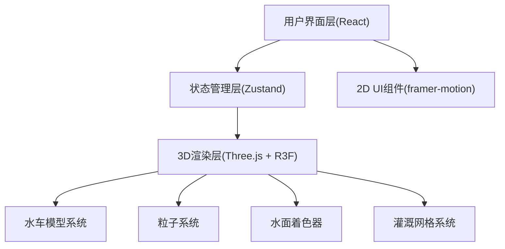

## 1. 架构设计



## 2. 技术描述

- **前端框架**：React 18 + TypeScript 5
- **构建工具**：Vite 5
- **3D渲染**：Three.js + @react-three/fiber + @react-three/drei
- **状态管理**：Zustand
- **动画库**：framer-motion
- **样式**：CSS-in-JS + 全局CSS变量

## 3. 目录结构

```
auto21/
├── package.json
├── index.html
├── tsconfig.json
├── vite.config.js
└── src/
    ├── main.tsx
    ├── components/
    │   ├── WaterScene.tsx      # 3D场景容器
    │   ├── ControlPanel.tsx    # 2D控制面板
    │   ├── WaterWheel.tsx      # 水车组件(翻车/筒车/高转筒车)
    │   ├── WaterParticles.tsx  # 水流粒子系统
    │   ├── WaterSurface.tsx    # 水面波纹着色器
    │   ├── IrrigationGrid.tsx  # 灌溉网格
    │   └── WaterGauge.tsx      # 水位计
    └── store/
        └── irrigationStore.ts  # Zustand状态仓库
```

## 4. 状态模型

### 4.1 Store 状态定义

```typescript
interface IrrigationState {
  // 水车类型
  selectedWheel: 'fanche' | 'tongche' | 'gaozhuan';
  
  // 控制参数
  gateOpening: number;      // 0-100，默认50
  sailAngle: number;        // 0-90，默认45
  timeScale: number;        // 1, 2, 4
  
  // 计算属性
  wheelSpeed: number;       // 转速 = 开度 × sin(角度) × 0.8
  reservoirLevel: number;   // 0-1，与开度联动
  irrigationCoverage: number; // 0-100，百分比
  
  // 粒子系统
  particleCount: number;    // 当前粒子数
  
  // Actions
  setSelectedWheel: (type: 'fanche' | 'tongche' | 'gaozhuan') => void;
  setGateOpening: (value: number) => void;
  setSailAngle: (value: number) => void;
  setTimeScale: (scale: number) => void;
  updateWheelSpeed: () => void;
}
```

## 5. 核心配置

### 5.1 水车参数

| 水车类型 | 尺寸参数 | 机械特征 |
|----------|----------|----------|
| 翻车 | 长3单位，高1.5单位 | 木制龙骨链式，链轮齿数24 |
| 筒车 | 直径2.5单位 | 竹筒辐条式，20个竹筒圆周分布 |
| 高转筒车 | 高4单位 | 双层链传动，上下双链轮 |

### 5.2 性能参数

- 目标帧率：≥55FPS
- 粒子上限：1200个
- 粒子生成率：10-60个/帧（随转速线性变化）
- 粒子大小：0.5-1.5px
- 相机距离：3-12单位
- 相机俯仰角：15-75度

## 6. 技术要点

1. **自定义几何**：使用Three.js BufferGeometry构建水车模型
2. **ShaderMaterial**：水面波纹使用自定义着色器
3. **InstancedMesh**：灌溉网格使用实例化渲染优化性能
4. **Points**：水流粒子系统使用Points渲染
5. **OrbitControls**：相机控制，限制旋转角度
6. **framer-motion**：UI动画、滑块弹性反馈、按钮悬停效果
7. **useFrame**：R3F帧循环更新动画
