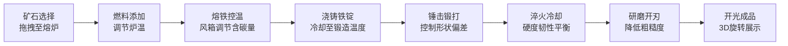

## 1. 产品概述

古代兵器铸造模拟器是一款在浏览器中运行的互动游戏应用，通过数字化方式重现铁匠铺中从矿石选料到成品开光的完整锻造流程，解决传统锻造工艺难以反复练习和直观感受锻造精度与成品品质的问题。

- 面向对古代冶金工艺感兴趣的教育用户和游戏爱好者，提供沉浸式的锻造体验
- 通过实时物理模拟和视觉反馈，让用户理解每一步操作对最终品质的影响

## 2. 核心功能

### 2.1 功能模块

1. **矿石与燃料选择模块**：拖拽矿石和燃料至熔炉，触发火焰动画和温度变化
2. **熔铁与控温模块**：观察铁水熔化过程，通过风箱调节供氧量控制温度和含碳量
3. **锻打成型模块**：鼠标连击模拟锤击，观察铁锭形变和温度变化，控制形状偏差
4. **淬火与回火模块**：选择淬火液，观察冷却过程对硬度和韧性的影响
5. **磨刃与开光模块**：鼠标拖动研磨降低粗糙度，最终生成随机纹理和3D旋转展示

### 2.2 页面详情

| 页面名称 | 模块名称 | 功能描述 |
|-----------|-------------|---------------------|
| 主锻造界面 | 矿石架 | 陈列三种矿石（赤铁矿、磁铁矿、褐铁矿），标注铁含量，支持拖拽 |
| 主锻造界面 | 燃料仓 | 堆放木炭和煤炭，支持拖拽至炉底 |
| 主锻造界面 | 熔炉系统 | 包含坩埚、温度计、风箱手柄，实时显示温度、含碳量 |
| 主锻造界面 | 铁砧区域 | 夹持铁锭，接收锤击输入，显示形状参数和偏差率 |
| 主锻造界面 | 淬火槽 | 选择清水/油淬火液，显示硬度韧性指标和合格判定 |
| 主锻造界面 | 磨刀石 | 支持鼠标拖动研磨，显示粗糙度值和刀刃反光效果 |
| 主锻造界面 | 成品展示 | 3D旋转视图展示最终兵器，显示随机开光纹理 |

## 3. 核心流程

用户从选择矿石开始，依次经过熔铁、锻打、淬火、磨刃五个阶段，每个阶段的操作参数直接影响下一阶段的品质，最终获得兵器品质评价。

## 4. 用户界面设计

### 4.1 设计风格

- **主色调**：深木色 #5c4033、石灰色 #7a7a7a、暖炉橙 #ff8c00、金属灰 #4a4a4a
- **点缀色**：金色边框 #d4a017、水银白 #e0e0e0
- **背景**：铁匠铺石墙木顶（#7a6b5a），地面夯土色（#c4a882）
- **操作面板**：半透明羊皮纸效果 background: rgba(245, 222, 179, 0.85)
- **按钮风格**：悬停放大1.1倍 + 2px金色边框，0.2s过渡动画
- **字体**：思源宋体，营造古典工艺氛围
- **动效**：火焰跳动（0.4s ease-in-out）、气泡粒子、蒸汽粒子、金属反光渐变

### 4.2 页面设计概览

| 页面名称 | 模块名称 | UI元素 |
|-----------|-------------|-------------|
| 主锻造界面 | 整体布局 | 1200px+ 三栏布局，800-1200px 上下堆叠，800px以下 横向压缩 |
| 主锻造界面 | 矿石架 | 左侧垂直排列，矿石带颜色标识和百分比标签，拖拽半透明跟随 |
| 主锻造界面 | 熔炉 | 中央位置，火焰多层径向渐变动画，温度计HSV蓝红渐变 |
| 主锻造界面 | 铁砧 | 中下位置，铸铁色带凹痕纹理，铁锭SVG形变动画 |
| 主锻造界面 | 淬火槽 | 右侧中下，液体CSS渐变光泽，蒸汽粒子动画 |
| 主锻造界面 | 操作面板 | 右侧羊皮纸风格，进度条、数值显示、按钮 |
| 主锻造界面 | 成品展示 | 3D perspective + rotateY自动旋转，金属光泽纹理 |

### 4.3 响应式设计

- **桌面端（≥1200px）**：左（矿石燃料）- 中（锻造区域）- 右（控制面板）三栏布局
- **平板端（800-1200px）**：上（锻造场景）- 下（控制面板）堆叠布局
- **移动端（<800px）**：工具图标缩小至80%，横向并排排列，操作区纵向堆叠

### 4.4 3D场景指导

- **环境**：铁匠铺室内暖光氛围，使用AmbientLight + PointLight模拟炉火照明
- **光照**：主光源（炉火）橙黄色，环境光弱暖色调，适当阴影增强立体感
- **相机**：PerspectiveCamera，初始视角俯视45度，可轻度交互旋转
- **焦点元素**：熔炉、铁砧、淬火槽为视觉重心，成品展示时相机自动围绕旋转
- **交互**：拖拽物跟随鼠标（2D Canvas层），3D物体接收点击事件
- **后处理**：轻微Bloom效果增强火光氛围，适当色调映射
- **性能**：多边形面数控制，使用InstancedMesh处理粒子效果，目标FPS ≥ 30

### 4.5 动效与交互反馈

| 交互类型 | 视觉反馈 | 响应时间 |
|-----------|-------------|----------|
| 拖拽矿石 | 跟随鼠标，半透明（opacity: 0.7） | < 100ms |
| 点击锤击 | 铁锭凹陷形变，温度色变，粒子飞溅 | < 50ms |
| 风箱拉动 | 皮囊收缩动画（0.3s），鼓点音效 | < 100ms |
| 矿石入炉 | 火焰升腾动画（0.6s），碰撞粒子 | < 100ms |
| 淬火 | 蒸汽粒子（1.5s），嘶嘶音效，颜色骤变 | < 100ms |
| 悬停按钮 | 放大1.1倍，金色边框高亮 | < 200ms |
