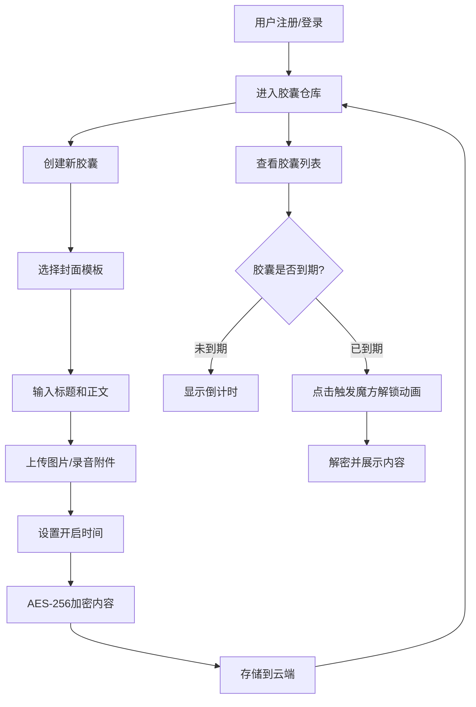

## 1. 产品概述

虚拟时间胶囊是一款让用户可以创建加密电子书信并设定未来开启时间的Web应用。用户将重要的记忆、话语或承诺封存，在约定时间到来前绝对无法查看，到期后通过解锁仪式开启内容。

- 核心价值：通过时间延迟机制创造仪式感和情感价值，保护隐私的同时增强内容的珍贵感
- 目标用户：希望保存珍贵记忆、给未来的自己或他人写信、记录重要时刻的用户
- 市场价值：填补了"时间延迟内容"这一独特细分市场，结合加密技术和情感体验

## 2. 核心功能

### 2.1 用户角色

| 角色 | 注册方式 | 核心权限 |
|------|----------|----------|
| 普通用户 | 用户名+密码注册 | 创建胶囊、查看胶囊仓库、解锁到期胶囊、管理个人胶囊 |

### 2.2 功能模块

1. **用户认证模块**：用户注册、登录、会话管理
2. **胶囊仓库主页**：星尘动画背景、3D翻转胶囊卡片、瀑布流布局、排序筛选
3. **胶囊创建模块**：封面模板选择、内容编辑、附件上传、时间设置、AES-256加密
4. **胶囊解锁模块**：魔方解锁动画、解密展示、乱码符文过渡效果

### 2.3 页面详情

| 页面名称 | 模块名称 | 功能描述 |
|----------|----------|----------|
| 登录/注册页 | 认证模块 | 用户输入用户名密码，注册新账户或登录已有账户 |
| 胶囊仓库页 | 仓库模块 | 展示所有胶囊卡片，支持按开启时间排序、按状态分类筛选 |
| 胶囊创建页 | 创建模块 | 选择封面模板、输入标题正文、上传附件、设置开启时间、加密存储 |
| 胶囊详情页 | 解锁模块 | 魔方解锁动画、解密内容展示、附件查看 |

## 3. 核心流程

用户注册登录后，进入胶囊仓库查看所有胶囊。点击创建胶囊，选择封面模板，输入内容，上传附件，设置开启时间，系统用AES-256加密后存储。回到仓库可以看到胶囊卡片，显示倒计时。到期后点击胶囊，触发魔方解锁动画，解密并展示内容。

## 4. 用户界面设计

### 4.1 设计风格

- **主色调**：暗色深蓝 #0b0e1a（背景）
- **品牌色**：金色 #d4af37（强调）、科技蓝 #00d4ff（交互）
- **卡片效果**：毛玻璃 backdrop-filter: blur(20px)，玻璃边框发光 box-shadow
- **字体**：Orbitron（标题）、Inter（正文）
- **动效风格**：流畅优雅，3D旋转，粒子效果，淡入过渡

### 4.2 页面设计概述

| 页面名称 | 模块名称 | UI元素 |
|----------|----------|---------|
| 登录页 | 认证模块 | 深空背景、星光粒子、毛玻璃登录卡片、金色输入框边框、Orbitron标题字体 |
| 胶囊仓库页 | 仓库模块 | 星尘动画背景、瀑布流网格、3D翻转胶囊卡片、倒计时显示、锁状态动画、筛选排序控件 |
| 胶囊创建页 | 创建模块 | 封面模板预览网格、富文本编辑器、附件上传区域、时间选择器、加密进度提示 |
| 胶囊解锁页 | 解锁模块 | 全屏3D魔方、6面碎片动画、金色光晕脉冲、乱码符文过渡效果 |

### 4.3 响应式

- 桌面优先设计，适配 320px - 1920px
- 移动端：单列布局，卡片全屏宽度
- 平板：2-3列瀑布流
- 桌面：3-4列瀑布流，宽窄随机排列
- 触摸优化：增大点击区域，支持滑动切换分类

### 4.4 3D场景指导

- **环境**：深空背景，星尘粒子漂浮，营造宇宙时间感
- **光照**：环境光 + 金色点光源 + 科技蓝光带，营造未来科技感
- **相机**：胶囊卡片使用轻微透视，解锁时镜头推进
- **动画**：
  - 胶囊卡片：360°持续旋转，悬停加速至2s一圈
  - 锁图标：未到期时轻微晃动，可开启时金色光晕脉冲
  - 解锁魔方：3D旋转6面，每面显示碎片，解锁成功时碎片合拢
- **性能**：首页渲染 < 600ms，解密操作 < 1s（超时显示进度条，支持后台处理）
