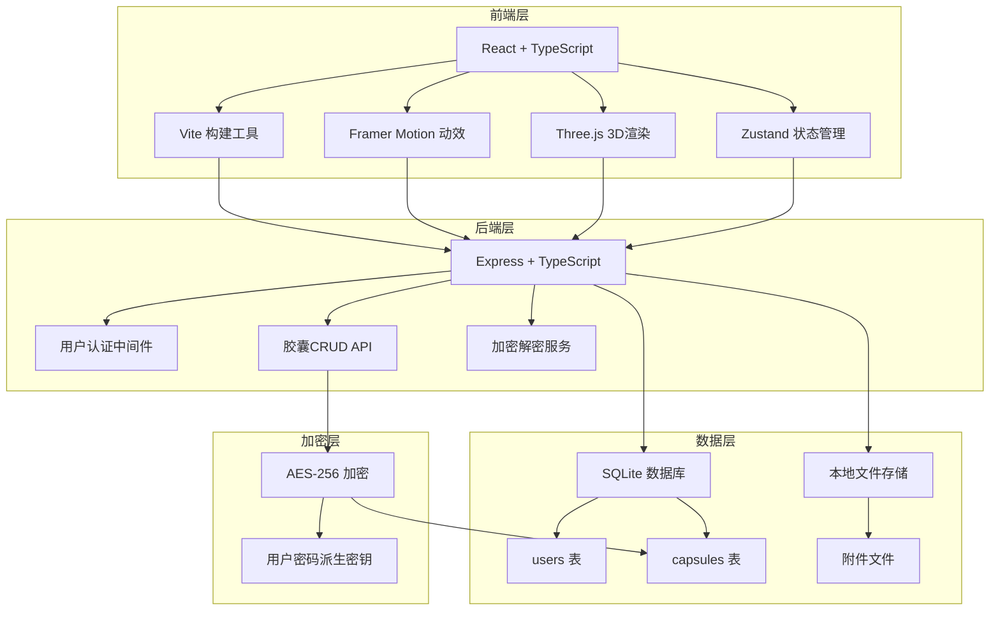
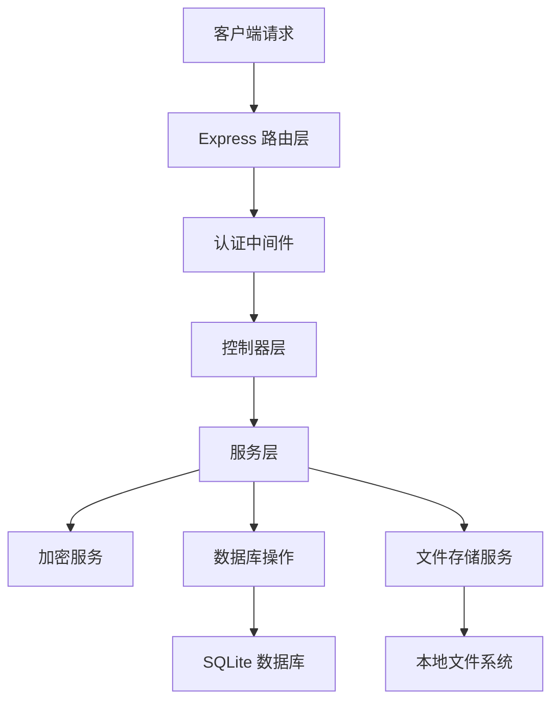

## 1. 架构设计



## 2. 技术描述

- **前端**：React 18 + TypeScript + Vite + Framer Motion + Three.js + Zustand
- **后端**：Express 4 + TypeScript + SQLite3 + crypto-js + uuid
- **构建工具**：Vite + concurrently（前后端同时启动）
- **数据库**：SQLite（本地文件数据库，无需额外部署）
- **加密**：AES-256-CBC，密钥由用户密码派生

## 3. 路由定义

| 路由 | 页面 | 说明 |
|------|------|------|
| /login | 登录页 | 用户登录入口 |
| /register | 注册页 | 新用户注册 |
| /dashboard | 胶囊仓库 | 主页，展示所有胶囊卡片 |
| /create | 创建胶囊 | 创建新时间胶囊 |
| /capsule/:id | 胶囊详情 | 查看/解锁胶囊 |
| * | 404重定向 | 未匹配路由跳转登录页 |

## 4. API 定义

```typescript
// 类型定义
interface User {
  id: string;
  username: string;
  password_hash: string;
  created_at: string;
}

interface Capsule {
  id: string;
  user_id: string;
  title: string;
  encrypted_content: string;
  cover_template: string;
  attachment_url: string | null;
  attachment_type: 'image' | 'audio' | null;
  open_time: string;
  created_at: string;
  is_opened: boolean;
}

// API 端点
// 认证
POST /api/auth/register - 注册
  请求: { username: string, password: string }
  响应: { token: string, user: { id: string, username: string } }

POST /api/auth/login - 登录
  请求: { username: string, password: string }
  响应: { token: string, user: { id: string, username: string } }

// 胶囊
GET /api/capsules - 获取用户胶囊列表
  响应: { capsules: Capsule[] }

POST /api/capsules - 创建胶囊
  请求: FormData { title, encrypted_content, cover_template, open_time, attachment? }
  响应: { capsule: Capsule }

GET /api/capsules/:id - 获取单个胶囊
  响应: { capsule: Capsule }

PUT /api/capsules/:id/unlock - 标记胶囊为已开启
  请求: { user_password: string }
  响应: { decrypted_content: string, capsule: Capsule }
```

## 5. 服务端架构



## 6. 数据模型

### 6.1 ER 图

```mermaid
erDiagram
    USERS {
        string id PK
        string username UNIQUE
        string password_hash
        datetime created_at
    }
    
    CAPSULES {
        string id PK
        string user_id FK
        string title
        string encrypted_content
        string cover_template
        string attachment_url
        string attachment_type
        datetime open_time
        datetime created_at
        boolean is_opened
    }
    
    USERS ||--o{ CAPSULES : "owns"
```

### 6.2 DDL 语句

```sql
-- 用户表
CREATE TABLE IF NOT EXISTS users (
  id TEXT PRIMARY KEY,
  username TEXT UNIQUE NOT NULL,
  password_hash TEXT NOT NULL,
  created_at DATETIME DEFAULT CURRENT_TIMESTAMP
);

-- 胶囊表
CREATE TABLE IF NOT EXISTS capsules (
  id TEXT PRIMARY KEY,
  user_id TEXT NOT NULL,
  title TEXT NOT NULL,
  encrypted_content TEXT NOT NULL,
  cover_template TEXT NOT NULL,
  attachment_url TEXT,
  attachment_type TEXT,
  open_time DATETIME NOT NULL,
  created_at DATETIME DEFAULT CURRENT_TIMESTAMP,
  is_opened INTEGER DEFAULT 0,
  FOREIGN KEY (user_id) REFERENCES users(id) ON DELETE CASCADE
);

-- 索引
CREATE INDEX IF NOT EXISTS idx_capsules_user_id ON capsules(user_id);
CREATE INDEX IF NOT EXISTS idx_capsules_open_time ON capsules(open_time);
```
