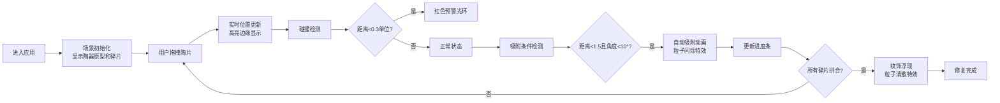

## 1. 产品概述

虚拟考古实验室陶器碎片拼合交互可视化应用，让用户以考古修复师的身份在三维工作台上拼合破碎陶片，再现古代陶器完整形态。

- **主要目的**：通过沉浸式3D交互体验，模拟考古修复过程，展示古代陶器的修复工艺
- **解决问题**：传统文物修复无法直观展示过程，本应用提供可交互的数字化修复体验
- **目标用户**：考古爱好者、教育工作者、博物馆参观者

---

## 2. 核心功能

### 2.1 用户角色
| 角色 | 注册方式 | 核心权限 |
|------|----------|----------|
| 普通用户 | 无需注册 | 体验陶器碎片拼合交互，查看修复进度和最终效果 |

### 2.2 功能模块
1. **三维工作台场景**：半透明陶器基础模型、散落陶片、灯光环境、轨道控制
2. **陶片交互系统**：拖拽移动、旋转控制、高亮提示、吸附动画
3. **碰撞检测系统**：碎片间碰撞预警、红色光环提示
4. **拼合进度展示**：环状进度条、修复计数显示
5. **完成特效系统**：古代纹饰浮现、粒子消散特效

### 2.3 页面详情
| 页面名称 | 模块名称 | 功能描述 |
|----------|----------|----------|
| 主页面 | 3D工作台场景 | 渲染陶器原型和6片碎片，支持鼠标轨道控制查看 |
| 主页面 | 陶片交互 | 拖拽碎片、旋转调整、吸附拼合、碰撞预警 |
| 主页面 | 进度显示 | 左下角环状进度条、顶部修复计数文字 |
| 主页面 | 完成特效 | 全部拼合后纹饰浮现、粒子消散动画 |

---

## 3. 核心流程

---

## 4. 用户界面设计

### 4.1 设计风格
- **主色调**：深褐色 #2e1b0e（背景）、陶土色 #c49a6c（陶器主体）、浅陶色 #d4a574（碎片）
- **高亮色**：金色 #ffd700（拖拽高亮）、淡蓝色 #4a90d9（吸附光晕）、红色 #e74c3c（碰撞预警）
- **进度渐变色**：红色 #e74c3c → 绿色 #27ae60
- **字体**：Noto Serif SC（Google Fonts）
- **工作台背景**：深褐色木纹纹理
- **整体氛围**：博物馆考古实验室的温暖专业感

### 4.2 页面设计概述
| 页面名称 | 模块名称 | UI元素 |
|----------|----------|--------|
| 主页面 | 3D工作台 | 居中半透明陶器原型（高8单位，直径6单位），周围悬浮6片不规则陶片 |
| 主页面 | 进度指示器 | 左下角环状进度条（半径40px），顶部"已修复 X/6 片"文字（18px，#e0d5c1） |
| 主页面 | 交互反馈 | 拖拽时光标为抓取状态，悬停时陶片透明度提升至0.9，金色边缘高亮 |
| 主页面 | 动画效果 | 吸附时0.5秒归正动画，1秒淡蓝色光晕，粒子闪烁（#ffd700，2-4px，0.3秒） |

### 4.3 响应式
- **桌面端**（≥768px）：全屏3D场景，正常尺寸工作台
- **移动端**（<768px）：工作台缩小至80%，左右滚动支持，适配触摸操作

### 4.4 3D场景指引
- **环境**：深褐色木质工作台背景，暖色调环境光，聚光灯突出陶器
- **灯光设置**：环境光（强度0.6）+ 方向光（强度0.8，投射阴影）+ 点光源（强度0.4，补光）
- **相机设置**：PerspectiveCamera，轨道控制器（OrbitControls），初始距离15单位，可360°旋转查看
- **核心元素**：半透明陶器原型（线框模式，颜色#c49a6c）、6片不规则碎片（带灰度噪音纹理）
- **交互动画**：拖拽时碎片跟随光标，吸附时位置平滑过渡、颜色渐变，碰撞时红色光环
- **后期效果**：碎片融合时的光晕效果，完成时的粒子消散特效
- **性能要求**：≥30FPS，初始化<2秒，内存<200MB
