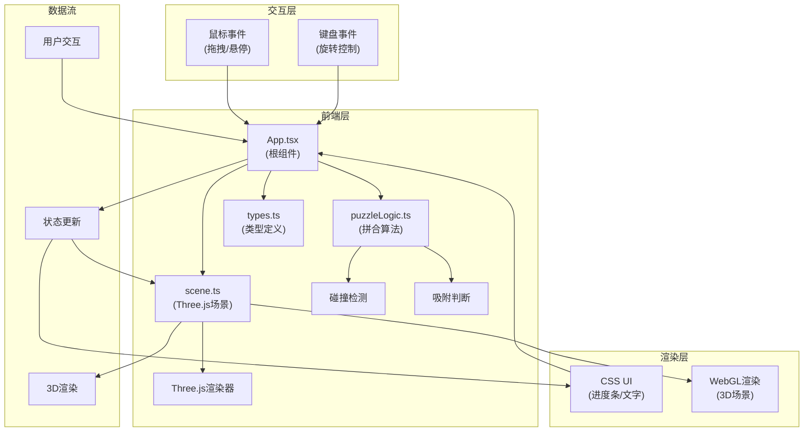

## 1. 架构设计



**文件调用关系和数据流向**：
```
┌─────────────────────────────────────────────────────────┐
│  数据流向: 用户交互 → App.tsx → puzzleLogic.ts → scene.ts → 渲染  │
└─────────────────────────────────────────────────────────┘

src/types.ts (类型定义)
    ↑ 被所有文件引用
    │
src/App.tsx (根组件)
    ├→ 管理全局状态 (碎片位置、拼合进度、拖拽状态)
    ├→ 接收用户交互事件 (鼠标/触摸)
    ├→ 调用 puzzleLogic.ts 进行拼合检测
    └→ 传递数据给 scene.ts 更新3D渲染

src/puzzleLogic.ts (拼合算法)
    ├→ 接收碎片位置和目标位置数据
    ├→ 计算距离和角度偏差
    ├→ 判断吸附条件
    ├→ 碰撞检测
    └→ 返回吸附结果和动画参数

src/scene.ts (Three.js场景)
    ├→ 初始化Three.js场景、相机、灯光
    ├→ 创建陶器原型和碎片模型
    ├→ 接收碎片位置数据更新3D对象矩阵
    ├→ 处理轨道控制器
    └→ 执行动画帧渲染
```

---

## 2. 技术描述

- **前端框架**：React 18 + TypeScript 5
- **3D引擎**：Three.js 0.160.0 + @types/three
- **构建工具**：Vite 5 + @vitejs/plugin-react
- **样式方案**：原生CSS（无CSS框架，使用CSS变量和自定义样式）
- **动画方案**：Three.js动画系统 + CSS transitions + requestAnimationFrame
- **状态管理**：React useState/useReducer（无需额外状态管理库）
- **初始化工具**：npm create vite@latest

---

## 3. 项目结构

```
auto222/
├── package.json              # 项目依赖和脚本
├── vite.config.js            # Vite构建配置
├── tsconfig.json             # TypeScript配置
├── index.html                # 入口HTML
└── src/
    ├── App.tsx               # 根组件，全局状态管理
    ├── scene.ts              # Three.js场景管理
    ├── puzzleLogic.ts        # 拼合算法核心
    ├── types.ts              # TypeScript类型定义
    └── main.tsx              # React入口文件
```

---

## 4. 类型定义

```typescript
// src/types.ts

// 碎片状态枚举
export enum FragmentState {
  FLOATING = 'floating',     // 悬浮状态
  DRAGGING = 'dragging',     // 拖拽中
  SNAPPING = 'snapping',     // 吸附动画中
  PLACED = 'placed',         // 已放置
  COLLIDING = 'colliding'    // 碰撞中
}

// 陶片接口
export interface PotteryFragment {
  id: number;
  mesh: THREE.Mesh | null;
  position: THREE.Vector3;
  targetPosition: THREE.Vector3;
  rotation: THREE.Euler;
  targetRotation: THREE.Euler;
  state: FragmentState;
  color: string;
  featurePoints: THREE.Vector3[];  // 断裂边缘特征点
  thickness: number;
}

// 拼合事件类型
export interface SnapEvent {
  fragmentId: number;
  success: boolean;
  position: THREE.Vector3;
  rotation: THREE.Euler;
}

// 碰撞事件类型
export interface CollisionEvent {
  fragmentId1: number;
  fragmentId2: number;
  isColliding: boolean;
}

// 全局应用状态
export interface AppState {
  fragments: PotteryFragment[];
  placedCount: number;
  totalFragments: number;
  isCompleted: boolean;
  draggingFragmentId: number | null;
}
```

---

## 5. 核心算法说明

### 5.1 吸附检测算法
```typescript
// 距离阈值: 1.5单位
// 角度阈值: 10° (转换为弧度)
function checkSnapCondition(
  fragmentPos: Vector3,
  targetPos: Vector3,
  fragmentRot: Euler,
  targetRot: Euler
): { shouldSnap: boolean; distance: number; angleDiff: number } {
  const distance = fragmentPos.distanceTo(targetPos);
  const angleDiff = calculateAngleDifference(fragmentRot, targetRot);
  return {
    shouldSnap: distance < 1.5 && angleDiff < (10 * Math.PI / 180),
    distance,
    angleDiff
  };
}
```

### 5.2 碰撞检测算法
```typescript
// 碰撞距离阈值: 0.3单位
function checkCollision(
  frag1: PotteryFragment,
  frag2: PotteryFragment
): boolean {
  if (frag1.state === FragmentState.PLACED || frag2.state === FragmentState.PLACED) {
    return false;
  }
  const distance = frag1.position.distanceTo(frag2.position);
  return distance < 0.3;
}
```

---

## 6. 性能优化策略

1. **渐进式加载**：先显示工作台骨架，再异步加载纹理和模型
2. **实例化渲染**：使用InstancedMesh优化相似对象渲染
3. **LOD控制**：根据相机距离调整模型细节
4. **帧率控制**：requestAnimationFrame动态调整渲染频率
5. **内存管理**：及时释放未使用的几何体和材质
6. **事件节流**：鼠标移动事件使用requestAnimationFrame节流
