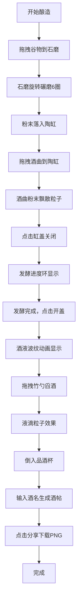

## 1. 产品概述

虚拟酿酒师是一款在浏览器中模拟古代酿酒工艺的互动应用，用户通过筛选谷物、调配酒曲、控制发酵，最终酿造出不同风味的虚拟美酒并生成"酒帖"海报分享。

- **核心价值**：降低传统酿酒知识学习门槛，让用户在无实物环境下体验完整酿造流程
- **目标用户**：酒文化爱好者、传统文化学习者、休闲游戏玩家
- **市场价值**：寓教于乐，传播中华传统酿酒文化，提供独特的互动体验

## 2. 核心功能

### 2.1 功能模块
1. **主酿造场景**：3D酒坊操作台，包含谷物簸箕、石磨、陶缸、酒曲架、品酒杯
2. **谷物碾磨系统**：拖拽谷物到石磨，磨盘旋转动画，粉末落入陶缸
3. **酒曲发酵系统**：拖拽酒曲到陶缸，粒子效果，发酵进度环倒计时
4. **品酒装杯系统**：竹勺舀酒，液滴粒子，酒液倒入品酒杯动画
5. **酒帖生成系统**：输入酒名，自动生成古风酒帖海报，支持PNG下载分享

### 2.2 页面详情

| 页面名称 | 模块名称 | 功能描述 |
|-----------|-------------|---------------------|
| 酿造主界面 | 3D操作台 | 展示木本色酒坊操作台，包含所有酿造器具 |
| 酿造主界面 | 谷物簸箕区 | 左上角5个竹编簸箕盛放不同谷物，支持拖拽 |
| 酿造主界面 | 石磨组件 | 中央石磨，接收谷物后旋转6圈碾磨 |
| 酿造主界面 | 陶缸组件 | 接收碾磨粉末和酒曲，显示发酵进度环 |
| 酿造主界面 | 酒曲架组件 | 3种酒曲，带标签说明发酵特性，支持拖拽 |
| 酿造主界面 | 品酒组件 | 竹勺舀酒倒入品酒杯，触发酒帖生成 |
| 酒帖海报 | 海报展示 | 包含酒名、日期、配方、香气标签、酒液色块 |
| 酒帖海报 | 分享下载 | 900x600px PNG图片下载，古朴宣纸纹理背景 |

## 3. 核心流程

用户从选择谷物开始，经过碾磨、加曲、发酵、舀酒品尝，最终生成酒帖的完整酿造体验。

## 4. 用户界面设计

### 4.1 设计风格
- **主色调**：暖色调，主色#c8a882，辅色#8b5e3c，背景#f5e6c8（古朴宣纸色）
- **字体**：标题使用Google Fonts的Noto Serif SC宋体风格
- **交互效果**：悬停时淡金色光晕（box-shadow: 0 0 8px #d4af37），点击时0.1s按压缩放（scale 0.95）
- **纹理细节**：操作台木纹纹理、投影效果、宣纸纹理背景

### 4.2 页面设计概览

| 页面名称 | 模块名称 | UI元素 |
|-----------|-------------|-------------|
