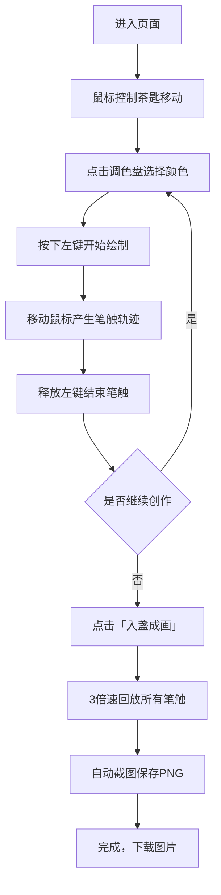

## 1. 产品概述

茶百戏是一款在浏览器中模拟宋代点茶技艺的互动艺术应用，用户可以像古代风雅文人一样，用茶匙蘸取茶膏在茶汤表面勾勒山水花鸟图案，并将创作过程录制为可分享的动态茶画。

- **核心价值**：传承中华茶文化，让用户以沉浸式交互体验宋代点茶的雅致美学
- **目标用户**：茶文化爱好者、艺术创作者、国风文化追求者

## 2. 核心功能

### 2.1 用户角色
| 角色 | 注册方式 | 核心权限 |
|------|----------|----------|
| 普通用户 | 无需注册 | 自由绘制、切换颜色、回放创作、保存图片 |

### 2.2 功能模块
1. **主画布区域**：圆形茶盏画布、茶匙光标、实时笔触渲染、水墨晕染效果
2. **调色盘模块**：五色茶膏选择、颜色切换动画、选中高亮效果
3. **回放保存模块**：3倍速笔触回放、缓入缓出动画、自动截图保存、水印添加
4. **视觉氛围模块**：飞白标题动画、雾气粒子效果、按钮脉冲动画

### 2.3 页面详情
| 页面名称 | 模块名称 | 功能描述 |
|---------|----------|----------|
| 主页面 | 茶盏画布 | 300px直径圆形画布，青黑釉色内壁，冰裂纹纹理，乳白色茶汤带波纹动画 |
| 主页面 | 茶匙交互 | 竹制茶匙光标，跟随鼠标移动，尖端颜色随选中茶膏变化 |
| 主页面 | 笔触绘制 | 按下左键绘制，轨迹宽度随按压时间变化（0.5-3px），起止点淡入淡出水墨晕染 |
| 主页面 | 调色盘 | 五色茶膏（墨绿、赭石、朱砂、藤黄、黛蓝）圆形排列，点击切换 |
| 主页面 | 入盏成画按钮 | 3倍速回放绘制过程，完成后自动保存640x480 PNG图片，带木纹背景和水印 |
| 主页面 | 视觉氛围 | 飞白标题动画、升腾雾气粒子、按钮脉冲效果 |

## 3. 核心流程

用户进入页面 → 鼠标在茶盏上移动控制茶匙 → 选择茶膏颜色 → 按下左键开始绘制 → 移动鼠标留下水墨轨迹 → 释放左键结束笔触 → 多次创作完成作品 → 点击「入盏成画」按钮 → 系统3倍速回放所有笔触 → 自动截图保存为带水印的PNG图片

## 4. 用户界面设计

### 4.1 设计风格
- **整体风格**：宋代极简美学，雅致温润，留白充足
- **主色调**：茶色 #c8a96e、墨色 #2c2c2c、留白 #faf3e0
- **茶盏**：直径300px，内壁青黑釉色 #2a2a1a，冰裂纹纹理
- **茶汤**：乳白色 #f5e6d0，3s周期径向波纹渐变动画
- **按钮**：圆角矩形 border-radius: 8px，点击脉冲扩散动画（0.2s，扩大至1.2倍）
- **字体**：Google Fonts - Ma Shan Zheng（马善政楷体）
- **标题**：仿宋体「茶百戏」，2s循环飞白笔触动画

### 4.2 页面设计概览
| 页面名称 | 模块名称 | UI元素 |
|---------|----------|--------|
| 主页面 | 顶部标题区 | 「茶百戏」飞白动画标题，居中显示，茶色字体 |
| 主页面 | 中心茶盏区 | 圆形茶盏（300px），青黑内壁，冰裂纹，乳白色茶汤，周围雾气粒子（20个，大小3-6px，透明度0.2-0.5，上升速度0.5px/s） |
| 主页面 | 右侧调色盘 | 五色茶膏色块（30x30px）圆形排列，间隔10px，选中高亮 |
| 主页面 | 右上角按钮 | 「入盏成画」按钮，茶色背景，墨色文字 |
| 主页面 | 茶匙光标 | 竹制茶匙（120px长，细尖端），跟随鼠标，尖端颜色随选中茶膏渐变（0.3s过渡） |

### 4.3 响应式设计
- **桌面端**：茶盏居中，调色盘右侧垂直圆形排列，按钮右上角
- **移动端**：茶盏缩放至屏幕宽度85%，调色盘改为底部横向排列，按钮适配触控区域
- **触摸优化**：支持触摸事件，增大触控热区

### 4.4 动画与交互细节
- **茶汤波纹**：径向渐变，3s周期，微弱波纹动画
- **水墨晕染**：每笔起止使用 shadowBlur，半径0→8px→0渐变
- **笔触宽度**：按压时间越长，笔触越粗（0.5-3px）
- **颜色切换**：茶匙尖端颜色0.3s渐变过渡，图标同步变色
- **回放动画**：3倍速，每笔带缓入缓出（easeInOutCubic）
- **雾气粒子**：20个粒子，大小3-6px随机，透明度0.2-0.5，上升速度0.5px/s

## 5. 性能要求
- 绘制帧率稳定60fps
- 回放动画帧率不低于30fps
- 初始加载时间不超过2秒
-