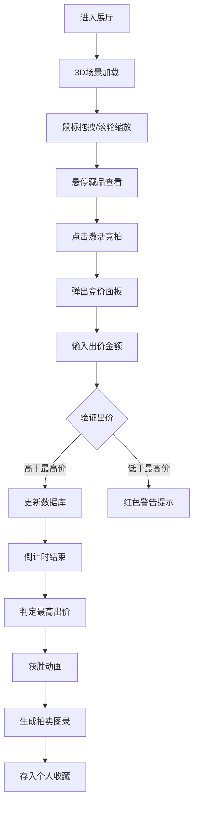

## 1. 产品概述
虚拟拍卖行是一个沉浸式的3D数字展厅Web应用，用户可以作为资深鉴定师浏览古董藏品，通过互动激活隐藏的"时光能量波"视觉效果，参与竞拍并生成专属拍卖图录。

- **核心价值**：将传统拍卖与数字艺术结合，通过3D可视化和互动特效打造沉浸式收藏体验
- **目标用户**：古董收藏家、艺术爱好者、数字藏品投资者
- **市场定位**：高端虚拟藏品拍卖平台，强调历史文化价值与视觉体验

## 2. 核心特性

### 2.1 用户角色
| 角色 | 注册方式 | 核心权限 |
|------|---------|---------|
| 藏家 | 自动分配匿名用户ID | 浏览展厅、互动藏品、参与竞拍、查看收藏 |

### 2.2 功能模块
1. **3D数字展厅**：环绕式弧形展柜布局，第一人称视角漫游
2. **藏品互动系统**：悬停能量波、点击旋转、拖拽竞拍
3. **实时竞拍系统**：30秒倒计时竞价、价格验证、出价历史
4. **拍卖图录生成**：PNG格式下载，含3D截图与背景故事
5. **个人收藏馆**：历史竞拍记录、藏品详情回顾
6. **历史背景模式**：动态文字叙述、光晕特效

### 2.3 页面详情
| 页面名称 | 模块名称 | 功能描述 |
|---------|---------|----------|
| 首页/展厅 | 3D展厅渲染 | 弧形排列10个展柜，低多边形文物模型，鼠标拖拽旋转视角，滚轮缩放 |
| 首页/展厅 | 互动悬停效果 | 能量球脉动、金色边框、名称底价浮窗 |
| 首页/展厅 | 点击激活效果 | 藏品自转、粒子爆破、竞价面板弹出 |
| 竞拍面板 | 出价系统 | 金币输入、步长100、价格验证、倒计时毫秒级显示 |
| 竞拍结果 | 获胜动画 | 星尘粒子散落、恭喜弹窗、图录生成 |
| 藏品详情 | 3D展示 | 独立3D视图、可旋转观察 |
| 藏品详情 | 历史背景模式 | 放射性光晕、向上滚动古风文字 |
| 个人收藏 | 藏品列表 | 卡片式展示、成交记录、点击跳转详情 |

## 3. 核心流程
用户进入虚拟展厅 → 鼠标拖拽环顾四周 → 悬停藏品查看信息 → 点击藏品激活竞拍 → 输入出价金额 → 系统验证并更新 → 倒计时结束判定 → 生成拍卖图录 → 查看个人收藏

## 4. 用户界面设计

### 4.1 设计风格
- **主题**：哥特式奢华风格，深色博物馆氛围
- **主色**：金色 `#d4af37`（尊贵、财富）
- **辅色**：木色 `#8b4513`（古典、温润）
- **背景**：深褐渐变 `#1b1210` → `#2a1f1a`
- **字体**：Palatino / Serif 家族，典雅古典
- **按钮**：黄铜质感边框，hover时金色流光动画
- **卡片**：深色半透明背景，hover放大1.1倍+金色光晕投影
- **能量效果**：CSS渐变+关键帧+Canvas粒子，随藏品色系变化

### 4.2 页面设计概述
| 页面名称 | 模块名称 | UI元素 |
|---------|---------|--------|
| 3D展厅 | 展柜系统 | 弧形排列10个黄铜质感展柜，内发光效果，近处明亮远处微暗 |
| 3D展厅 | 能量粒子 | 半透明球体，悬停脉动扩散，色相旋转1.2倍缩放 |
| 竞价面板 | 毛玻璃效果 | 背景模糊10px，金色边框，出价历史列表，毫秒级倒计时 |
| 拍卖图录 | 仿古卷轴 | 金色边框，书法字体，3D截图，背景故事文字 |
| 个人收藏 | 藏品卡片 | 正反翻转效果，正面缩略图，背面成交记录 |
| 历史背景模式 | 文字滚动 | 金色字体，半透明背景，每行3秒向上滚动 |

### 4.3 响应式设计
- **桌面端**：完整3D展厅，10个展柜弧形排列，鼠标悬停/点击/拖拽交互
- **平板端（iPad Pro）**：自适应分辨率，展柜布局优化，触控支持
- **交互优化**：触控长按替代悬停，双击替代点击，双指缩放

### 4.4 3D场景指引
- **环境**：深色博物馆空间，柔和顶光+展柜重点照明，营造真实展厅氛围
- **灯光**：AmbientLight环境光 + PointLight展柜射灯 + SpotLight中央拍卖台
- **相机**：PerspectiveCamera透视相机，初始45度俯视，fov=60
- **运动**：OrbitControls轨道控制，鼠标拖拽旋转，滚轮缩放，阻尼平滑
- **构图**：10个展柜按180度弧形排列，半径15单位，中央为拍卖台
- **交互**：Raycaster射线检测，悬停高亮，点击触发动画
- **后处理**：Bloom光晕效果，FXAA抗算法，提升视觉质量
- **性能**：低多边形模型（<500面/件），实例化渲染，LOD层级细节
