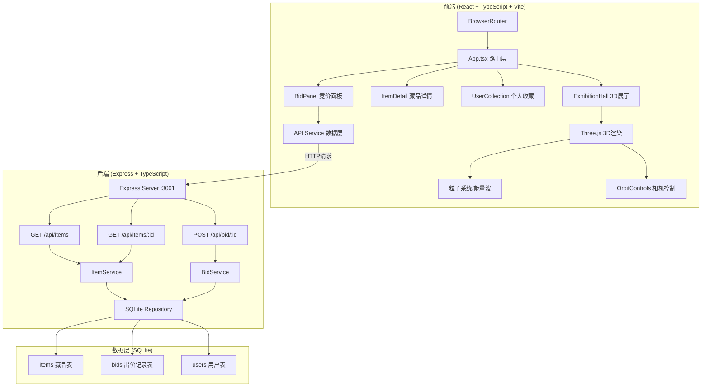
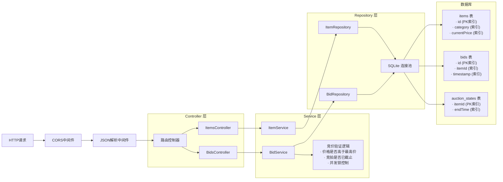
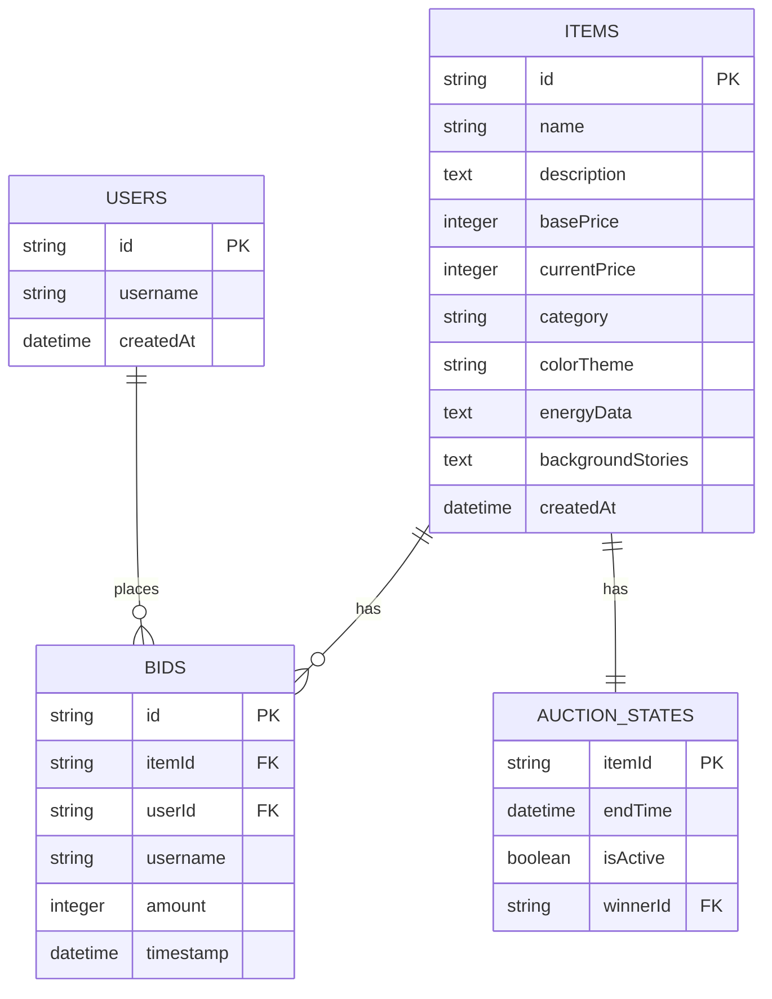

## 1. 架构设计



## 2. 技术描述

- **前端框架**：React 18 + TypeScript 5 + Vite 5
- **3D渲染**：Three.js 0.160 + @types/three
- **状态管理**：Zustand
- **路由**：React Router DOM 6
- **样式**：CSS Modules + PostCSS动画
- **后端**：Express 4 + TypeScript
- **数据库**：better-sqlite3 9 + 索引优化
- **HTTP客户端**：Fetch API
- **其他工具**：uuid 9（唯一ID）、cors 2（跨域）

## 3. 路由定义

| 路由 | 用途 |
|-----|------|
| `/` | 3D数字展厅首页，展示所有藏品展柜 |
| `/auction` | 竞拍大厅，中央拍卖台模式 |
| `/item/:id` | 藏品详情页，3D展示+历史背景模式 |
| `/users/:userId` | 个人收藏馆，历史竞拍成功记录 |

## 4. API 定义

### 类型定义
```typescript
interface ArtifactItem {
  id: string;
  name: string;
  description: string;
  basePrice: number;
  currentPrice: number;
  category: 'bronze' | 'porcelain' | 'coin' | 'jade' | 'painting';
  colorTheme: string;
  energyData: EnergyData;
  backgroundStories: string[];
  createdAt: string;
}

interface EnergyData {
  frequency: number;
  amplitude: number;
  resonance: number;
  historicalKeys: string[];
}

interface BidRecord {
  id: string;
  itemId: string;
  userId: string;
  username: string;
  amount: number;
  timestamp: string;
}

interface AuctionState {
  itemId: string;
  endTime: string;
  isActive: boolean;
  winnerId: string | null;
  bids: BidRecord[];
}
```

### API 接口
| 方法 | 路径 | 请求体 | 响应 |
|-----|------|-------|------|
| GET | `/api/items` | - | `{ items: ArtifactItem[], auctionStates: AuctionState[] }` |
| GET | `/api/items/:id` | - | `{ item: ArtifactItem, bids: BidRecord[], auctionState: AuctionState }` |
| POST | `/api/bid/:id` | `{ userId: string, username: string, amount: number }` | `{ success: boolean, newBid?: BidRecord, error?: string, auctionState: AuctionState }` |

## 5. 服务器架构图



## 6. 数据模型

### 6.1 ER 图



### 6.2 DDL 语句

```sql
-- 藏品表
CREATE TABLE IF NOT EXISTS items (
  id TEXT PRIMARY KEY,
  name TEXT NOT NULL,
  description TEXT NOT NULL,
  basePrice INTEGER NOT NULL,
  currentPrice INTEGER NOT NULL,
  category TEXT NOT NULL,
  colorTheme TEXT NOT NULL,
  energyData TEXT NOT NULL,
  backgroundStories TEXT NOT NULL,
  createdAt DATETIME DEFAULT CURRENT_TIMESTAMP
);

CREATE INDEX IF NOT EXISTS idx_items_category ON items(category);
CREATE INDEX IF NOT EXISTS idx_items_currentPrice ON items(currentPrice);

-- 出价记录表
CREATE TABLE IF NOT EXISTS bids (
  id TEXT PRIMARY KEY,
  itemId TEXT NOT NULL,
  userId TEXT NOT NULL,
  username TEXT NOT NULL,
  amount INTEGER NOT NULL,
  timestamp DATETIME DEFAULT CURRENT_TIMESTAMP,
  FOREIGN KEY (itemId) REFERENCES items(id),
  FOREIGN KEY (userId) REFERENCES users(id)
);

CREATE INDEX IF NOT EXISTS idx_bids_itemId ON bids(itemId);
CREATE INDEX IF NOT EXISTS idx_bids_timestamp ON bids(timestamp);
CREATE INDEX IF NOT EXISTS idx_bids_itemId_amount ON bids(itemId, amount DESC);

-- 拍卖状态表
CREATE TABLE IF NOT EXISTS auction_states (
  itemId TEXT PRIMARY KEY,
  endTime DATETIME,
  isActive INTEGER DEFAULT 0,
  winnerId TEXT,
  FOREIGN KEY (itemId) REFERENCES items(id),
  FOREIGN KEY (winnerId) REFERENCES users(id)
);

CREATE INDEX IF NOT EXISTS idx_auction_states_endTime ON auction_states(endTime);

-- 用户表
CREATE TABLE IF NOT EXISTS users (
  id TEXT PRIMARY KEY,
  username TEXT NOT NULL,
  createdAt DATETIME DEFAULT CURRENT_TIMESTAMP
);

-- 初始化10件藏品数据
INSERT OR IGNORE INTO items (id, name, description, basePrice, currentPrice, category, colorTheme, energyData, backgroundStories) VALUES
('bronze-jue', '商代青铜爵', '商代晚期青铜酒器，三足鼎立，纹饰精美', 5000, 5000, 'bronze', '#cd7f32', '{"frequency":7.8,"amplitude":0.85,"resonance":92,"historicalKeys":["祭祀礼器","王室专用","青铜文明"]}', '["商王武丁时期铸造，用于王室祭祀大典","曾出土于殷墟王陵，见证了商代青铜铸造的巅峰技艺","器身铭文记载了平定鬼方的赫赫战功"]'),
('ru-yao-vase', '宋代汝窑瓷瓶', '汝窑天青釉弦纹瓶，宋代五大名窑之首', 2500, 2500, 'porcelain', '#87ceeb', '{"frequency":6.3,"amplitude":0.92,"resonance":98,"historicalKeys":["雨过天青","宋徽宗御窑","玛瑙入釉"]}', '["宋徽宗赵佶梦中之色，雨过天青云破处","以玛瑙末入釉，釉面泛出淡淡红晕，如晨露初晞","历经靖康之变，辗转流传千年，釉色依旧温润如玉"]'),
('roman-gold-coin', '古罗马金币', '奥古斯都时期金币，浮雕精美品相完好', 3000, 3000, 'coin', '#ffd700', '{"frequency":9.1,"amplitude":0.78,"resonance":88,"historicalKeys":["奥古斯都","罗马帝国","金本位"]}', '["屋大维·奥古斯都统治时期铸造，见证罗马帝国黄金时代","币面浮雕为奥古斯都头像，背面为罗马女神立像","曾作为军饷发放给征战高卢的罗马军团士兵"]'),
('han-jade-dress', '汉代金缕玉衣', '西汉中山靖王墓出土，金丝连缀玉片', 8000, 8000, 'jade', '#90ee90', '{"frequency":5.5,"amplitude":0.95,"resonance":99,"historicalKeys":["金缕玉衣","死后成仙","汉室诸侯"]}', '["中山靖王刘胜殓服，以2498片玉片1100克金丝连缀而成","汉代人深信玉能寒尸，穿金缕玉衣可保尸骨不朽","1968年满城汉墓出土，震惊世界的考古发现"]'),
('sung-scroll', '清明上河图局部', '张择端真迹残卷，宋代市井风情', 15000, 15000, 'painting', '#daa520', '{"frequency":4.2,"amplitude":0.88,"resonance":96,"historicalKeys":["张择端","汴京繁华","界画巅峰"]}', '["北宋徽宗朝翰林图画院张择端绘，绢本设色长卷","描绘汴京汴河沿岸的市井风情与漕运盛况","残卷仅存虹桥段，人物车马栩栩如生，毫发毕现"]'),
('tang-sancai', '唐代三彩骆驼', '唐三彩骆驼载乐俑，釉色鲜艳', 4500, 4500, 'porcelain', '#cd853f', '{"frequency":7.2,"amplitude":0.82,"resonance":90,"historicalKeys":["唐三彩","丝绸之路","盛唐气象"]}', '["唐代厚葬之风盛行，三彩器为达官贵人陪葬明器","骆驼昂首嘶鸣，背负乐团，再现丝绸之路商旅盛况","黄、绿、白三色釉交融，流淌出盛唐的雍容气度"]'),
('zhou-bronze-ding', '西周青铜鼎', '西周大盂鼎，铭文珍贵', 12000, 12000, 'bronze', '#b87333', '{"frequency":5.8,"amplitude":0.91,"resonance":97,"historicalKeys":["列鼎制度","金文书法","西周初年"]}', '["周康王时期铸造，内铸铭文291字，记载康王对盂的册命","列鼎制度象征贵族等级，九鼎为天子之制","清代道光年间出土，为海内三宝之一"]'),
('ming-vase', '明代青花瓶', '永乐青花缠枝莲纹瓶，苏麻离青料', 6000, 6000, 'porcelain', '#4169e1', '{"frequency":6.8,"amplitude":0.86,"resonance":93,"historicalKeys":["永宣青花","郑和下西洋","苏麻离青"]}', '["明永乐朝景德镇官窑烧制，使用郑和带回的苏麻离青料","青花发色浓艳，铁锈斑深入胎骨，如墨在宣纸晕散","缠枝莲纹连绵不绝，象征生生不息的吉祥寓意"]'),
('greek-marble', '希腊大理石神像', '公元前5世纪雅典娜神像残件', 20000, 20000, 'jade', '#f5f5dc', '{"frequency":3.5,"amplitude":0.94,"resonance":95,"historicalKeys":["古典时期","菲狄亚斯","帕特农神庙"]}', '["希腊古典时期杰作，可能出自菲狄亚斯学派之手","原供奉于帕特农神庙，见证了雅典黄金时代的辉煌","衣纹褶皱如行云流水，虽残损仍不失神圣庄严"]'),
('jade-imperial-seal', '传国玉玺', '和氏璧镌刻，受命于天既寿永昌', 50000, 50000, 'jade', '#00ff7f', '{"frequency":2.1,"amplitude":0.99,"resonance":100,"historicalKeys":["和氏璧","秦始皇","传国玉玺"]}', '["楚人和氏三献璞玉，历三代终成国宝，名曰和氏璧","秦始皇统一六国，命李斯以虫鸟篆书\"受命于天，既寿永昌\"","传国玉玺历经秦汉魏晋南北朝，辗转流传千年，象征正统皇权"]');
```
