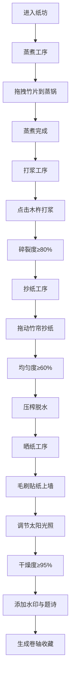

## 1. 产品概述

古代宣纸制作模拟器是一款基于Web的3D交互应用，让用户能够在浏览器中沉浸式体验传统手工造纸的完整工艺流程，解决无法亲身体验传统手工艺、缺乏触觉反馈与过程可视化的问题。

- 主要用途：教育展示、文化传播、互动体验
- 目标用户：文化爱好者、学生、博物馆参观者
- 市场价值：传承中华造纸文化，提供可交互的数字化体验

## 2. 核心功能

### 2.1 用户角色
| 角色 | 注册方式 | 核心权限 |
|------|----------|----------|
| 访客用户 | 无需注册 | 体验造纸全过程、添加水印、题诗、收藏作品 |

### 2.2 功能模块
1. **蒸煮工序**：竹片拖拽、蒸锅蒸煮、蒸汽粒子、进度显示
2. **打浆工序**：木杵敲击、碎裂度计算、纸浆粒子系统、过筛功能
3. **抄纸工序**：竹帘拖拽、均匀度算法、压榨动画、水滴粒子
4. **晒纸工序**：晒纸墙、毛刷贴纸、太阳光照调节、干燥度计算
5. **成品处理**：水印印章库、题诗功能、卷轴生成、本地收藏画廊

### 2.3 页面详情
| 页面名称 | 模块名称 | 功能描述 |
|----------|----------|----------|
| 主造纸场景 | 蒸煮区 | 拖拽竹片到蒸锅上方，蒸汽粒子效果，进度条显示 |
| 主造纸场景 | 打浆区 | 点击木杵敲击，碎裂度进度，纸浆粒子系统 |
| 主造纸场景 | 抄纸区 | 竹帘拖拽抄纸，均匀度检测，压榨动画 |
| 主造纸场景 | 晒纸区 | 毛刷贴纸，太阳光照调节，干燥度计算 |
| 成品展示 | 水印选择 | 6种印章图案选择，半透明水印叠加 |
| 成品展示 | 题诗功能 | 毛笔字体渲染，文字输入与展示 |
| 成品展示 | 收藏画廊 | localStorage存储，最多12张作品展示 |

## 3. 核心流程

用户进入纸坊场景，依次完成四道工序：
1. 用竹夹夹起青竹片，拖拽到蒸锅上方停留2秒完成蒸煮
2. 竹料落入石臼，点击木杵打浆至碎裂度80%以上
3. 纸浆流入抄纸池，拖动竹帘抄纸，均匀度达标后压榨
4. 湿纸贴到晒纸墙，调节太阳光照加速干燥
5. 干燥完成后添加水印、题诗，生成卷轴并收藏

## 4. 用户界面设计

### 4.1 设计风格
- **主色调**：暖木色 `#8b5e3c`，米白色 `#f5f0e0`，竹青色 `#3a7a4a`
- **背景色**：深棕色 `#3a2a1a`
- **按钮风格**：拟物化木纹边框，`border-radius: 8px`，`box-shadow` 立体感，hover时放大1.05倍并带金色光晕 `#d4ac0d`
- **字体**：标题使用 Google Fonts Noto Serif SC，正文使用系统衬线字体
- **布局**：四个工序模块上下排列，每个模块高度占视口40%，通过滚动切换
- **动画**：工序切换渐变过渡0.5秒，交互震动反馈（transform:translate循环3次）

### 4.2 页面设计概述
| 页面名称 | 模块名称 | UI元素 |
|----------|----------|--------|
| 主造纸场景 | 蒸煮区 | 3D蒸锅、蒸汽粒子、竹片、进度条、木纹操作台 |
| 主造纸场景 | 打浆区 | 石臼、木杵、纸浆粒子、碎裂度进度、过筛按钮 |
| 主造纸场景 | 抄纸区 | 水池波纹动画、竹帘、均匀度指示器、压榨压板 |
| 主造纸场景 | 晒纸区 | 晒纸墙、毛刷、太阳图标、干燥度进度条 |
| 成品展示 | 水印库 | 6个印章缩略图、印章预览、应用按钮 |
| 成品展示 | 题诗区 | 文字输入框、毛笔字体预览、卷轴画布 |
| 成品展示 | 画廊 | 卷轴缩略图网格、删除按钮、空状态提示 |

### 4.3 响应性
- 桌面端优先，最小分辨率1280x720
- 使用CSS Grid和Flex布局确保自适应
- 所有操作区域不重叠，保持清晰的视觉层次
- 触摸设备支持手势拖拽操作

### 4.4 3D场景指导
- **环境**：古代木结构纸坊，竹席地面纹理，暖色调氛围
- **光照**：环境光 + 方向光模拟室内自然光，蒸煮区添加点光源模拟炉火
- **相机**：透视相机，初始位置俯视操作台，支持轻微平移查看细节
- **粒子系统**：蒸汽粒子（30颗/秒，大小渐变）、纸浆粒子（最多200颗，颜色随碎裂度变化）、水滴粒子（半径3px，下落速度100px/s）
- **性能**：帧率不低于55FPS，粒子系统使用BufferGeometry优化
- **后处理**：轻微泛光效果增强氛围感
