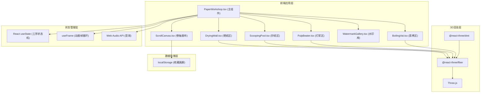

## 1. 架构设计



## 2. 技术描述

- **前端框架**：React 18 + TypeScript
- **构建工具**：Vite 5.x
- **3D引擎**：Three.js r160 + @react-three/fiber v8 + @react-three/drei v9
- **UI组件库**：tweakpane (参数调节面板)
- **样式方案**：CSS Modules + CSS变量 + 内联样式
- **音效**：Web Audio API (程序生成音效)
- **存储**：localStorage (本地收藏)
- **状态管理**：React useState/useReducer (工序状态机)

## 3. 技术栈详情

| 依赖包 | 版本 | 用途 |
|--------|------|------|
| react | ^18.2.0 | UI框架 |
| react-dom | ^18.2.0 | DOM渲染 |
| three | ^0.160.0 | 3D渲染引擎 |
| @types/three | ^0.160.0 | Three.js类型定义 |
| @react-three/fiber | ^8.15.0 | React Three.js渲染器 |
| @react-three/drei | ^9.92.0 | Three.js辅助组件库 |
| tweakpane | ^4.0.0 | 参数调节面板 |
| typescript | ^5.3.0 | 类型系统 |
| vite | ^5.0.0 | 构建工具 |
| @vitejs/plugin-react | ^4.2.0 | React Vite插件 |

## 4. 目录结构

```
src/
├── PaperWorkshop.tsx       # 主游戏组件，状态机管理
├── main.tsx                # 应用入口
├── index.css               # 全局样式
├── components/
│   ├── BoilingVat.tsx      # 蒸煮工序组件
│   ├── PulpBeater.tsx      # 打浆工序组件
│   ├── ScoopingPool.tsx    # 抄纸工序组件
│   ├── DryingWall.tsx      # 晒纸工序组件
│   ├── WatermarkGallery.tsx # 水印库组件
│   └── ScrollCanvas.tsx    # 卷轴画布组件
├── hooks/
│   ├── useParticleSystem.ts # 粒子系统Hook
│   ├── useDragControls.ts  # 拖拽控制Hook
│   └── useAudio.ts         # 音效Hook
├── utils/
│   ├── textureGenerator.ts # 纹理生成工具
│   └── paperMath.ts        # 造纸算法工具
├── types/
│   └── index.ts            # 类型定义
└── assets/
    └── watermarks/         # 水印SVG资源
```

## 5. 核心数据模型

### 5.1 工序状态枚举
```typescript
type ProcessStage = 
  | 'boiling_idle'
  | 'boiling_active'
  | 'beating_active'
  | 'scooping_active'
  | 'drying_active'
  | 'finished';
```

### 5.2 纸张状态
```typescript
interface PaperState {
  boilingProgress: number;      // 蒸煮进度 0-100
  fragmentationLevel: number;   // 碎裂度 0-100
  uniformity: number;           // 均匀度 0-100
  dryness: number;              // 干燥度 0-100
  watermark: string | null;     // 水印类型
  poemText: string;             // 题诗文字
  textureSeed: number;          // 纹理种子
}
```

### 5.3 收藏作品
```typescript
interface GalleryItem {
  id: string;
  imageData: string;            // base64 PNG数据
  watermark: string;
  poemText: string;
  createdAt: number;
}
```

## 6. 核心算法

### 6.1 均匀度计算
```
均匀度 = 100 - (拖拽速度方差 * 系数)
拖拽速度 = 两点距离 / 时间差
方差 = Σ(速度 - 平均速度)² / 样本数
```

### 6.2 干燥度计算
```
每秒干燥增加量 = 1% + (光照强度 / 100) * 1%
干燥度 = min(当前干燥度 + 每秒增加量, 100)
```

### 6.3 粒子系统性能优化
- 使用BufferGeometry批量渲染粒子
- 对象池复用粒子，避免频繁GC
- 帧率自适应粒子更新频率

## 7. 性能指标

| 指标 | 要求 |
|------|------|
| 平均帧率 | ≥ 55 FPS |
| 蒸汽粒子 | 30颗/秒 |
| 打浆粒子上限 | 200颗 |
| 首屏加载时间 | ≤ 3秒 |
| 内存占用 | ≤ 200MB |
