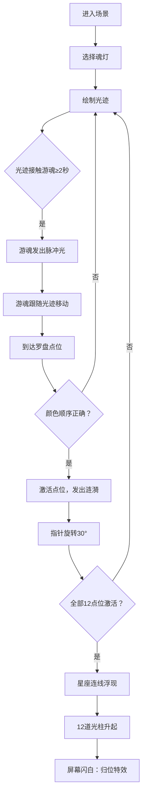

## 1. 产品概述
幽冥魂灯 - 沉浸式3D通灵者交互可视化体验。用户扮演身披暗蓝色斗篷的通灵者，通过点亮魂灯、书写光迹引导游魂归位，最终在星空罗盘上点亮宿命星座。

- **核心价值**：提供独特的东方神秘主义美学交互体验，融合传统文化与现代3D技术
- **目标用户**：对神秘学、星座、东方美学感兴趣的用户，以及交互艺术爱好者
- **市场定位**：Web端创意交互展示项目，可用于艺术展览、品牌宣传、个人作品集展示

## 2. 核心功能

### 2.1 用户角色
| 角色 | 注册方式 | 核心权限 |
|------|----------|----------|
| 通灵者（用户） | 无需注册，直接访问 | 完整的交互体验权限，可自由操作魂灯和引导游魂 |

### 2.2 功能模块
1. **主场景**：灵台、星空背景、魂灯UI、罗盘系统
2. **魂灯系统**：三盏魂灯选择、光迹绘制、脉冲效果
3. **游魂系统**：游魂生成、光迹捕捉、路径跟随、粒子尾迹
4. **罗盘系统**：12星座点位、激活判定、指针旋转、星座连线
5. **特效系统**：脉冲光、涟漪、光柱、屏幕闪白
6. **调试面板**：粒子数量、光迹生命周期等参数调节

### 2.3 页面详情
| 页面名称 | 模块名称 | 功能描述 |
|---------|---------|----------|
| 主场景页 | 灵台模块 | 直径8单位圆形灵台，台面星纹20s周期缓慢旋转 |
| 主场景页 | 游魂模块 | 半透明球体游魂，半径0.3，透明度0.3-0.7循环，周期3s |
| 主场景页 | 魂灯模块 | 红、蓝、金三色魂灯，点击选中，鼠标拖拽绘制光迹 |
| 主场景页 | 罗盘模块 | 12个均匀分布点位，未激活灰色，激活后发光 |
| 主场景页 | 特效模块 | 脉冲光、涟漪、光柱、归位闪白特效 |
| 主场景页 | 调试面板 | Tweakpane面板调节粒子数量、光迹生命周期等参数 |

## 3. 核心流程
用户进入场景 → 点击选择魂灯 → 鼠标拖拽绘制光迹 → 光迹接触游魂累计2秒 → 游魂发出脉冲光 → 游魂跟随光迹向最近未激活罗盘点位移动 → 到达点位激活（需按颜色顺序：红→蓝→金）→ 点位发出涟漪 → 罗盘指针旋转30度 → 全部12点位激活 → 星座连线浮现 → 12道光柱升起 → 屏幕闪白触发"归位"特效

## 4. 用户界面设计

### 4.1 设计风格
- **主色调**：深空青色渐变（#0a0e1a → #1a2a3a），暗调复古底色
- **强调色**：魂灯三色 - 红色#ff5555、蓝色#5599ff、金色#ffdd44
- **辅助色**：游魂#c8e6ff，未激活点位#444
- **字体**：Google Fonts - Orbitron（科技感与神秘感结合）
- **视觉风格**：暗调复古霓虹感，发光效果，半透明质感，柔边光晕

### 4.2 页面设计概述
| 页面名称 | 模块名称 | UI元素 |
|---------|---------|--------|
| 主场景页 | 视觉层 | 深空青色渐变背景，圆形灵台（带旋转星纹），12星座罗盘点位 |
| 主场景页 | 交互层 | 魂灯选择UI（左/右下角），鼠标绘制光迹，碰撞检测反馈 |
| 主场景页 | 动效层 | 游魂漂浮，光迹抖动波动，脉冲光，涟漪扩散，光柱升起，屏幕闪白 |
| 主场景页 | 调试层 | Tweakpane面板（右上角），可调节粒子数量、光迹生命周期等 |

### 4.3 响应式
- Desktop-first设计，支持1920×1080及以上分辨率
- 移动设备自适应缩放，保持核心交互可用
- 触控设备支持触摸绘制光迹

### 4.4 3D场景设计
- **环境**：深空青色渐变背景，无HDRI，营造幽冥氛围
- **光照**：AmbientLight（0.2强度）+ PointLight（三盏魂灯位置，颜色对应）
- **相机**：PerspectiveCamera，位置(0, 8, 12)，lookAt(0, 0, 0)，固定视角
- **构图**：灵台居中，游魂环绕，罗盘在外围，魂灯UI在屏幕角落
- **交互**：鼠标位置映射到3D空间平面，点击选择魂灯，拖拽绘制光迹
- **后处理**：BloomEffect（发光效果），FXAA抗锯齿
- **性能**：稳定30fps+，粒子≤500，光迹缓存≤3条，每帧更新路径缓存
