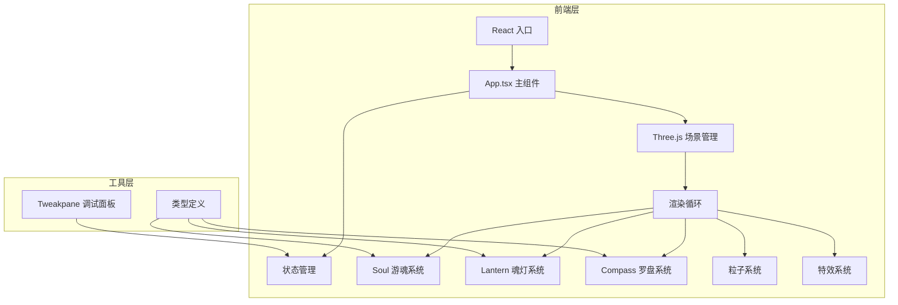

## 1. 架构设计



## 2. 技术描述
- **前端框架**：React@18 + TypeScript@5
- **3D引擎**：Three.js@0.158
- **构建工具**：Vite@5（esnext目标，输出dist目录）
- **调试工具**：Tweakpane
- **状态管理**：React useState/useRef（轻量级场景，无需额外状态库）
- **字体**：Google Fonts - Orbitron

## 3. 目录结构

```
project/
├── package.json
├── index.html
├── vite.config.js
├── tsconfig.json
├── src/
│   ├── index.tsx          # React入口，挂载App组件
│   ├── App.tsx            # 主应用组件，场景管理，动画循环
│   ├── Soul.ts            # 游魂类
│   ├── Lantern.ts         # 魂灯类
│   └── Compass.ts         # 罗盘类
└── .trae/documents/
    ├── PRD.md
    └── TECH-ARCHITECTURE.md
```

## 4. 核心类定义

### 4.1 Soul 游魂类
```typescript
interface Soul {
  position: THREE.Vector3;
  color: string;        // #c8e6ff
  radius: number;       // 0.3
  isCaptured: boolean;
  contactTime: number;  // 累计接触时间
  targetPoint: number | null;  // 目标罗盘点位索引
  moveSpeed: number;    // 0.5 单位/秒
  mesh: THREE.Mesh;
  particles: Particle[];
  
  updateMovement(delta: number, trailPoints: THREE.Vector3[]): void;
  drawParticles(): void;
}
```

### 4.2 Lantern 魂灯类
```typescript
interface Lantern {
  color: string;        // #ff5555 | #5599ff | #ffdd44
  radius: number;       // 0.4
  isSelected: boolean;
  trail: THREE.Line | null;
  trailPoints: THREE.Vector3[];
  trailLifetime: number;  // 5秒
  
  drawTrail(point: THREE.Vector3): void;
  emitPulse(position: THREE.Vector3): void;
  updateTrail(delta: number): void;
}
```

### 4.3 Compass 罗盘类
```typescript
interface Compass {
  points: CompassPoint[];  // 12个点位
  pointerAngle: number;
  activatedCount: number;
  
  activatePoint(index: number, color: string): boolean;  // 返回是否成功激活
  checkAllActivated(): boolean;
  showConstellation(): void;
}

interface CompassPoint {
  position: THREE.Vector3;
  symbol: string;     // 星座符号
  isActivated: boolean;
  activatedColors: string[];  // 已激活的颜色顺序
  mesh: THREE.Mesh;
}
```

## 5. 性能优化策略

| 优化点 | 策略 | 阈值 |
|--------|------|------|
| 粒子数量 | 对象池复用，超出上限移除最旧粒子 | ≤ 500 |
| 光迹缓存 | 最多保留3条光迹，超出移除最旧 | ≤ 3 |
| 路径缓存 | 每帧更新游魂移动路径，避免重复计算 | 每帧更新 |
| 渲染优化 | 材质复用，几何体合并，按需更新 | 30fps+ |
| 动画循环 | 使用requestAnimationFrame，deltaTime控制 | 固定时间步长 |

## 6. 交互事件处理

| 事件 | 处理逻辑 |
|------|----------|
| 鼠标点击 | Raycaster检测点击魂灯，切换选中状态，播放缩放动画 |
| 鼠标移动 | 若有选中魂灯且按下，将鼠标位置投影到3D平面，添加光迹点 |
| 碰撞检测 | 每帧检测光迹与游魂距离，累计接触时间 |
| 游魂归位 | 检测游魂与目标点位距离，到达后触发激活逻辑 |

## 7. 颜色顺序激活规则
每个罗盘点位需按以下顺序激活（可循环，但每个游魂对应一种颜色）：
1. 红色魂灯 (#ff5555) → 第一个游魂
2. 蓝色魂灯 (#5599ff) → 第二个游魂  
3. 金色魂灯 (#ffdd44) → 第三个游魂

若颜色顺序不匹配，则激活失败，游魂继续漂浮等待下一次引导。
