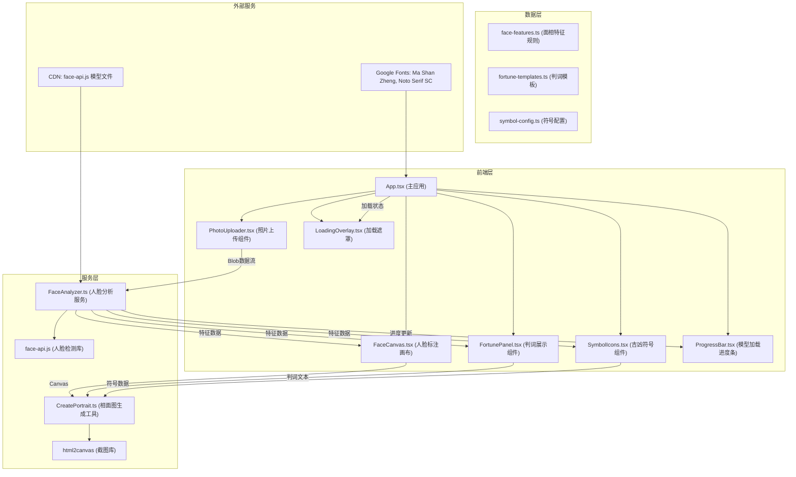

## 1. 架构设计



**数据流说明：**
1. 用户通过 PhotoUploader 上传照片或开启摄像头，输出 Blob 数据流
2. FaceAnalyzer 接收 Blob，调用 face-api.js 加载 CDN 模型（进度反馈给 ProgressBar）
3. FaceAnalyzer 检测人脸68点坐标，计算五官比例，匹配面相规则，输出 FaceFeatures
4. FaceCanvas 根据特征数据在照片上绘制红色标注点和轮廓
5. FortunePanel 根据特征数据渲染相面判词，应用水墨波纹动画
6. SymbolIcons 根据特征数据渲染吉凶符号，依次淡入显示
7. 用户点击"生成相面图"时，CreatePortrait 整合照片、标注、判词、符号，绘制600x800px水墨风格相面图并输出 Blob 供下载
8. LoadingOverlay 在检测过程中显示竹简旋转动画

## 2. 技术描述

- **前端框架**：React@18 + TypeScript@5 + Vite@5
- **构建工具**：Vite@5，使用 @vitejs/plugin-react
- **人脸检测**：face-api.js@0.22.2（CDN加载模型）
- **图片处理**：html2canvas@1.4.1（可选，用于canvas转图片下载）
- **样式方案**：CSS Modules + CSS Variables + Keyframes动画
- **字体**：Google Fonts - Ma Shan Zheng（标题）、Noto Serif SC（正文）
- **无需后端**：纯前端应用，所有计算在浏览器端完成

## 3. 项目文件结构

```
auto228/
├── package.json
├── vite.config.js
├── tsconfig.json
├── index.html
└── src/
    ├── App.tsx (主应用组件，状态管理)
    ├── main.tsx (入口文件)
    ├── index.css (全局样式、CSS变量、字体)
    ├── components/
    │   ├── PhotoUploader.tsx (照片上传/摄像头组件)
    │   ├── FaceCanvas.tsx (人脸标注画布组件)
    │   ├── FortunePanel.tsx (判词展示组件)
    │   ├── SymbolIcons.tsx (吉凶符号组件)
    │   ├── PortraitPreview.tsx (相面图预览组件)
    │   ├── LoadingOverlay.tsx (加载动画组件)
    │   └── ProgressBar.tsx (模型加载进度条)
    ├── services/
    │   └── FaceAnalyzer.ts (人脸分析服务类)
    ├── utils/
    │   ├── CreatePortrait.ts (相面图生成工具)
    │   └── canvasUtils.ts (Canvas绘制工具函数)
    ├── data/
    │   ├── face-features.ts (面相特征规则配置)
    │   ├── fortune-templates.ts (判词模板库)
    │   └── symbol-config.ts (吉凶符号配置)
    ├── types/
    │   └── index.ts (TypeScript类型定义)
    └── hooks/
        ├── useFaceDetection.ts (人脸检测Hook)
        └── useCamera.ts (摄像头Hook)
```

**模块调用关系：**
- `App.tsx` → 组合所有子组件，管理全局状态（照片、检测结果、加载状态）
- `PhotoUploader.tsx` → 调用 `useCamera.ts`，输出 Blob 给 `FaceAnalyzer`
- `FaceAnalyzer.ts` → 依赖 `face-api.js`，使用 `face-features.ts` 规则，输出 `FaceFeatures`
- `FortunePanel.tsx` → 使用 `fortune-templates.ts` 模板，接收 `FaceFeatures` 渲染判词
- `SymbolIcons.tsx` → 使用 `symbol-config.ts` 配置，接收 `FaceFeatures` 渲染符号
- `CreatePortrait.ts` → 使用 `canvasUtils.ts`，整合所有元素生成最终图片

## 4. 类型定义

```typescript
// src/types/index.ts

export interface Point {
  x: number;
  y: number;
}

export interface FaceLandmarks {
  leftEyebrow: Point[];
  rightEyebrow: Point[];
  leftEye: Point[];
  rightEye: Point[];
  nose: Point[];
  mouth: Point[];
  jaw: Point[];
  forehead: Point[];
  chin: Point[];
  acupoints: {
    yintang: Point;      // 印堂
    shangen: Point;      // 山根
    renzhong: Point;     // 人中
    nasalBase: Point;    // 鼻准
  };
}

export interface FaceMeasurements {
  faceWidth: number;
  faceHeight: number;
  foreheadHeight: number;
  noseWidth: number;
  noseHeight: number;
  eyeWidth: number;
  eyeDistance: number;
  eyebrowDistance: number;
  mouthWidth: number;
  earHeight: number;
}

export interface FaceFeatures {
  landmarks: FaceLandmarks;
  measurements: FaceMeasurements;
  ratios: {
    foreheadToFace: number;
    noseWidthToFace: number;
    eyeToFace: number;
    eyebrowToEye: number;
    mouthToFace: number;
  };
  attributes: {
    foreheadFull: boolean;
    noseRounded: boolean;
    eyesUpturned: boolean;
    eyebrowDistanceWide: boolean;
    mouthSymmetric: boolean;
    earPosition: 'high' | 'normal' | 'low';
  };
}

export interface FortuneResult {
  verdict: string[];
  symbols: FortuneSymbol[];
}

export interface FortuneSymbol {
  type: 'wealth' | 'career' | 'longevity' | 'happiness' | 'love' | 'sorrow' | 'illness' | 'disaster';
  name: string;
  color: string;
  icon: string;
  description: string;
}

export type UploadSource = 'file' | 'camera';
export type AppState = 'idle' | 'uploading' | 'detecting' | 'analyzing' | 'complete' | 'generating';
```

## 5. 核心API设计

### 5.1 FaceAnalyzer 类

```typescript
class FaceAnalyzer {
  static loadModels(onProgress: (progress: number) => Promise<void>;
  detectFace(imageBlob: Blob): Promise<FaceFeatures | null>;
  analyzeFeatures(landmarks: FaceLandmarks): FaceFeatures;
  generateFortune(features: FaceFeatures): FortuneResult;
}
```

### 5.2 CreatePortrait 工具

```typescript
function createPortrait(
  imageSrc: string,
  features: FaceFeatures,
  fortune: FortuneResult,
  options?: PortraitOptions
): Promise<Blob>;

interface PortraitOptions {
  width: number;      // default: 600
  height: number;     // default: 800
  paperColor: string; // default: '#f5ecd7'
  inkColor: string;   // default: '#c0392b'
}
```

## 6. 性能优化策略

1. **模型预加载**：应用启动时即开始加载face-api.js模型，使用进度条反馈
2. **Web Worker**：人脸检测计算在Web Worker中执行，避免阻塞UI
3. **requestAnimationFrame**：标注点动画使用rAF，保证≥30FPS
4. **离屏Canvas**：相面图生成使用OffscreenCanvas，提升绘制性能
5. **图片压缩**：上传照片前进行适当压缩，降低检测计算量
6. **懒加载**：非核心组件（如相面图生成器）按需加载
7. **内存管理**：及时释放Blob URL和Canvas资源，避免内存泄漏
