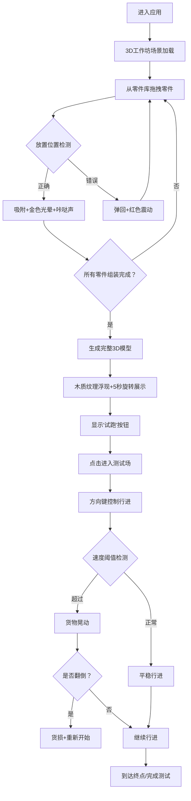

## 1. 产品概述
本产品是一个基于Web的3D交互游戏应用，模拟中国古代《天工开物》中"木牛流马"的设计与组装过程，用户可在虚拟工坊中完成零件组装，并在测试场中体验其行进与运载能力。

- **核心价值**：解决传统木工机械知识难以直观交互的问题，让用户在无实物环境下完整体验古代机械设计流程
- **目标用户**：历史爱好者、机械设计爱好者、教育工作者、学生群体
- **市场定位**：集教育性与趣味性于一体的文化科技交互产品

## 2. 核心特性

### 2.1 用户角色
| 角色 | 注册方式 | 核心权限 |
|------|----------|----------|
| 普通用户 | 无需注册，直接访问 | 完整体验组装与测试流程 |

### 2.2 功能模块
1. **工作坊场景**：3D木工作坊环境，包含工作台、零件库、设计图纸参考
2. **组装系统**：零件拖拽、自动吸附、碰撞检测、完整度判断
3. **展示动画**：组装完成后的模型旋转展示，木质纹理呈现
4. **测试场系统**：物理行走模拟、方向控制、连杆联动动画、货物平衡检测
5. **视觉效果**：木屑粒子系统、光晕特效、震动反馈、材质渲染

### 2.3 页面详情
| 页面名称 | 模块名称 | 功能描述 |
|----------|----------|----------|
| 主界面 | 工作坊场景 | 3D视角木工作坊，木栅栏围成，稻草地面，工具墙，中央工作台 |
| 主界面 | 零件库面板 | 右侧展示6种零件（独轮×2、木箱、连杆×4、牛首、缰绳、轴套），带重量指示和质感贴图 |
| 主界面 | 组装区域 | 工作台中央区域，半透明白色线框显示设计图，支持零件拖拽放置 |
| 主界面 | 设计图纸 | 左侧古旧图纸，水墨风格爆炸结构图，作为组装参考 |
| 主界面 | 试跑按钮 | 组装完成后出现，点击进入测试场 |
| 测试场 | 土路场景 | 蜿蜒土路200px，随机凸起凹陷，两侧低多边形树木草丛，渐变天空 |
| 测试场 | 操控系统 | 方向键控制行进速度和转向 |
| 测试场 | 物理模拟 | 连杆联动动画（牛首15度摆动，1Hz频率），货物晃动检测，翻倒判定 |

## 3. 核心流程

用户进入应用后，首先看到3D木工作坊场景。从右侧零件库拖拽零件到中央工作台，零件放置到正确位置时自动吸附并发出咔哒声和金色光晕；放置错误时弹回并红色震动。当所有零件按设计图放置完毕，木牛流马自动组合成完整3D模型，伴随木质纹理浮现和5秒旋转展示。之后左侧出现"试跑"按钮，点击进入测试场。用户用方向键控制木牛流马在蜿蜒土路上行进，观察连杆联动动画，当速度过快时货物开始晃动，若翻倒则货损并重新开始。

## 4. 用户界面设计

### 4.1 设计风格
- **主色调**：暖棕色#3e2a1a（工作坊背景），配合木质色系
- **强调色**：金色#ffd700（光晕、吸附特效），红色#e74c3c（错误反馈）
- **工作台**：颜色#8b5e3c，尺寸400x300px，粗糙纹理
- **零件库**：高光影渲染，悬停时放大1.2倍+淡金色边缘发光
- **设计图纸**：泛黄卷边效果，中国水墨风格
- **粒子效果**：飘散木屑粒子，颜色#d4a574，大小1-2px，每秒5-10颗

### 4.2 页面设计概览
| 页面名称 | 模块名称 | UI元素 |
|----------|----------|--------|
| 工作坊主