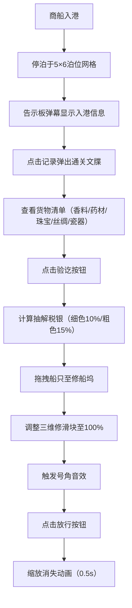

## 1. 产品概述

宋代市舶司商船通关管理系统，让用户以泉州市舶司监官的身份，沉浸式体验古代海上丝绸之路的商船入港、验货、抽解（征税）和放行全流程管理。

- 核心目的：通过数字化交互重现宋代海外贸易管理制度，兼具教育性与趣味性
- 目标用户：历史爱好者、教育工作者、文化传播受众
- 产品价值：以游戏化方式普及宋代市舶司制度，展示泉州港作为东方第一大港的历史风貌

## 2. 核心功能

### 2.1 用户角色

| 角色 | 注册方式 | 核心权限 |
|------|----------|----------|
| 市舶司监官 | 无需注册，直接进入 | 管理泊位、验看货物、抽解征税、修船放行 |

### 2.2 功能模块

1. **港区平面图**：5行6列泊位网格，展示停靠商船状态，支持拖拽操作
2. **木制告示板**：弹幕式滚动显示最近10艘入港商船信息，速度可调
3. **通关文牒**：点击商船记录弹出详情卡片，展示货物清单与税银计算
4. **修船坞**：拖拽船只进入维修，通过滑块调整维修状态，完成后放行

### 2.3 页面详情

| 页面名称 | 模块名称 | 功能描述 |
|----------|----------|----------|
| 主界面 | 港区平面图 | CSS Grid布局5×6泊位网格，每泊位显示⛵图标，支持拖拽至修船坞 |
| 主界面 | 木制告示板 | 弹幕滚动显示商船信息（名称、原产地、货物概要），三档速度调节 |
| 主界面 | 通关文牒卡片 | 600×400px米色卡片，展示船名、船长、载重、分栏货物清单，数量橙色高亮 |
| 主界面 | 验讫弹窗 | 半透明遮罩，显示细色货10%/粗色货15%抽解比例，自动计算税银总额，0.3s弹出动画 |
| 主界面 | 修船坞 | 半圆形凹槽背景，三滑块（船底/桅杆/帆布）100%触发号角音效，放行后0.5s消失动画 |

## 3. 核心流程

### 商船通关流程

商船入港 → 停泊泊位 → 告示板显示记录 → 点击查看通关文牒 → 验讫抽解 → 拖拽至修船坞 → 维修调整 → 放行离港

## 4. 用户界面设计

### 4.1 设计风格

- **宋式美学**：整体采用宋代雅致审美，强调简洁、温润、典雅
- **主色调**：米白#f5f0e0、深褐#8b4513、靛蓝#1a5276
- **辅助色**：木棕#6b3a2a、浅黄#f5deb3、米色#f5e6c8、橙色#e67e22、金色#ffd700
- **按钮样式**：圆角6px，背景渐变#8b4513→#6b3a2a，悬停亮度提升30%
- **字体**：思源宋体，体现宋代印刷文化
- **布局风格**：Flex弹性布局，左侧港区平面图，右侧告示板，底部弹出区域
- **图标风格**：使用emoji ⛵ 表示帆船，修船坞使用水波#4a90d9

### 4.2 页面设计概述

| 页面名称 | 模块名称 | UI元素 |
|----------|----------|--------|
| 主界面 | 港区平面图 | 5×6 CSS Grid网格，泊位可停靠，帆船#8b5a2b色，拖拽交互 |
| 主界面 | 木制告示板 | 深棕#6b3a2a背景，浅黄#f5deb3文字，弹幕滚动，速度调节按钮 |
| 主界面 | 通关文牒卡片 | 浅米#f5e6c8背景，深褐#8b4513木纹边框，货物分栏显示，数量橙色高亮 |
| 主界面 | 验讫弹窗 | 半透明遮罩#00000088，0.3s弹性动画，税银总额醒目显示 |
| 主界面 | 修船坞 | 半圆凹槽，水波#4a90d9背景，三滑块控件，Web Audio号角音效 |

### 4.3 交互与动画

- **卡片切换**：0.3s淡入淡出过渡
- **列表悬停**：背景变为半透明金色#ffd70022
- **放行动画**：0.5秒缩放+位移，化作小点消失
- **性能要求**：所有动画60fps，50+列表项无卡顿

### 4.4 响应式

- 桌面端优先设计
- 使用Flex和Grid自适应布局
- 最小支持宽度1280px，保证港区网格完整显示

## 5. 技术约束

- 框架：React 18 + TypeScript
- 构建工具：Vite
- 路由：React Router DOM
- 动画：Framer Motion
- 状态管理：Zustand
- 样式：Styled-components + Emotion
- 图表：Recharts（可扩展税银统计）
