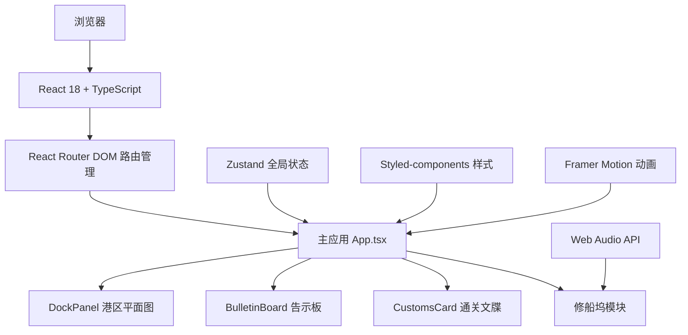
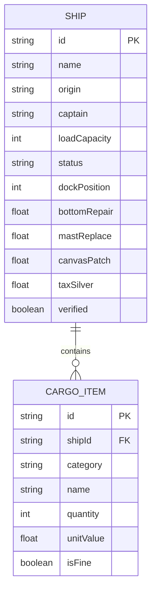

## 1. 架构设计



## 2. 技术描述

- **前端框架**：React 18 + TypeScript（严格模式）
- **构建工具**：Vite 5
- **路由管理**：react-router-dom 6
- **状态管理**：zustand 4（全局状态：商船列表、泊位状态、修船坞数据）
- **动画库**：framer-motion 10
- **样式方案**：styled-components 6 + @emotion/react 11
- **图表库**：recharts 2（税银数据可视化扩展）
- **HTTP客户端**：axios 1（预留接口扩展）
- **目标版本**：ES2020

## 3. 目录结构

```
.
├── index.html
├── package.json
├── tsconfig.json
├── vite.config.js
└── src/
    ├── App.tsx                    # 主应用组件，路由管理
    ├── components/
    │   ├── DockPanel.tsx          # 港区平面图（泊位网格+拖拽+放行动画）
    │   ├── BulletinBoard.tsx      # 告示板（弹幕滚动+点击交互）
    │   └── CustomsCard.tsx        # 通关文牒（货物清单+验讫弹窗+税银计算）
    ├── utils/
    │   └── dataStore.ts           # Zustand全局状态管理
    └── styles/
        └── theme.ts               # 统一主题变量
```

## 4. 路由定义

| 路由 | 用途 |
|------|------|
| / | 主界面，包含港区平面图、告示板、通关文牒和修船坞 |
| /docks | 泊位列表页 |
| /bulletin | 告示板详情页 |
| /customs/:shipId | 通关文牒详情页 |
| /repair | 修船坞页面 |

## 5. 数据模型

### 5.1 数据模型定义



### 5.2 TypeScript类型定义

```typescript
// 商船状态
type ShipStatus = 'docked' | 'inspecting' | 'repairing' | 'departing';

// 货物类别
type CargoCategory = '香料' | '药材' | '珠宝' | '丝绸' | '瓷器' | '其他';

// 货物项
interface CargoItem {
  id: string;
  category: CargoCategory;
  name: string;
  quantity: number;
  unitValue: number;
  isFine: boolean; // 是否为细色货
}

// 商船
interface Ship {
  id: string;
  name: string;
  origin: string;
  captain: string;
  loadCapacity: number;
  status: ShipStatus;
  dockPosition: number | null;
  cargo: CargoItem[];
  repair: {
    bottomRepair: number;    // 0-100
    mastReplace: number;     // 0-100
    canvasPatch: number;     // 0-100
  };
  taxSilver: number;
  verified: boolean;
  arrivalTime: number;
}

// 泊位
interface Dock {
  id: number;
  row: number;
  col: number;
  shipId: string | null;
}

// 全局状态
interface AppState {
  ships: Ship[];
  docks: Dock[];
  bulletinRecords: string[];
  scrollSpeed: 'slow' | 'medium' | 'fast';
  selectedShipId: string | null;
  showCustomsCard: boolean;
  repairShipId: string | null;
  // actions
  addShip: (ship: Ship) => void;
  updateShip: (id: string, updates: Partial<Ship>) => void;
  removeShip: (id: string) => void;
  selectShip: (id: string | null) => void;
  setScrollSpeed: (speed: 'slow' | 'medium' | 'fast') => void;
  moveShipToRepair: (shipId: string) => void;
  updateRepairProgress: (shipId: string, field: keyof Ship['repair'], value: number) => void;
  releaseShip: (shipId: string) => void;
  calculateTax: (shipId: string) => number;
}
```

## 6. 核心模块说明

### 6.1 DockPanel 港区平面图
- 使用 CSS Grid 实现 5×6 泊位网格
- 拖拽功能：HTML5 Drag & Drop API
- 放行动画：Framer Motion 缩放 + 位移
- 帆船图标：emoji ⛵ 或内联SVG，颜色#8b5a2b

### 6.2 BulletinBoard 告示板
- 弹幕滚动：CSS Animation 或 Framer Motion
- 速度控制：slow(60s) / medium(40s) / fast(20s) 一轮回
- 点击交互：联动 CustomsCard 显示

### 6.3 CustomsCard 通关文牒
- 货物分栏显示，数量橙色#e67e22高亮
- 验讫弹窗：半透明遮罩 + 0.3s弹出动画
- 税银计算：细色货10%，粗色货15%

### 6.4 修船坞
- 三个 Slider 组件控制维修进度
- Web Audio API 生成号角音效（每项达100%时触发）
- 放行触发 0.5s 缩放消失动画

## 7. 性能优化

- 列表虚拟化：超过50条数据时使用虚拟滚动
- 动画优化：使用 transform 和 opacity 属性实现60fps动画
- 状态优化：Zustand 按需选择器避免不必要重渲染
- 事件防抖：滑块拖动时使用节流处理
