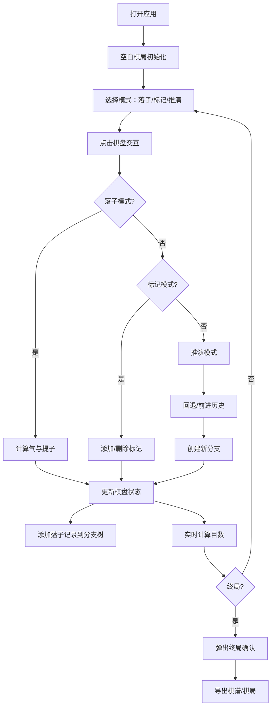

## 1. 产品概述

古风围棋推演应用是一款基于浏览器的围棋打谱与推演工具，以唐代宫廷棋待诏的视角，为用户提供沉浸式的围棋对弈体验。用户可在19×19的虚拟棋盘上落子、标记、创建分支推演变化，并生成水墨风格的终局棋谱。

- **核心目标**：为围棋爱好者提供专业的打谱推演工具，兼具文化审美价值
- **目标用户**：围棋爱好者、棋手、传统文化爱好者
- **市场价值**：填补古风围棋应用的空白，将传统艺术与现代技术融合

## 2. 核心功能

### 2.1 用户角色
| 角色 | 注册方式 | 核心权限 |
|------|----------|----------|
| 访客 | 无需注册 | 完整使用所有功能、导入导出棋局 |

### 2.2 功能模块
1. **棋盘交互**：19×19网格棋盘、Canvas渲染、落子动画、提子特效
2. **游戏逻辑**：落子规则、气计算、提子判定、禁着点检测、打劫检测
3. **分支推演**：多分支树管理、前进/后退、分支创建、当前分支高亮
4. **打谱标记**：圆形标记、三角标记、手数标注、标记删除
5. **目数计算**：实时目数统计、无容错区域计数法、终局确认
6. **数据管理**：JSON格式导入导出、棋局保存与恢复
7. **棋谱导出**：水墨风格SVG棋谱生成

### 2.3 页面详情
| 页面名称 | 模块名称 | 功能描述 |
|---------|----------|----------|
| 主界面 | 顶部状态栏 | 棋局名称编辑、当前手数显示、黑白目数对比、提子统计 |
| 主界面 | 中央棋盘区 | 19×19围棋棋盘、落子交互、标记显示、分支高亮 |
| 主界面 | 右侧分支树 | 树形结构展示落子历史、分支缩进连线、金色高亮当前节点 |
| 主界面 | 底部工具栏 | 落子/标记/推演模式切换、撤销/重做、导出功能 |
| 主界面 | 弹出对话框 | 终局确认、导出选项、导入文件选择 |

## 3. 核心流程

用户打开应用后，默认进入空白棋局。点击棋盘交叉点即可落子，系统自动计算气和提子。用户可随时回退到任意手数创建新分支进行推演。通过标记工具可在棋盘上添加分析标记。完成后可导出JSON棋局或水墨SVG棋谱。

## 4. 用户界面设计

### 4.1 设计风格
- **设计理念**：唐代典雅风韵，仿古宣纸质感，水墨意境
- **主色调**：羊皮纸黄(#f5f0e8)、檀木棕(#8b4513/#3e2723)、墨黑(#1a1a1a)、朱砂红(#ff5555)、金色(#d4af37)
- **字体**：楷体（KaiTi）、Google Fonts Noto Serif SC
- **按钮风格**：圆形工具栏按钮(直径36px)，背景#8b4513，悬浮变为#a0522d
- **布局风格**：竖式布局，顶部状态栏、中央棋盘、右侧分支面板、底部工具栏
- **特殊效果**：宣纸纹理背景、木纹边框渐变、落子弹性动画、提子粒子消散

### 4.2 页面设计概述
| 页面名称 | 模块名称 | UI元素 |
|---------|----------|--------|
| 主界面 | 顶部状态栏 | 高度60px、背景#3e2723、文字#f5e6c8、可编辑棋局名称、手数显示、目数方块、提子圆点图标 |
| 主界面 | 棋盘区域 | Canvas渲染、1px网格线#4a3728、九星标记、木质边框#d2b48c(宽50px带木纹渐变)、落子径向渐变高光 |
| 主界面 | 分支树面板 | 宽度280px、底色#ede0d4、楷体手数节点、实线连接父子节点、金色下划线标记当前节点 |
| 主界面 | 底部工具栏 | 圆形图标按钮(落子/标记/推演/撤销/重做/导出)、右下角定位 |
| 主界面 | 动画效果 | 棋子从上方20px下落弹性动画(0.3s)、提子5颗白色粒子扩散消散(0.5s) |

### 4.3 响应式设计
- **桌面端**（≥1024px）：竖式布局，右侧分支树面板常驻显示
- **移动端**（<1024px）：右侧面板自动折叠为底部抽屉，点击展开
- **触摸优化**：点击区域放大，支持手势滑动浏览分支树

### 4.4 视觉细节
- **棋盘背景**：通过CSS径向渐变模拟仿古宣纸纹理，无外部图片依赖
- **棋子样式**：黑子#1a1a1a带径向渐变高光，白子#f0f0f0带阴影
- **分支树**：缩进层次显示，实线连接，当前分支金色高亮
- **标记系统**：红色圆形(#ff5555)、蓝色三角(#5599ff)、手数数字标注
