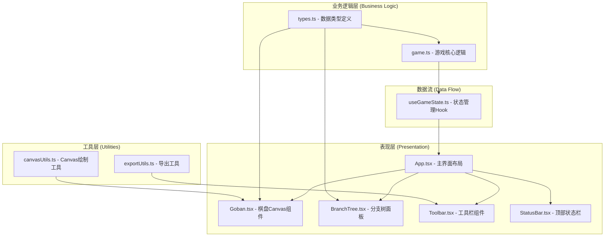

## 1. 架构设计



## 2. 技术描述

### 2.1 技术栈
- **前端框架**：React@18 + TypeScript@5
- **构建工具**：Vite@5 + @vitejs/plugin-react@4
- **样式方案**：原生CSS + CSS变量（无第三方UI库）
- **渲染方式**：HTML5 Canvas（棋盘渲染）+ React DOM（UI组件）
- **状态管理**：React useState + useReducer + 自定义Hook

### 2.2 核心模块职责

| 模块 | 职责 | 依赖 |
|------|------|------|
| types.ts | 定义棋盘坐标、棋子颜色、落子记录、分支节点、标记等核心数据类型 | 无 |
| game.ts | 围棋规则实现：落子、气计算、提子、禁着点、打劫、分支树管理 | types.ts |
| Goban.tsx | Canvas棋盘渲染：网格、星位、棋子、标记、动画、交互 | types.ts, canvasUtils.ts |
| App.tsx | 主界面布局与状态协调：整合所有子组件、管理全局状态 | types.ts, game.ts, useGameState.ts |
| BranchTree.tsx | 分支树可视化展示与交互 | types.ts |
| StatusBar.tsx | 顶部状态栏：手数、目数、提子数显示 | types.ts |
| Toolbar.tsx | 底部工具栏：模式切换、撤销重做、导出 | types.ts, exportUtils.ts |
| exportUtils.ts | JSON导入导出、SVG水墨棋谱生成 | types.ts, game.ts |
| canvasUtils.ts | Canvas绘制辅助函数 | types.ts |
| useGameState.ts | 游戏状态管理Hook | types.ts, game.ts |

### 2.3 文件结构

```
project-root/
├── package.json
├── vite.config.js
├── tsconfig.json
├── index.html
└── src/
    ├── types.ts           # 数据类型定义
    ├── game.ts            # 游戏核心逻辑
    ├── App.tsx            # 主应用组件
    ├── main.tsx           # 入口文件
    ├── hooks/
    │   └── useGameState.ts # 状态管理Hook
    ├── components/
    │   ├── Goban.tsx       # 棋盘Canvas组件
    │   ├── StatusBar.tsx   # 顶部状态栏
    │   ├── Toolbar.tsx     # 底部工具栏
    │   └── BranchTree.tsx  # 分支树面板
    ├── utils/
    │   ├── canvasUtils.ts  # Canvas绘制工具
    │   └── exportUtils.ts  # 导出工具
    └── styles/
        ├── index.css       # 全局样式
        └── variables.css   # CSS变量
```

## 3. 核心数据结构

### 3.1 数据类型定义（types.ts）

```typescript
// 棋盘坐标
interface Point {
  x: number;  // 0-18 列
  y: number;  // 0-18 行
}

// 棋子颜色
type StoneColor = 'black' | 'white' | null;

// 标记类型
type MarkerType = 'circle' | 'triangle' | 'number';

// 棋盘标记
interface Marker {
  id: string;
  position: Point;
  type: MarkerType;
  color?: string;
  number?: number;
}

// 落子记录
interface Move {
  id: string;
  moveNumber: number;
  position: Point | null;  // null 表示虚着(pass)
  color: StoneColor;
  capturedStones: Point[]; // 被提的棋子
  markers: Marker[];       // 此手添加的标记
  boardSnapshot: StoneColor[][]; // 落子后棋盘快照
  previousKo?: Point | null;     // 打劫禁入点
}

// 分支节点
interface BranchNode {
  id: string;
  move: Move | null;  // null 表示根节点
  parentId: string | null;
  children: string[];  // 子节点ID列表
  depth: number;       // 深度（手数）
  branchIndex: number; // 分支索引（同父亲下的第几个分支）
}

// 游戏状态
interface GameState {
  board: StoneColor[][];
  currentNodeId: string;
  branchTree: Map<string, BranchNode>;
  currentMoveNumber: number;
  blackCaptures: number;  // 黑方提子数
  whiteCaptures: number;  // 白方提子数
  blackTerritory: number; // 黑方目数
  whiteTerritory: number; // 白方目数
  markers: Marker[];      // 当前棋盘上的所有标记
  koPoint: Point | null;  // 当前打劫禁入点
  gameName: string;
  isGameOver: boolean;
  mode: 'play' | 'mark' | 'review';  // 落子/标记/推演模式
  selectedMarkerType: 'circle' | 'triangle' | 'number';
}
```

### 3.2 数据流向

1. **用户交互** → Goban/Toolbar/BranchTree → 触发action
2. **Action处理** → useGameState → game.ts 规则计算
3. **状态更新** → GameState → 重新渲染所有组件
4. **Canvas渲染** → Goban.tsx 调用 canvasUtils 绘制棋盘
5. **导出流程** → Toolbar → exportUtils 生成 JSON/SVG

## 4. 核心算法

### 4.1 气的计算（game.ts）
```
函数 calculateLiberties(point, color, board):
  1. 使用广度优先搜索(BFS)遍历连通的同色棋子
  2. 统计相邻的空点数量（气）
  3. 返回气数和连通棋子列表
```

### 4.2 提子判定（game.ts）
```
函数 captureStones(point, color, board):
  1. 获取落子点四周的对手棋子组
  2. 对每个对手棋子组计算气
  3. 气为0则提走该组所有棋子
  4. 返回被提棋子列表
```

### 4.3 禁着点检测（game.ts）
```
函数 isLegalMove(point, color, board, koPoint):
  1. 检查点是否为空
  2. 检查是否为打劫禁入点
  3. 模拟落子并检查是否能提对方子
  4. 若不能提子，检查自己是否有气（禁止自杀）
  5. 返回是否合法
```

### 4.4 目数计算（无容错区域计数法）
```
函数 calculateTerritory(board):
  1. 遍历所有空点
  2. 使用BFS找出所有连通的空区域
  3. 对每个区域检查边界棋子颜色
  4. 若边界全为黑子，区域计为黑目
  5. 若边界全为白子，区域计为白目
  6. 边界混合则不计目
  7. 加上提子数（每提一子算1目）
```

### 4.5 分支树管理
```
类 GameTree:
  - addNode(parentId, move): 创建新节点并添加到分支树
  - getCurrentPath(): 获取从根到当前节点的路径
  - canGoBack(): 检查是否可回退
  - canGoForward(): 检查是否可前进（在当前分支内）
  - goBack(): 回退一步
  - goForward(): 前进一步
  - switchBranch(nodeId): 切换到指定分支节点
  - createBranch(move): 在当前节点创建新分支
```

## 5. 性能优化策略

### 5.1 Canvas渲染优化
- 分层Canvas：棋盘网格/背景层、棋子层、标记层、动画层
- 脏矩形渲染：仅重绘变化区域
- requestAnimationFrame 统一动画调度
- 离屏Canvas预渲染棋盘底图

### 5.2 状态管理优化
- 棋盘快照使用引用共享（Immutable模式）
- 分支节点按需加载，避免一次性渲染200+节点
- useMemo/useCallback 减少不必要重渲染
- 虚拟滚动实现分支树面板

### 5.3 计算优化
- 气计算使用缓存，避免重复计算
- 落子合法性检查提前终止
- 目数计算防抖处理（延迟50ms计算）

### 5.4 动画优化
- CSS transforms 替代 top/left 动画
- will-change 提示浏览器优化
- 粒子动画使用Canvas而非DOM元素
- 弹性动画使用 spring 物理公式

## 6. 导出格式定义

### 6.1 JSON棋局格式
```json
{
  "version": "1.0",
  "gameName": "对弈名",
  "createdAt": "2026-06-09T00:00:00.000Z",
  "initialBoard": "[[null,...],...]",  // 初始棋盘（让子等情况）
  "branchTree": {
    "nodes": [...],  // 所有分支节点
    "rootId": "root",
    "currentNodeId": "..."
  },
  "finalBoard": "[[null,...],...]",  // 最终棋盘状态
  "blackCaptures": 10,
  "whiteCaptures": 8,
  "blackTerritory": 45,
  "whiteTerritory": 42
}
```

### 6.2 SVG水墨棋谱
- 宣纸质感背景（径向渐变+noise）
- 水墨晕染效果的棋子
- 手数标注（楷体）
- 木纹边框
- 可直接打印或分享
