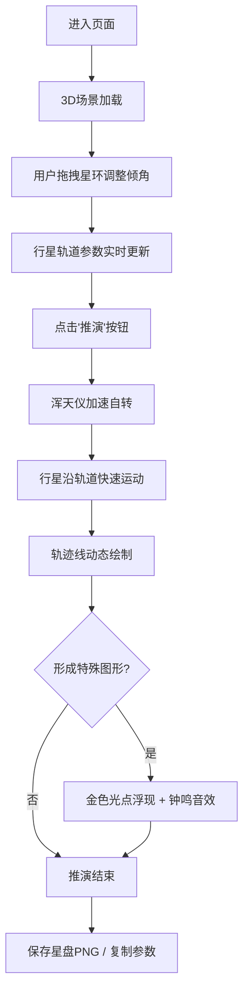

## 1. 产品概述

古代星象师浑天仪模拟应用，通过3D可视化技术直观演示古代天文知识，让用户能够在虚拟观星台上操控浑天仪、调整星环角度、推演行星轨迹并生成可分享的星盘图。

- 解决问题：古代星象知识在三维空间中难以直观演示与交互，传统平面教学难以传达天球坐标系的复杂性
- 目标用户：天文爱好者、历史文化研究者、学生及对古代科技感兴趣的大众
- 产品价值：将晦涩的古代天文学转化为沉浸式交互体验，传承中华古代科技文明

## 2. 核心功能

### 2.1 功能模块

1. **观星台主场景**：圆形石台、十二宫星图、半透明浑天仪、三色可拖拽星环
2. **行星系统**：6颗可交互行星（水星、金星、火星、木星、土星、月亮），点击显示轨道参数
3. **天象推演**：点击推演按钮触发加速动画，行星轨迹形成特殊几何图形时触发天象应验
4. **星盘导出**：生成1024x1024 PNG星盘图，支持复制参数表格
5. **操作面板**：星环倾角调节、行星信息展示、推演控制

### 2.2 页面详情

| 页面名称 | 模块名称 | 功能描述 |
|-----------|-------------|---------------------|
| 主页面 | 观星台场景 | 圆形石台（直径12单位），台面十二宫星图纹理60s周期自转 |
| 主页面 | 浑天仪 | 半径5单位半透明球体，经纬网格线#2e5a6b，透明度0.3 |
| 主页面 | 三色星环 | 黄道（金#ffd700）、赤道（青#00bfff）、银道（红#ff4444），可拖拽调整0-90度倾角 |
| 主页面 | 行星系统 | 6颗行星，半径0.3-0.6单位，各具特色纹理，点击弹出轨道信息面板 |
| 主页面 | 推演动画 | 浑天仪加速自转（2s→0.5s一圈），行星快速运动并留下彩色轨迹 |
| 主页面 | 天象应验 | 轨迹形成梅花形/十字形/六芒星时浮现金色光点+钟鸣音效 |
| 主页面 | 操作面板 | 毛玻璃效果，显示星环倾角、行星参数、推演按钮 |
| 主页面 | 星盘导出 | 生成PNG图片（含网格、轨迹、水印），复制参数表格 |

## 3. 核心流程

## 4. 用户界面设计

### 4.1 设计风格
- **主色调**：深空蓝#0a0a2e，辅以金色#ffd700、青色#00bfff、红色#ff4444、铜绿#2e7d32
- **字体**：Cinzel（Google Fonts）用于古朴文字展示，整体采用衬线字体营造古典氛围
- **视觉风格**：暗色调星穹风格，毛玻璃操作面板，发光与阴影效果营造神秘感
- **按钮风格**：铜绿色#2e7d32，篆书"推演"二字，悬停亮度提升1.2倍，点击下压动画
- **动画风格**：平滑过渡、弹性阻尼（0.8）、脉冲发光、渐变消散

### 4.2 页面设计概述

| 页面名称 | 模块名称 | UI元素 |
|-----------|-------------|-------------|
| 主页面 | 背景 | 星空粒子（200颗，1-3px随机，2-4s闪烁周期），缓慢旋转 |
| 主页面 | 观星台 | 圆形石台居中，直径根据屏幕自适应，十二宫纹理缓慢旋转 |
| 主页面 | 浑天仪 | 半透明发光球体，经纬网格清晰，中央悬浮 |
| 主页面 | 星环 | 三色环形，拖拽末端调整角度，拖拽时光点沿环移动 |
| 主页面 | 行星 | 各自发光+阴影，悬停高亮，点击弹出信息面板 |
| 主页面 | 操作面板 | 左上角/右侧毛玻璃面板，白色半透明边框，背景模糊10px |
| 主页面 | 推演按钮 | 铜绿色篆书按钮，点击时发光脉冲扩散动画 |
| 主页面 | 轨迹线 | 宽度3px，透明度0.2-0.8渐变，尾部3s逐渐消散 |

### 4.3 响应式设计
- 桌面优先，适配1920x1080及以上分辨率
- 16:9屏幕上观星台居中且大小自适应
- 操作面板在小屏幕上自动调整布局
- 触控设备支持触摸拖拽星环

### 4.4 3D场景指导
- **环境**：深空背景#0a0a2e，星空粒子营造宇宙氛围
- **光照**：环境光+定向光，行星自发光与阴影效果
- **相机**：透视相机，初始距离15-20单位，可环绕观察
- **交互**：Raycaster实现星环拖拽、行星点击检测
- **后处理**：辉光效果增强发光元素，Bloom提升视觉质感
- **性能**：单帧计算<10ms，稳定60fps，轨迹点数量限制避免性能问题

## 5. 交互细节

1. **星环拖拽**：鼠标悬停星环末端显示可拖拽提示，拖拽时有弹性阻尼（0.8），限制角度0-90度
2. **行星交互**：悬停时行星放大1.1倍并增强发光，点击后周围弹出信息面板显示实时轨道参数
3. **推演动画**：按钮点击后浑天仪转速从2s/圈加速到0.5s/圈，行星速度同步提升
4. **天象应验**：检测轨迹几何形状（梅花形/十字形/六芒星），触发时金色光点从中心扩散，钟鸣音效1s
5. **参数同步**：星环倾角变化实时更新行星轨道参数显示

## 6. 性能要求

- 帧率：稳定60fps
- 单帧动画计算：≤10ms
- 轨迹点数量：动态清理，最多保留最近500个点
- 内存占用：WebGL场景控制在200MB以内
