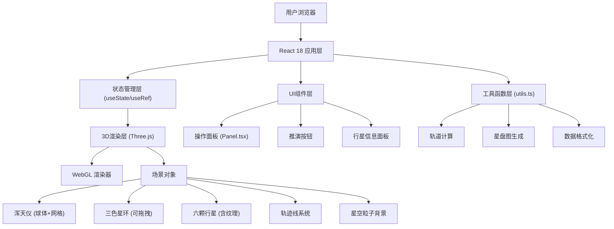

## 1. 架构设计



## 2. 技术描述

- **前端框架**：React 18 + TypeScript 5
- **构建工具**：Vite 5 + @vitejs/plugin-react
- **3D渲染**：Three.js r160 + @types/three
- **样式方案**：CSS Modules + CSS Variables（无需Tailwind，保持纯CSS控制以实现精细的毛玻璃和动画效果）
- **字体**：Google Fonts - Cinzel（古朴衬线字体）
- **音频**：Web Audio API（钟鸣音效合成）
- **图形导出**：Canvas 2D API + Three.js渲染到Texture

## 3. 项目文件结构

```
auto232/
├── package.json
├── vite.config.js
├── tsconfig.json
├── index.html
├── public/
│   └── (纹理资源)
└── src/
    ├── main.tsx          # React入口
    ├── App.tsx           # 主应用组件，状态管理
    ├── Astrolabe.tsx     # Three.js 3D场景核心
    ├── Panel.tsx         # 操作面板UI
    ├── utils.ts          # 工具函数
    └── styles/
        └── globals.css   # 全局样式
```

## 4. 核心组件设计

### 4.1 App.tsx - 主应用组件

**状态管理**：
```typescript
interface AppState {
  ringInclinations: {
    ecliptic: number;    // 黄道倾角 0-90
    equator: number;     // 赤道倾角 0-90
    galactic: number;    // 银道倾角 0-90
  };
  selectedPlanet: string | null;
  isSimulationRunning: boolean;
  planetaryData: PlanetData[];
}

interface PlanetData {
  id: string;
  name: string;
  longitude: number;     // 黄经
  declination: number;   // 赤纬
  inclination: number;   // 轨道倾角
  speed: number;         // 运行速度
  semiMajorAxis: number; // 半长轴
  eccentricity: number;  // 偏心率
}
```

**Props下发**：
- `ringInclinations` → Astrolabe.tsx（用于星环旋转矩阵计算）
- `onRingChange` → Astrolabe.tsx（星环拖拽回调）
- `selectedPlanet` → Panel.tsx（高亮显示）
- `onPlanetSelect` → Astrolabe.tsx（行星点击回调）
- `isSimulationRunning` → Astrolabe.tsx（推演状态控制）

### 4.2 Astrolabe.tsx - Three.js场景核心

**核心类/对象**：
- `scene`：THREE.Scene，背景色#0a0a2e
- `camera`：THREE.PerspectiveCamera，fov 60，near 0.1，far 1000
- `renderer`：THREE.WebGLRenderer，antialias=true，alpha=true
- `raycaster`：THREE.Raycaster，用于拖拽和点击检测
- `mouse`：THREE.Vector2，归一化鼠标坐标

**场景元素创建**：

1. **浑天仪球体**：
   - `SphereGeometry(radius=5, widthSegments=32, heightSegments=32)`
   - `MeshBasicMaterial(color=0x2e5a6b, transparent=true, opacity=0.3, wireframe=false)`
   - 叠加`LineSegments` + `EdgesGeometry` 实现经纬网格线

2. **三色星环**：
   - `RingGeometry(innerRadius=5.2, outerRadius=5.5, thetaSegments=64)`
   - `MeshBasicMaterial(color=0xffd700/0x00bfff/0xff4444, side=THREE.DoubleSide, transparent=true, opacity=0.8)`
   - 每个星环有一个拖拽手柄（末端小球）

3. **六颗行星**：
   - `SphereGeometry(radius=0.3-0.6)`
   - `MeshStandardMaterial` 配合程序化纹理生成
   - 土星额外添加 `RingGeometry` 光环

4. **轨迹线系统**：
   - `CatmullRomCurve3` 存储轨迹点
   - `BufferGeometry` + `LineBasicMaterial` 动态更新
   - 每颗行星独立轨迹，使用渐变色材质

5. **星空粒子背景**：
   - `BufferGeometry` 存储200个随机点
   - `PointsMaterial(size=1-3, transparent=true, opacity=0.8)`
   - 顶点着色器实现闪烁效果

**动画循环**：
- 使用 `requestAnimationFrame` 实现60fps循环
- 单帧计算逻辑控制在10ms以内
- 使用 `useRef` 存储Three.js对象避免重复创建

### 4.3 Panel.tsx - 操作面板

**UI元素**：
- 星环倾角滑块（3个，范围0-90，实时同步）
- 推演按钮（铜绿色，篆书文字，脉冲动画）
- 行星列表（6个，点击高亮选中）
- 选中行星信息面板（黄经、赤纬、轨道倾角、运行速度）
- 导出按钮（保存PNG、复制参数）

**样式**：
- 毛玻璃效果：`backdrop-filter: blur(10px)`
- 半透明白色边框：`border: 1px solid rgba(255,255,255,0.2)`
- 背景：`background: rgba(10,10,46,0.6)`

### 4.4 utils.ts - 工具函数

**轨道计算函数**：
```typescript
function calculateOrbitPosition(
  semiMajorAxis: number,
  eccentricity: number,
  trueAnomaly: number,
  inclination: number
): THREE.Vector3 {
  // 椭圆参数方程
  const r = semiMajorAxis * (1 - eccentricity * eccentricity) / 
            (1 + eccentricity * Math.cos(trueAnomaly));
  const x = r * Math.cos(trueAnomaly);
  const y = r * Math.sin(trueAnomaly);
  // 应用轨道倾角旋转
  const rotatedY = y * Math.cos(inclination);
  const z = y * Math.sin(inclination);
  return new THREE.Vector3(x, rotatedY, z);
}
```

**星盘图生成函数**：
```typescript
async function generateStarMap(
  renderer: THREE.WebGLRenderer,
  scene: THREE.Scene,
  camera: THREE.Camera,
  size: number = 1024
): Promise<string> {
  // 1. 渲染3D场景到离屏canvas
  // 2. 创建2D canvas绘制坐标网格
  // 3. 叠加3D渲染结果
  // 4. 添加日期时间水印
  // 5. 返回base64 PNG数据
}
```

**天象应验检测**：
```typescript
function detectCelestialPattern(trajectoryPoints: THREE.Vector3[]): string | null {
  // 检测梅花形：5个点对称分布
  // 检测十字形：4个点正交分布
  // 检测六芒星：6个点对称分布（两个三角形叠加）
  // 计算点之间的角度和距离关系
}
```

## 5. 性能优化策略

1. **对象池化**：轨迹点BufferGeometry复用，避免频繁GC
2. **LOD（细节层次）**：远离相机时降低几何体细分
3. **帧率控制**：使用 `performance.now()` 实现固定时间步长
4. **轨迹点限制**：每颗行星最多保留500个轨迹点，超出时移除最早的点
5. **材质复用**：相同颜色的行星共享材质实例
6. **矩阵更新优化**：使用 `matrixAutoUpdate = false` 手动控制矩阵更新

## 6. 数据模型

```typescript
// 行星数据类型
interface PlanetConfig {
  id: string;
  name: string;
  chineseName: string;
  radius: number;
  color: number;
  semiMajorAxis: number;
  eccentricity: number;
  baseSpeed: number;
  textureType: 'crater' | 'striped' | 'ringed' | 'smooth';
}

// 星环数据类型
interface RingConfig {
  id: string;
  name: string;
  color: number;
  rotationAxis: 'x' | 'y' | 'z';
  minAngle: number;
  maxAngle: number;
}

// 推演参数表格
interface SimulationParams {
  timestamp: string;
  ringInclinations: {
    ecliptic: number;
    equator: number;
    galactic: number;
  };
  planets: Array<{
    name: string;
    longitude: string;
    declination: string;
    inclination: string;
    speed: string;
  }>;
}
```

## 7. 初始化数据

```typescript
// 行星初始配置
const PLANETS: PlanetConfig[] = [
  { id: 'mercury', name: 'Mercury', chineseName: '水星', radius: 0.3, color: 0xb5b5b5, semiMajorAxis: 7, eccentricity: 0.205, baseSpeed: 0.04, textureType: 'crater' },
  { id: 'venus', name: 'Venus', chineseName: '金星', radius: 0.35, color: 0xe6c87a, semiMajorAxis: 8.5, eccentricity: 0.007, baseSpeed: 0.035, textureType: 'smooth' },
  { id: 'mars', name: 'Mars', chineseName: '火星', radius: 0.4, color: 0xe74c3c, semiMajorAxis: 10, eccentricity: 0.093, baseSpeed: 0.03, textureType: 'crater' },
  { id: 'jupiter', name: 'Jupiter', chineseName: '木星', radius: 0.6, color: 0xd4ac0d, semiMajorAxis: 12, eccentricity: 0.049, baseSpeed: 0.02, textureType: 'striped' },
  { id: 'saturn', name: 'Saturn', chineseName: '土星', radius: 0.5, color: 0xc8a882, semiMajorAxis: 14, eccentricity: 0.057, baseSpeed: 0.015, textureType: 'ringed' },
  { id: 'moon', name: 'Moon', chineseName: '月亮', radius: 0.32, color: 0xaaaaaa, semiMajorAxis: 6, eccentricity: 0.055, baseSpeed: 0.05, textureType: 'crater' },
];

// 星环初始配置
const RINGS: RingConfig[] = [
  { id: 'ecliptic', name: '黄道', color: 0xffd700, rotationAxis: 'x', minAngle: 0, maxAngle: 90 },
  { id: 'equator', name: '赤道', color: 0x00bfff, rotationAxis: 'z', minAngle: 0, maxAngle: 90 },
  { id: 'galactic', name: '银道', color: 0xff4444, rotationAxis: 'y', minAngle: 0, maxAngle: 90 },
];
```
