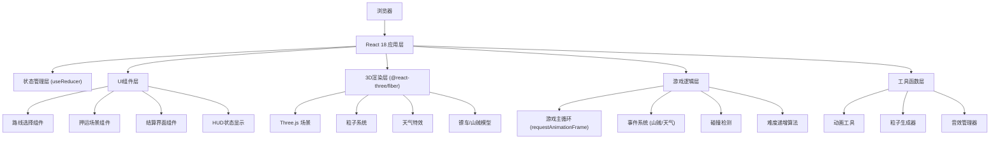

## 1. 架构设计



## 2. 技术描述

- **前端框架**: React 18 + TypeScript 5
- **构建工具**: Vite 5
- **3D渲染**: Three.js 0.160 + @react-three/fiber 8.15 + @react-three/drei 9.92
- **路由**: React Router DOM 6
- **状态管理**: React useReducer（轻量级游戏状态）
- **样式方案**: CSS Modules + CSS Variables（水墨风主题）
- **性能优化**: requestAnimationFrame 驱动游戏循环，粒子对象池，线性插值雾效

## 3. 目录结构

```
src/
├── main.tsx              # React入口
├── App.tsx               # 主应用组件，状态机管理
├── types.ts              # TypeScript类型定义
├── scenes/
│   └── RoadScene.tsx     # 3D场景组件
├── components/
│   ├── RouteSelector.tsx # 路线选择组件
│   ├── Settlement.tsx    # 结算界面组件
│   ├── HUD.tsx           # 状态显示组件
│   ├── Bandit.tsx        # 山贼组件
│   ├── Cart.tsx          # 镖车组件
│   └── WeatherEffect.tsx # 天气特效组件
├── utils/
│   ├── gameLoop.ts       # 游戏主循环
│   ├── particles.ts      # 粒子系统工具
│   └── animation.ts      # 动画工具函数
└── styles/
    ├── theme.css         # 主题变量（水墨风）
    └── global.css        # 全局样式
```

## 4. 路由定义

| Route | Purpose |
|-------|---------|
| / | 游戏主入口，状态机控制显示不同阶段 |
| /select | 路线选择界面 |
| /journey | 押运场景 |
| /settle | 结算界面 |

## 5. 数据模型

### 5.1 游戏状态接口

```typescript
// 游戏阶段枚举
enum GamePhase {
  ROUTE_SELECT = 'route_select',
  TRAVELING = 'traveling',
  BATTLE = 'battle',
  WEATHER_EVENT = 'weather_event',
  SETTLEMENT = 'settlement'
}

// 路线类型
enum RouteType {
  MOUNTAIN = 'mountain',
  WATER = 'water',
  FOREST = 'forest'
}

// 天气类型
enum WeatherType {
  RAIN = 'rain',
  SANDSTORM = 'sandstorm',
  FOG = 'fog'
}

// 事件类型
enum EventType {
  BANDIT = 'bandit',
  WEATHER = 'weather'
}

// 山贼接口
interface Bandit {
  id: string;
  position: { x: number; y: number; z: number };
  health: number;
  isAttacking: boolean;
  attackTimer: number;
  defeated: boolean;
}

// 游戏状态接口
interface GameState {
  phase: GamePhase;
  selectedRoute: RouteType | null;
  cartHealth: number; // 0-100
  silver: number;
  distance: number; // 已行进距离
  totalDistance: number; // 总路程
  banditsDefeated: number;
  weatherHandled: number;
  currentWeather: WeatherType | null;
  weatherTimer: number;
  bandits: Bandit[];
  eventQueue: GameEvent[];
  difficulty: number; // 难度系数，每次递增
  banditFrequency: number; // 山贼出现频率
  weatherInterval: number; // 天气事件间隔
  lastWeatherTrigger: number; // 上次天气触发距离
  isPaused: boolean;
}

// 游戏事件接口
interface GameEvent {
  type: EventType;
  timestamp: number;
  data: any;
}
```

### 5.2 游戏动作类型

```typescript
type GameAction =
  | { type: 'SELECT_ROUTE'; payload: RouteType }
  | { type: 'START_JOURNEY' }
  | { type: 'UPDATE_DISTANCE'; payload: number }
  | { type: 'SPAWN_BANDIT'; payload: Bandit }
  | { type: 'DEFEAT_BANDIT'; payload: string }
  | { type: 'BANDIT_ATTACK'; payload: string }
  | { type: 'TRIGGER_WEATHER'; payload: WeatherType }
  | { type: 'HANDLE_WEATHER'; payload: { success: boolean } }
  | { type: 'END_WEATHER' }
  | { type: 'DAMAGE_CART'; payload: number }
  | { type: 'ADD_SILVER'; payload: number }
  | { type: 'ARRIVE_AT_INN' }
  | { type: 'NEXT_ORDER' }
  | { type: 'PAUSE' }
  | { type: 'RESUME' }
  | { type: 'RESET' };
```

## 6. 核心算法

### 6.1 难度递增算法

```typescript
// 每次接下一单后调用
function increaseDifficulty(state: GameState): Partial<GameState> {
  const newDifficulty = state.difficulty + 1;
  return {
    difficulty: newDifficulty,
    // 山贼出现频率提升20%
    banditFrequency: state.banditFrequency * 1.2,
    // 天气事件间隔缩短15%
    weatherInterval: state.weatherInterval * 0.85,
    // 重置距离计数器
    distance: 0,
    lastWeatherTrigger: 0,
  };
}
```

### 6.2 镖银计算算法

```typescript
function calculateSilver(state: GameState): number {
  const baseSilver = 50;
  const banditBonus = state.banditsDefeated * 10;
  const weatherBonus = state.weatherHandled * 15;
  return baseSilver + banditBonus + weatherBonus;
}
```

### 6.3 游戏主循环

```typescript
// 使用 requestAnimationFrame 驱动
// 每帧更新：镖车位置、粒子系统、山贼AI、天气效果、事件检测
// 性能目标：30FPS+，粒子数≤600
```

## 7. 性能优化策略

1. **粒子对象池**：预创建粒子对象，复用而非销毁重建
2. **requestAnimationFrame**：统一动画循环，避免多次监听
3. **线性插值雾效**：预计算雾密度值，避免实时复杂计算
4. **粒子数限制**：雨丝粒子≤600颗，确保低端设备流畅
5. **组件懒渲染**：非活动阶段组件不渲染
6. **事件节流**：用户输入事件节流，避免高频触发
